# DeepAgentForecast

**English** | [简体中文](README.zh-CN.md)

[](https://deepwiki.com/linroger/DeepAgentForecast)
[](LICENSE)
[](backend/.python-version)
[](package.json)

> **Ask one question about the future. Get a researched, simulated and audited forecast.**

DeepAgentForecast is a forecasting engine that runs on your own machine. You type a question such as *"Who wins the US AI race by 2030?"* and it:

1. researches the open web and every important actor with DeerFlow 2 research agents;
2. turns what it learned into a temporal knowledge graph;
3. casts the real-world actors as LLM agents on a simulated Twitter and Reddit, advancing one calendar period per round;
4. writes a sectioned forecast report with scenario probabilities, 10 or more yes/no forecasts that can be checked later, charts, and prediction-market cross-checks.

The report is only served after it passes a strict citation and consistency audit. One dashboard shows every stage while it runs.

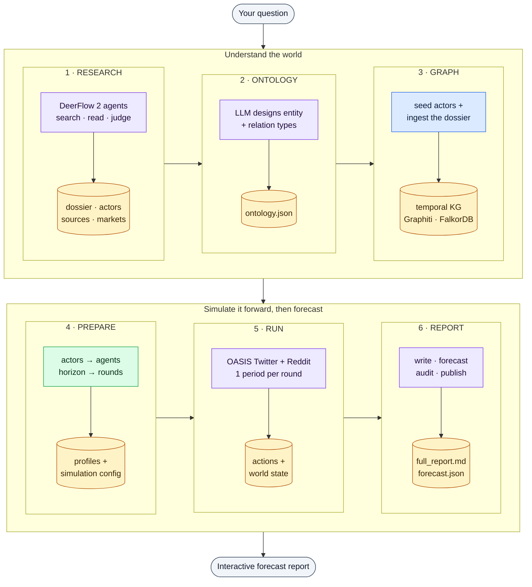

<sub>Colour key for the flowcharts in this README: **blue** = component or process · **purple** = LLM-driven step · **green** = deterministic step (no LLM) · **red** = gate or decision · **amber** = durable artifact or store · **grey, dashed** = external service.</sub>

### Highlights

- **One prompt, six stages.** research → ontology → graph → prepare → run → report run as one pipeline, which can be cancelled and resumed. You never carry files between stages by hand.
- **Fast, bounded, cache-efficient research.** The default research engine (v3) plans the question as key intelligence questions, sends one bounded search-and-read agent at each, fills gaps within a tool budget, and writes a cited dossier. Its prompts are laid out for provider prompt caching, so about 80% of input tokens are served from cache. A deep run takes about 40 minutes and 1.45M input tokens, against about 20 hours and 46.8M for the previous multi-pass loop. Every figure in the evidence is checked against the page it cites.
- **Deep, parallel research (legacy engine).** With `RESEARCH_ENGINE=legacy`, three isolated DeerFlow 2 research lanes attack the question from different angles:
  - base evidence;
  - base rates and historical analogs;
  - incentives, contrarian views and markets.

  One lane also builds a 17-dimension dossier on every key actor, with every claim tied to a source. A separate synthesis step then writes a 15–22K-word dossier that must pass a 7-dimension quality judge.
- **A knowledge graph you don't have to host.** It uses [Graphiti](https://github.com/getzep/graphiti) on an embedded FalkorDB, with local multilingual embeddings. There is no graph service, no Docker and no graph API key.
- **Simulation in calendar time.** The horizon in your question ("by 2030", "next 18 months", "2035年底") becomes a series of calendar rounds, each a day, week, half-month, month, quarter or half-year long. Researched events fire in the period they happen, and a shared world state evolves between rounds.
- **Forecasts built to be scored.**
  - Scenario probabilities are fixed before any prose is written.
  - Every report carries 10 or more binary forecasts, each with a probability and objective resolution criteria.
  - Where a Polymarket market with the same resolution criteria exists, the forecast is cross-checked against it.
- **No fake success.** SHA-256 manifests, sealed actor contracts, a read-only final audit and a publication gate all stand between a draft and the reader. A report with an unsupported citation, a probability that contradicts its prose, or a missing catch-all ("residual") scenario is never served.
- **Easy to run and watch.**
  - A live stage timeline and "run vitals": elapsed time, ETA, liveness and spend.
  - Cancel, resume and continue.
  - A bilingual UI and reports (English / 中文), and PDF export.
  - A switchable LLM backend: the local `claude` / `codex` CLIs, or any of six OpenAI-compatible APIs.

📖 **Deeper documentation:** [system architecture atlas](docs/architecture/DEEPRESEARCHFORECAST_SYSTEM_ATLAS.md) · [actor-intelligence architecture](docs/architecture/ACTOR_INTELLIGENCE_ARCHITECTURE.md) · [DeerFlow 2 (Stage 1) deep dive](docs/architecture/deerflow2/DEERFLOW_2_ARCHITECTURE.md) · [DeepWiki](https://deepwiki.com/linroger/DeepAgentForecast). See [Further documentation](#further-documentation) for what each one covers.

---

## Contents

- [Quickstart](#quickstart)
- [Demo](#demo)
- [How it works](#how-it-works)
- [Architecture](#architecture)
  - [Runtime topology](#runtime-topology) · [Request lifecycle](#request-lifecycle) · [Pipeline lifecycle, state and resume](#pipeline-lifecycle-state-and-resume) · [What each stage reads](#what-each-stage-reads) · [Code map](#code-map)
- [Stage-by-stage deep dive](#stage-by-stage-deep-dive)
  - [1 · Research](#stage-1--research-deerflow-2) · [2 · Ontology](#stage-2--ontology) · [3 · Knowledge graph](#stage-3--knowledge-graph) · [4 · Prepare](#stage-4--prepare) · [5 · Simulation](#stage-5--simulation) · [6 · Report and publication](#stage-6--report-and-publication) · [After the run](#after-the-run-ensembles-ledgers-and-monitoring)
- [Trust and quality guarantees](#trust-and-quality-guarantees)
- [Requirements](#requirements)
- [Installation and setup](#installation-and-setup)
- [Model providers](#model-providers)
- [Configuration (`.env`)](#configuration-env)
- [API reference](#api-reference)
- [The dashboard](#the-dashboard)
- [Operations and tooling](#operations-and-tooling)
- [Security](#security)
- [Development and testing](#development-and-testing)
- [DeerFlow 2 integration and the DRF2 target](#deerflow-2-integration-and-the-drf2-target)
- [Project layout](#project-layout)
- [Troubleshooting](#troubleshooting)
- [Glossary](#glossary)
- [Further documentation](#further-documentation)
- [Acknowledgments](#acknowledgments) · [License](#license)

---

## Quickstart

```bash
git clone https://github.com/linroger/DeepResearchForecast.git
cd DeepResearchForecast
./setup.sh        # interactive: pick an LLM provider, install everything, assemble DeerFlow
npm run doctor    # fast, offline check of prerequisites and imports
npm start         # backend on :5001 + frontend on :3000; follows logs and stage transitions
```

Open **<http://localhost:3000>**, type a question, and click **Run research + simulate + forecast**.

- **There is nothing to host.** The knowledge graph runs against an embedded FalkorDB: the `falkordblite` package starts a private Redis + FalkorDB child process. There is no Docker, no account and no graph API key.
- **One LLM is enough.** Use either:
  - a logged-in local `claude` or `codex` CLI (no API key needed), or
  - an API key for `openai`, `kimi`, `minimax`, `deepseek`, `qwen` or `glm`.

  `setup.sh` lets you choose, live-tests the key with a one-token call, and points the research stage at the matching model.
- **Plan for long runs.** `deep` depth, the default, is thorough and slow: the research watchdog alone allows Stage 1 up to 9 hours. For a first end-to-end trial, pick **quick** depth in the form.
- **Recommended:** add a [Firecrawl](https://firecrawl.dev) key (`FIRECRAWL_API_KEY`) for more reliable web search and page extraction.

The full walkthrough is in [Requirements](#requirements), [Installation and setup](#installation-and-setup) and [Configuration](#configuration-env).

---

## Demo

🔗 **[Live demo site](https://linroger.github.io/DeepResearchForecast/)** (English + 中文) walks through **every stage** of real end-to-end runs:
- the deep-research console log;
- the research dossier, with actors and sources;
- the generated ontology;
- an interactive knowledge graph;
- the simulated Twitter/Reddit forum;
- the final forecast report.

Here is one prompt, *"Who wins the US AI race by 2030?"*, going from question to interactive forecast (research → knowledge graph → population simulation → report):


▶ **[Watch the full demo video (47 s, MP4)](docs/media/demo.mp4)**

### Showcase run: global semiconductors through 2030

- A deep-mode research pass on the full semiconductor value chain: memory, HBM, logic and foundry, across 17 named companies.
- A 285-node knowledge graph.
- **115 personas** over **40 dual-platform rounds**.
- A sectioned forecast report.

▶ **[Watch the semiconductor walkthrough (42 s at 4× speed, MP4)](docs/media/demo-semiconductors.mp4)** · 🔗 **[Explore it live](https://linroger.github.io/DeepResearchForecast/demo.html?run=semiconductors-2030)**

| | |
|---|---|
|  <br/>*Stage 1: the deep-research console logs every search, fetch and write* |  <br/>*The finished research dossier: an evidence-grounded deep dive on the 2030 semiconductor industry* |
|  <br/>*Key actors from research: CEOs, analysts and companies, each with a researched stance and influence* |  <br/>*The web sources behind the dossier's claims* |
|  <br/>*The 285-entity knowledge graph and its 10 generated entity types* |  <br/>*The simulation after 40/40 rounds: 115 personas and the full Twitter feed* |
|  <br/>*The final forecast report with a clickable table of contents* | |

### All demo runs

The demo site hosts 15 complete runs, listed here newest first. Scale varies because the defaults have changed over time. Older runs used larger casts, and some used the legacy news-cycle simulation mode. Under today's defaults, a run simulates at most 20 researched actors, typically over 7–36 calendar rounds. When a run has an audited translation, its report and dossier tabs switch between English and 中文.

| Run | Date | Research model | Simulation |
|---|---|---|---|
| [Quantum computing to 2040: the US, China and EU race](https://linroger.github.io/DeepResearchForecast/demo.html?run=quantum-2040) | 2026-09 | GLM-5.3 | 29 rounds · 18 personas |
| [Global data centers to 2030: the US–China compute race](https://linroger.github.io/DeepResearchForecast/demo.html?run=datacenter-2030) | 2026-09 | GLM-5.3 (completed by the experimental linear engine) | 17 rounds · 18 personas |
| [Global grid-scale energy storage through 2040](https://linroger.github.io/DeepResearchForecast/demo.html?run=grid-storage-2040) | 2026-07 | MiniMax | 29 rounds · 19 personas |
| [Global EV industry through 2035](https://linroger.github.io/DeepResearchForecast/demo.html?run=ev-2035) | 2026-07 | MiniMax | 19 rounds · 12 personas |
| [The 2026 US midterms: House and Senate control scenarios](https://linroger.github.io/DeepResearchForecast/demo.html?run=us-midterms-2026) | 2026-07 | MiniMax | 36 rounds · 14 personas |
| [America's trading system in 2028: tariffs, reshoring and the AI-productivity race](https://linroger.github.io/DeepResearchForecast/demo.html?run=us-trade-2028) | 2026-07 | MiniMax | 36 rounds · 20 personas |
| [The Collision Decade: Modern Mercantilism × AI, 2026–2031](https://linroger.github.io/DeepResearchForecast/demo.html?run=collision-decade-2031) | 2026-07 | Claude | 24 rounds · 80 personas |
| [Global cloud computing: the 2030 endgame](https://linroger.github.io/DeepResearchForecast/demo.html?run=cloud-2030) | 2026-06 | MiniMax | 120 rounds · 80 personas |
| [Storage semiconductors: the 2027–2028 outlook](https://linroger.github.io/DeepResearchForecast/demo.html?run=storage-semi-2028) | 2026-06 | MiniMax | 96 rounds · 80 personas |
| [Global memory-chip market through 2030](https://linroger.github.io/DeepResearchForecast/demo.html?run=memory-semi-2030) | 2026-06 | — | 4 rounds · 80 personas |
| [How does the 2026 US–Iran war end?](https://linroger.github.io/DeepResearchForecast/demo.html?run=us-iran-2026) | 2026-06 | MiniMax | 40 rounds · 135 personas |
| [China's energy storage and battery market in 2035](https://linroger.github.io/DeepResearchForecast/demo.html?run=china-storage-2035) | 2026-06 | MiniMax | 40 rounds · 94 personas |
| [Global semiconductors through 2030](https://linroger.github.io/DeepResearchForecast/demo.html?run=semiconductors-2030) | 2026-06 | MiniMax | 40 rounds · 115 personas |
| [Who dominates US AI by 2030?](https://linroger.github.io/DeepResearchForecast/demo.html?run=us-ai-2030) | 2026-06 | MiniMax | 40 rounds · 42 personas |
| [How and when does the Russia–Ukraine war end?](https://linroger.github.io/DeepResearchForecast/demo.html?run=russia-ukraine) | 2026-06 | MiniMax | 3 rounds · 36 personas |

### Screenshots

These show the unified dashboard during a live run. They were captured in June 2026, before the run-vitals strip and the binary-forecast table were added.

| | |
|---|---|
|  <br/>*The **Graph** tab: the temporal knowledge graph built in Stage 3, captured while Stage 4 was running* |  <br/>***Dossier → Sources**: every web source cited by the research report* |
|  <br/>***Dossier → Key actors**: researched profiles of the principal actors* |  <br/>*The **Live log** tab: the DeerFlow research console, still viewable while the simulation runs* |
|  <br/>*Inspecting an entity's properties and summary in the **Graph** tab* |  <br/>*The **Simulation** tab at round 20/40: persona cards and the simulated Twitter feed* |
|  <br/>*Round 21/40: agents posting and reacting in character* |  <br/>*The **Simulation** tab at round 33/40, with the pipeline 88% complete* |

---

## How it works

One run of the system is called a **pipeline**, with an ID like `pipe_1ee2fae33f8c`. A `PipelineOrchestrator` runs the six stages in order on a background thread. It records every artifact with its SHA-256 hash in a manifest, so a failed or cancelled run can be **resumed** from the first stage whose outputs no longer check out.

| # | Stage | Progress band¹ | What happens | Main outputs |
|---|---|---|---|---|
| 1 | **Research** | 0–30% | The default engine (v3) plans key intelligence questions, runs one bounded search-and-read agent per question in parallel, closes gaps, writes and checks a cited dossier, and extracts structured data: actors, timeline, numbers, contested claims and markets. The legacy engine (`RESEARCH_ENGINE=legacy`) instead runs three DeerFlow 2 lanes plus a judged global synthesis. | `research_report.md`, `actor_dossier.md`, `actors.json`, `sources.json`, `timeline.json`, `prediction_markets.json` |
| 2 | **Ontology** | 30–40% | One LLM call designs at most 10 entity types and 10 relationship types for this question, seeded with the researched actors' own types. Deterministic post-processing then tags archetypes, relation families and valence. | `ontology.json` |
| 3 | **Graph** | 40–60% | The researched actors and their relationships are written into a local temporal knowledge graph first, deterministically. The dossier is then ingested as Graphiti episodes, using LLM extraction plus local embeddings. Duplicate entities are merged, and the graph is pruned around the cast. | graph `mirofish_<id>`, `graph_priors.json` |
| 4 | **Prepare** | 60–72% | Each researched actor becomes an agent. Its sealed context pack separates public facts from what the actor itself knows, and its role prompt is compiled deterministically. The forecast horizon is parsed from your question and cut into calendar rounds. | `simulation_config.json`, Twitter/Reddit profiles, seal manifests |
| 5 | **Run** | 72–92% | OASIS runs Twitter and Reddit side by side, one calendar period per round. Each round has a "world clock" (the current simulated date), real events dated inside that period, and a shared world state that evolves. | `actions.jsonl`, `world_state_trajectory.json`, `run_summary.json` |
| 6 | **Report** | 92–100% | ReportAgent does the following in order:<br/>• fixes scenario probabilities first;<br/>• writes sections using graph-retrieval tools;<br/>• extracts 10+ binary forecasts;<br/>• cross-checks prediction markets;<br/>• renders charts;<br/>• runs lint, citation and audit gates before publishing. | `full_report.md`, `forecast.json`, `charts/`, `final_audit.json` |

¹ These are the static bands. Once the graph's chunk count and the simulation's round count are known, the orchestrator re-splits the 40–100% range in proportion to expected work, so the report stage typically begins near 78%.

**Two run modes:**
- **Full**: all six stages.
- **Research only**: Stage 1 alone, which then fills the whole progress bar. A completed research-only run can be **continued** into a full run, reusing its sealed research.

---

## Architecture

### Runtime topology

Everything runs on one machine.
- **Frontend and API.** A Vue single-page app talks to a single Flask process, which is the Werkzeug development server in threaded mode, bound to `127.0.0.1:5001`.
- **Long-running work stays off request threads:**
  - every pipeline gets its own daemon thread, plus a heartbeat thread that ticks every 30 s;
  - Stage 1 (research) and Stage 5 (simulation) run as child processes;
  - the knowledge graph lives in an embedded FalkorDB, driven from an asyncio thread.
- **State.** All durable state is plain files under `backend/uploads/`.

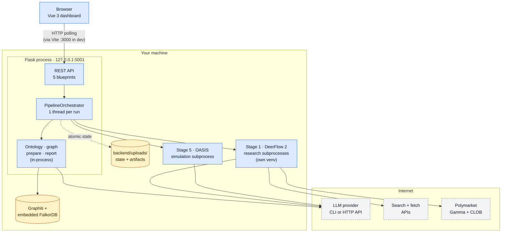

**Ports.** In development, the browser talks to the Vite dev server on `:3000`, which proxies `/api` to Flask. After `npm run build`, Flask serves the built UI itself, so everything is on `http://localhost:5001`.

**Who calls the LLM.** Model calls leave the machine through three separate transports:
- DeerFlow's model factory, for research;
- the backend's `LLMClient`, for ontology, graph extraction, event config and the report;
- the OASIS model adapter, for simulated agents.

**Market calls.** The report stage also re-quotes Polymarket prices.

| Component | Technology | Where in the code | Responsibility |
|---|---|---|---|
| Dashboard | Vue 3.5 · Vite 7 · vue-router · d3 · axios | `frontend/src/` | One view at `/`: the prompt form, stage timeline, run vitals, five result tabs, run history and settings. Polls the API. |
| API and orchestration | Flask (threaded) · Python 3.12 · uv | `backend/app/api/` · `backend/app/services/pipeline_orchestrator.py` | Admission and preflight; the six-stage state machine; cancel, resume, continue and fork; artifact manifests; the health gate |
| Research | DeerFlow 2 super-agent harness (LangChain / LangGraph), in its own venv | `deerflow_bridge/` → assembled into `deer-flow/` | Stage 1: evidence lanes, actor dossier, synthesis, judges, structured extraction, search/fetch/market tools, skills |
| Knowledge graph | graphiti-core 0.29.2 · falkordblite (embedded FalkorDB) · sentence-transformers `paraphrase-multilingual-MiniLM-L12-v2` | `backend/app/services/graph_builder.py` · `backend/app/services/graphiti_client/` | Stages 2–3; retrieval for Stages 4 and 6 |
| Simulation | [OASIS](https://github.com/camel-ai/oasis) (CAMEL-AI) | `backend/app/services/simulation_*.py` · `backend/scripts/run_parallel_simulation.py` | Stages 4–5: cast, roles, configuration and the dual-platform run |
| Report | ReportAgent · forecast extractor · report lint · visualizer (Plotly + kaleido, matplotlib) · pandoc + XeLaTeX | `backend/app/services/report_agent.py` · `forecast_extractor.py` · `report_lint.py` · `report_visualizer.py` | Stage 6, the publication gate and exports |
| LLM access | `LLMClient` (CLI or OpenAI-compatible HTTP) · DeerFlow model factory · OASIS model adapter | `backend/app/utils/llm_client.py` · `deerflow_bridge/config.yaml` · `backend/app/utils/oasis_llm.py` | Retries, circuit breakers, optional fallback provider, token and cost metering |

> **Naming heritage.** The code base grew out of [MiroFish](https://github.com/666ghj/MiroFish), which stored its graph in Zep Cloud. Names like `zep_tools.py`, the `ZEP_*` settings and `mirofish_<id>` graph IDs survive from that era. All of them now refer to the local Graphiti graph.

### Request lifecycle

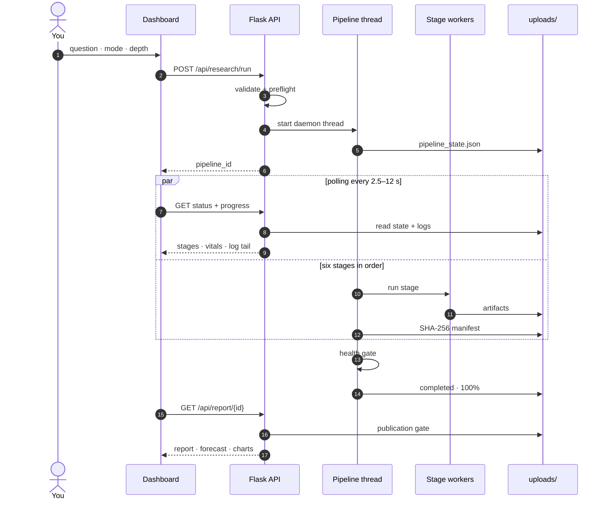

1. **Admission.** `POST /api/research/run` validates the body: `prompt`, `mode` (`full` or `research_only`), `depth` (`quick`, `standard` or `deep`), `max_rounds`, `language` and `model`. It then runs an **offline preflight** that checks:
   - the graph backend is importable;
   - the provider key or CLI is present;
   - the DeerFlow runtime and the research model's credentials exist.

   Any problem comes back as a `400` with a list of fixes, before anything is spent.
2. **Start.** The orchestrator:
   - creates `pipe_<12 hex>` and writes `pipeline_state.json` atomically;
   - pins the run's policies, such as the actor-intelligence contract, the seed count and whether the simulation may influence probabilities;
   - starts a daemon thread.

   The response is `{success, data: {pipeline_id, task_id, mode, status}}`. Concurrent runs are not capped; each run gets its own thread.
3. **Observation.** The dashboard polls two endpoints. There are no websockets or server-sent events.
   - `GET /api/research/status/<id>` returns the pipeline state plus a computed `live` block: elapsed time, ETA, heartbeat age, whether the owner process is alive, spend and budget.
   - `GET /api/research/<id>/progress` returns the merged research logs.

   Polling starts every 2.5 s, backs off ×1.5 up to 12 s while nothing changes, and pauses while the browser tab is hidden.
4. **Execution.** The pipeline thread runs the stages in order. Every progress update doubles as a cancellation point and a provider-outage checkpoint. When a stage completes, its artifacts are hashed into `handoff/manifest.json`.
5. **Completion.** After the report, the optional multi-seed ensemble runs, then the [health gate](#trust-and-quality-guarantees) decides whether the run is `completed`.
6. **Delivery.** The report, forecast, charts, Markdown and PDF are served only through the **publication gate**, which re-checks the audited SHA-256 hashes on every read.

### Pipeline lifecycle, state and resume

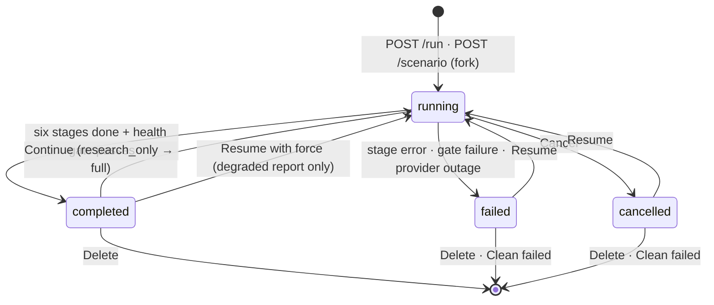

| Action | How | What happens |
|---|---|---|
| **Cancel** | Cancel button · `POST /api/research/<id>/cancel` | Sets the run's cancel event. Research subprocess groups are killed within about 1 s. The simulation is stopped at the next 5 s poll (SIGTERM, then SIGKILL after 10 s). Stages that already finished stay completed. |
| **Resume** | Resume button · `POST /api/research/<id>/resume` | Keeps the same pipeline ID and paths and re-runs preflight. Each stage is reused only if the checks in the next table pass; otherwise the run restarts from that stage. |
| **Continue** | "Continue to full pipeline" · `POST /api/research/<id>/continue` | Turns a completed research-only run into a full run. The research is reused if its sealed contract still validates. |
| **Fork (what-if)** | API only · `POST /api/research/<id>/scenario` | Creates a new pipeline that shares the base run's research, ontology and graph, applies a scenario overlay at PREPARE, then re-runs the simulation and report. |
| **Delete / Clean** | History drawer · `DELETE /api/research/<id>` · `POST /api/research/clean` | Removes `uploads/pipelines/<id>/`. Projects, simulations and reports are kept; graphs no run references are garbage-collected (the 5 newest are always kept). Clean deletes failed and cancelled runs, but skips any that forks depend on. |

**What a resume can reuse:**

| Stage | Reused when… | Otherwise |
|---|---|---|
| Research | v3: the run's phases under `handoff/v3/` are reused, and the attempt continues where it stopped. Legacy: the sealed research contract (`research_contract_manifest.json`) matches byte for byte and the report judge passed | Legacy: re-run only the global synthesis from the sealed lane evidence (`evidence_synthesis_manifest.json`) if it exists. Otherwise re-run the lanes, each resuming from its own checkpoint. At most 3 tool-budget "epochs" (resume attempts) per pipeline. |
| Ontology | the project already has an ontology | regenerate it |
| Graph | stage artifacts match their hashes, the actor seed readback still matches, and the graph contains entities | rebuild into a new graph ID |
| Prepare | manifest hashes match and the sealed simulation config validates | create a new simulation ID |
| Run | Prepare was reused, and the old simulation completed: an end marker on every platform, a valid `run_summary.json`, and a matching config seal | run the simulation again |
| Report | the previous report is not FAILED, its manifest and charts validate, and pipeline health allows reuse | write a new report |

**Durable state** (all under `backend/uploads/`):

| Path | Contents |
|---|---|
| `pipelines/<pipe_id>/pipeline_state.json` | The authoritative run record: status, stages, IDs, options, pinned policies, heartbeat. Written atomically. |
| `pipelines/<pipe_id>/run.json` | Reproducibility snapshot: git SHA, DeerFlow ref, the models resolved for each stage (secrets redacted) |
| `pipelines/<pipe_id>/handoff/` | Stage 1 output and inter-stage artifacts, `manifest.json` (SHA-256 per artifact), `research_contract_manifest.json` |
| `pipelines/<pipe_id>/run_telemetry.json` | Token and cost accounting, cumulative across attempts |
| `projects/<project_id>/` | The project record: ontology and `graph_id` |
| `graphiti_db/` | Embedded FalkorDB (`falkor.db`) and the embedding cache |
| `simulations/<sim_id>/` | Profiles, config and seals, action logs, SQLite databases, world-state trajectory, `run_summary.json` |
| `reports/<report_id>/` | `full_report.md`, `forecast.json`, `final_audit.json`, `charts/`, language variants, PDFs |
| `pipelines/_forecast_ledger/` | Forecast ledger and market-resolution records |

**Crash recovery.** On startup, the backend reconciles runs a previous process left `running`:
- If the owner process is gone (judged by heartbeat), the run is marked `failed`. If its report had already been written, it is marked `completed` with *degraded* health instead.
- Leftover research processes are terminated.
- A run whose last heartbeat is less than 120 s old stays `running` until it goes stale. After a crash, wait two minutes before resuming.

### What each stage reads

| Artifact | Written by | Read by |
|---|---|---|
| `handoff/research_report.md` | Stage 1 (v3 section writers, or the legacy global synthesis) | Ontology · Graph (when there is no dossier, or `GRAPH_CHUNK_SOURCE=both`) · Prepare · Report |
| `handoff/actor_dossier.md` | Stage 1 Track B (legacy engine only) | Ontology · Graph (the default chunk source) |
| `handoff/actors.json` (sealed `actor-intelligence/v1` under legacy; report-grounded and unsealed under v3) | Stage 1 extraction | Ontology (a bounded projection) · Graph (deterministic seed, chunk filter, pruning core) · Prepare (cast, context, roles) · Report |
| `handoff/sources.json` | Stage 1 | Prepare (the source-bound public world) · Report (`[S#]` citations) |
| `handoff/timeline.json` | Stage 1 extraction | Prepare (dated events) · Report (chronology, timeline chart) |
| `handoff/quantitative.json` · `contested.json` | Stage 1 extraction | Report (metric trajectories, contested claims) |
| `handoff/prediction_markets.json` · `market_price_history.json` | Stage 1 | Report (market pack, anchoring, price-history charts) |
| `handoff/ontology.json` | Stage 2 | Graph |
| Graph `mirofish_<id>` · `handoff/graph_priors.json` | Stage 3 | Prepare (entity matching, principal ordering) · Report (retrieval tools) |
| `simulations/<sim_id>/…` | Stages 4–5 | Report (diagnostic signal pack, simulation tools, world-state chart) |

### Code map

| Path | Responsibility |
|---|---|
| `backend/run.py` | Entry point. Validates config, starts Flask on `127.0.0.1:5001`, and optionally starts the resolution-monitor scheduler. |
| `backend/app/__init__.py` | App factory: CORS, auth gate, redacted request logging, blueprints, built-SPA serving, startup reconciliation |
| `backend/app/config.py` | Every setting (from `.env`, which overrides the shell) and the provider catalogue |
| `backend/app/api/` | Blueprints: `research.py` (pipelines), `graph.py`, `simulation.py`, `report.py`, `settings.py`, and `sdk.py` (optional `/api/v1`) |
| `backend/app/services/pipeline_orchestrator.py` | The six-stage state machine, research launcher, reuse and resume logic, health gate and multi-seed ensemble |
| `backend/app/services/ontology_generator.py` | Stage 2 |
| `backend/app/services/graph_builder.py` · `graphiti_client/` · `graph_pruner.py` · `zep_entity_resolver.py` | Stage 3 graph build on Graphiti + FalkorDB |
| `backend/app/services/zep_tools.py` · `zep_entity_reader.py` | Graph retrieval for ReportAgent and PREPARE |
| `backend/app/services/actor_context.py` · `actor_role_prompt.py` · `oasis_profile_generator.py` · `simulation_config_generator.py` · `simulation_manager.py` | Stage 4 |
| `backend/app/services/simulation_runner.py` · `simulation_ipc.py` · `worldstate.py` · `decision_channel.py` · `agent_dynamics.py` · `backend/scripts/run_parallel_simulation.py` | Stage 5 |
| `backend/app/services/report_agent.py` · `forecast_extractor.py` · `report_lint.py` · `report_visualizer.py` · `exec_brief.py` | Stage 6 |
| `backend/app/services/ensemble.py` · `backtest.py` · `forecast_ledger.py` · `resolution_autorun.py` | Multi-seed pooling, scoring, forecast ledger, monitor scheduler |
| `backend/app/utils/` | `llm_client.py` · `oasis_llm.py` · `sim_timeline.py` · `actors.py` · `prediction_markets.py` · `telemetry.py` · `atomic.py` · `security.py` … |
| `backend/app/mcp/` | stdio MCP servers (`kg_server.py`, `sim_server.py`) that DeerFlow can call |
| `deerflow_bridge/` | The Stage 1 driver `deerflow_research.py`, research engine v3 (`linear_research.py` + `research_gateway.py`), search/fetch/market tools, the budget ledger, skills, patches and `config.yaml` |
| `frontend/src/` | `views/ResearchView.vue` · `components/research/*` · `components/GraphPanel.vue` · `api/*` · `utils/*` · `i18n.js` |
| `drf2/` | Optional, not-yet-live ("pre-cutover") DeerFlow-2-native re-architecture ([details](#deerflow-2-integration-and-the-drf2-target)) |

---

## Stage-by-stage deep dive

### Stage 1 · Research (DeerFlow 2)

Stage 1 turns your question into a sealed **research contract**: a long-form dossier plus the structured data every later stage consumes.
- It is the only stage that browses the web.
- It was also by far the most expensive stage: the project's own cost forensics attributed about 96% of token spend to research under the legacy engine ([research-stage optimization notes](docs/RESEARCH_STAGE_OPTIMIZATION.md)). Research engine v3 was built to fix that.

Stage 1 has two engines. The orchestrator picks one per pipeline and passes it to the research subprocess explicitly.

| Engine | Selected by | Shape |
|---|---|---|
| **v3** *(default)* | `RESEARCH_ENGINE=v3`, or unset (`linear` is an alias) | One bounded, resumable research lane: plan → per-question agents → gap rounds → section writers → checks → structured extraction. `deerflow_bridge/linear_research.py` + `deerflow_bridge/research_gateway.py`. |
| **legacy** | `RESEARCH_ENGINE=legacy` (aliases `deerflow`, `agentic`) | The DeerFlow 2 multi-pass agent loop: three evidence lanes, a Track B actor dossier and a judged global synthesis (described [below](#legacy-engine-research_enginelegacy)). |

Evidence-lane, global-synthesis and extract-only invocations always use the legacy engine. So does a pipeline whose pinned actor policy requires the sealed `actor-intelligence/v1` plane (for example one admitted before v3 existed); v3 writes a report-grounded, unsealed `actors.json`, and v3 admissions pin the actor plane as not required.

#### Research engine v3 (default)

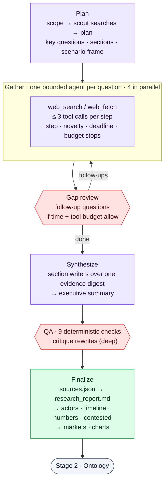

**How it works**
- **Plan.** A scope call and a few scout searches feed one planning call. It returns the key intelligence questions (KIQs), the report outline, the canonical scenario frame (names and weights) and the named actors. If the model is unreachable, a deterministic template plan is used, one bounded re-plan is tried before gathering, and the run is flagged as degraded.
- **Gather.** Each KIQ gets its own tool agent, seeded with search results, that can call `web_search` and `web_fetch`. An agent stops when it writes its notes, reaches its step budget, finds no new source for two steps, nears the phase deadline (keeping time for its final notes), or reaches the budget reserve. Fetched pages are stored once and returned as focus-ranked passages.
- **Gap rounds.** A review call proposes follow-up questions for what is still missing. A round runs only if the remaining time and tool budget can serve it.
- **Synthesize.** Section writers work in groups over one shared evidence digest, then the executive summary is written. A reply cut by its output cap is retried once with a wider cap and otherwise trimmed to its complete paragraphs.
- **Check.** Nine deterministic checks run on every report: section order, minimum length, citation density, the canonical scenario block, scenario weights, stale citations, dropped sections, error markers and complete sections. At deep depth a critique pass also rewrites sections with substantive problems.
- **Finalize.** `sources.json` is written before `research_report.md`, then actors, timeline, quantitative and contested facts are extracted, followed by prediction markets and charts.

**Prompt caching and token efficiency**
- Every model call is laid out as `[fixed system prompt][run brief][shared context][task]`, so sibling calls share a byte-identical prefix. Agent conversations are append-only, with the same tool schema bound on every call, and a small priming call warms the provider cache before each parallel fan-out.
- With GLM (the default model), caching is implicit. Each call sets thinking, `reasoning_effort` (low for agents and JSON, high for writers) and an output cap (6k / 16k / 20k tokens; 32k for extraction).
- With Claude, a short acknowledgement turn closes the shared context so cache breakpoints land on it.
- Usage is reported as `[usage] tokens in=… out=… cached=…` lines, which the pipeline's telemetry and spend records read.

**Accuracy**
- **Evidence tags.** A finding is **VERIFIED** only if every number in it appears on the page it cites, with percentages matched only to percentages and power, energy and currency figures only to the same unit class. **REPORTED** marks a finding that rests on a search snippet or an unfetched source. **UNVERIFIED** marks a number that is not on the cited page; writers must not state it as fact.
- **Citations.** An agent may cite only sources it was shown. `[S#]` markers are renumbered to be positional into `sources.json`, and the References section equals the cited set.
- **Scenarios.** The canonical scenario block is rendered by code, in the format the forecast parser reads, and restated or invented probabilities in the prose are corrected or flagged.
- **Untrusted text.** Web text travels inside `BEGIN/END UNTRUSTED EVIDENCE DATA` delimiters, and a precise, linear-time filter removes instructions addressed to a model.

**Reliability**
- Phases are saved under `handoff/v3/` and bound to the run's identity, so a resumed attempt continues where it stopped. Questions cut short by a deadline, the budget or an unusable reply are researched again on resume.
- Every provider call has a deadline-clipped timeout. The gateway retries transient errors with backoff, switches to the fallback model after a quota error, and disables SDK-level retries so there is one retry policy.
- Exit codes: `0` means a report was written, with any degradations listed in `meta.json` under `research_quality.degradation`. `2` is a resumable failure: the provider never answered, no sourced evidence was found, or an outage left fewer than half of the planned questions researched. `3` is a failed preflight.

**Presets**

| Depth | Key questions | Gap rounds × follow-ups | Agent steps | Searches / fetches (run) | Time plan |
|---|---|---|---|---|---|
| `quick` | 4 | none | 5 | 30 / 24 | 20 min |
| `standard` | 7 | 1 × 3 | 7 | 70 / 50 | 45 min |
| `deep` | 10 | 2 × 4 | 9 | 140 / 110 | 90 min |

v3 plans its wall clock at the smaller of the preset's time plan and 0.85 × the watchdog budget, so it finishes before the watchdog fires. Every preset value can be changed with the `RESEARCH_LINEAR_*` settings documented in `.env.example`.

**Live validation** (GLM-5.3, September 2026, one question at all three depths)

| Depth | Wall time | Model calls | Input / output tokens | Served from cache | Questions | Facts (verified) | Sources | Quality score |
|---|---|---|---|---|---|---|---|---|
| quick | 9 min | 40 | 222k / 78k | 78% | 4 | 48 (22) | 25 | 0.64 |
| standard | 31 min | 94 | 693k / 123k | 81% | 10 | 116 (69) | 34 | 0.69 |
| deep | 39 min | 155 | 1.45M / 244k | 81% | 17 | 194 (106) | 65 | 0.73 |

#### Legacy engine (`RESEARCH_ENGINE=legacy`)

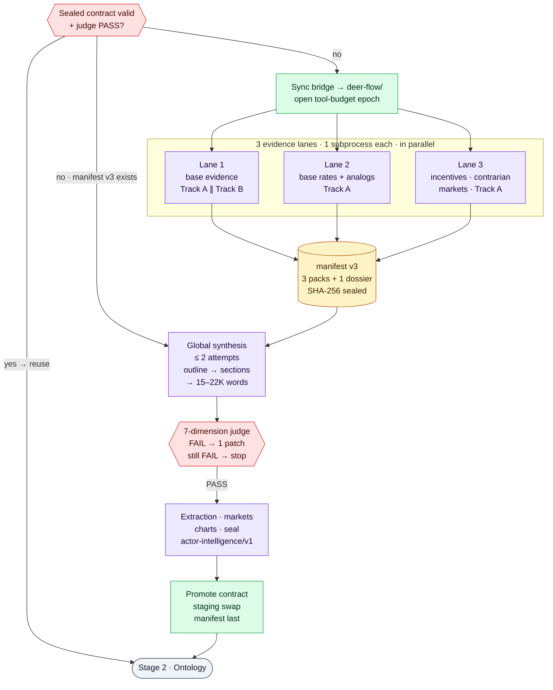

**How a legacy run is organized**

- **Isolation.**
  - DeerFlow runs in its own Python 3.12 virtualenv (`deer-flow/backend/.venv`), in subprocesses that each own a process group. Its LangChain/LangGraph dependencies therefore never mix with the backend's.
  - The question is passed through a private temp file (mode 0600), so it never appears in the process list.
  - Before every research run, the orchestrator re-syncs any changed bridge files into `deer-flow/`, compared by content hash. The skill sync fails closed.
- **Three evidence lanes** (`RESEARCH_PARALLEL_TRACKS=3`).
  - **Lane 1** gets your question unchanged and gathers the base evidence.
  - **Lane 2** looks for base rates, reference classes and historical analogs.
  - **Lane 3** looks at actor incentives, the contrarian case and market pricing.

  Each lane is an evidence-only subprocess that writes `evidence_pack.md` and `sources.json` to `handoff/track_<k>/`. Lanes 2 and 3 may fail without stopping the stage; lane 1 is mandatory.
- **One shared actor plane** (Track B, `DEERFLOW_DUAL_TRACK=true`). It runs only inside lane 1, concurrently with that lane's evidence track (Track A), in five steps:
  1. map the actor landscape;
  2. run a cast-wide completion pass over the 17 dimensions below;
  3. synthesize the dossier without tools;
  4. apply a 10-dimension judge, allowing up to 2 refinements;
  5. run a deterministic audit that checks every claim is tied to a source.

  If the dossier fails, the stage fails. It never falls back to an unaudited cast.
- **Sealing.** `evidence_synthesis_manifest.json` (v3) records the three evidence packs, their source ledgers and the single actor dossier, with its coverage and judge files, all with SHA-256 hashes.
- **Global synthesis.** A fresh subprocess, with no sub-agents and at most 2 attempts, does the following in order:
  1. writes an outline;
  2. drafts sections with up to 4 parallel writers;
  3. stitches them together and adds an executive summary;
  4. enforces a 15,000–22,000-word length gate (it re-expands if too short and fails if over the hard maximum);
  5. finalizes citations;
  6. runs a **7-dimension report judge**. A FAIL with listed gaps gets one targeted patch and a re-judge; an explicit FAIL stops the stage.
- **Wrap-up.** The same subprocess then:
  - extracts structured data (`actors.json`, `timeline.json`, `quantitative.json`, `contested.json`);
  - refreshes the Polymarket snapshot and its 90-day price history;
  - renders research charts;
  - seals the actor contract.
- **Promotion.** The contract files are copied to a staging directory and swapped into `handoff/`, with a rollback copy kept. `research_contract_manifest.json` is written **last**. The parent process then recomputes every actor receipt, claim and lineage hash ("reception") before Stage 2 may start.

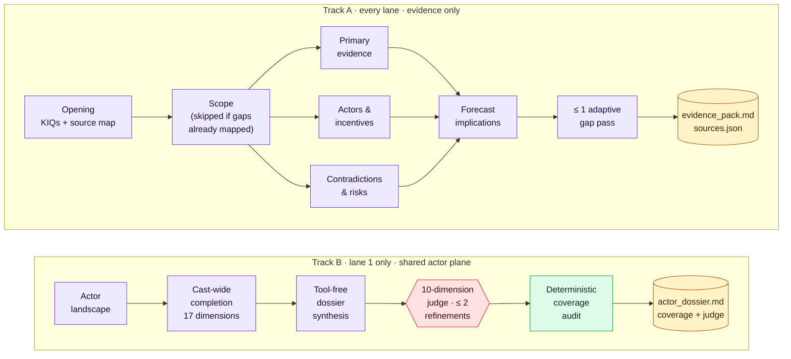

**Inside a lane.** A lane follows a staged multi-pass protocol:
1. **Opening.** Drafts the key intelligence questions (KIQs) and a source map.
2. **Scope.** Skipped when the opening already produced a complete gap ledger.
3. **Three parallel passes:** primary evidence; actors and incentives; contradictions and risks.
4. **Forecast implications.**
5. **At most one adaptive gap-closing pass.**

Scoped sub-agents (`scoped-researcher`) do the gap-closing and actor-research work. They are capped at 3 per lane and 9 across the machine.

**The 17 actor dimensions.**
- **Who the actor is:** identity & history · values & worldview · incentives · motivations · capabilities · constraints · operational preferences.
- **Who they deal with:** alliances · opponents & competitors.
- **How they decide and act:** decision rights, process & triggers · current actions · future plans · investments & capital allocation.
- **What to expect from them:** track record · likely actions · red lines · knowledge state.

Every claim carries:
- the time it applies to;
- its epistemic status and a confidence level;
- its dependencies, contradictions and qualifiers;
- an exact quote or span from a fetched source.

A cell with no support becomes a **typed gap**, not an invented fact.

**The DeerFlow harness.** Each subprocess assembles a LangChain agent from the model, the tools, four skills and an ordered middleware stack. The skills are `deep-research`, `actor-ontology-research`, `prediction-markets` and `forecast-visuals`.
- Context summarization triggers at 80K tokens and keeps the most recent 16K.
- Title generation and long-term memory are disabled: a headless run never displays a title, and memory would leak between runs.
- Claude prompt caching is enabled for the research model; set `DEERFLOW_CLAUDE_PROMPT_CACHE=0` to disable it.
- Patched middleware resets per-run tool-call counters, so later passes aren't starved.

**Tools, sources and budgets**

| Tool | Backends (in priority order) | Notes |
|---|---|---|
| `web_search` | Serper → Tavily → Firecrawl v2 `/search` → keyless DuckDuckGo, depending on which key is set | Results cached for 6 h (200 MB) |
| `web_fetch` | Firecrawl v2 `/scrape` (if keyed) → Jina Reader → Exa (if keyed) → direct HTTP (opt-in) | Circuit breaker (5 failures → 120 s pause); cached 72 h (500 MB); Firecrawl reuses pages up to 48 h old |
| `prediction_market_search` | Polymarket Gamma API (no key) | Relevance-gated market candidates, recorded per lane |
| Knowledge-graph MCP | The backend graph over stdio MCP | Only when a research run starts with an existing graph (fork / continue / resume) and `RESEARCH_MCP_KG=true`. The server registration (`deerflow_bridge/extensions_config.json`) is a template: the orchestrator fills in this checkout's paths and the backend's Python when it deploys the file to `deer-flow/`. |

- **Tool-budget ledger.** A SQLite ledger shared by all lanes caps each attempt (an "epoch") at 1,800 tool attempts, 900 searches (360 per lane) and 450 fetches (180 per lane). A pipeline gets at most 3 epochs.
- **Machine-wide leases.** A second SQLite table caps concurrent research model streams (12) and harness sub-agents (9) across every pipeline on the machine.
- **Firecrawl limits.** Firecrawl calls are rate-limited and capped per process: 5 results per search, 300 searches and 400 fetches per process, and backoff on HTTP 429 responses.

**Depth and time budgets**

| Depth | What it does | Watchdog budget¹ |
|---|---|---|
| `quick` | Short protocol, for trying the pipeline end to end | 900 s × 1.5 ≈ 23 min |
| `standard` | Middle ground | 7,200 s × 1.5 = 3 h |
| `deep` *(default)* | The full multi-pass protocol above, plus multi-part synthesis (15–22K words) | 21,600 s × 1.5 = 9 h |

¹ The ×1.5 multiplier applies whenever dual-track, sub-agents or fan-out is enabled, and all three are on by default. Override the budget with `DEERFLOW_RESEARCH_TIMEOUT`. The v3 engine uses the same watchdog budget as an upper bound but plans its own, much shorter time (see its presets above).

**When things go wrong**

- **Watchdog.** It kills a lane's process group when the lane's budget runs out. A timed-out lane 2 or 3 is salvaged if it already wrote its evidence pack; a timed-out lane 1 fails the stage.
- **Synthesis retry.** Global synthesis gets one retry in a clean directory. Logs of failed attempts are kept under `handoff/research_attempts/`.
- **Error guards.** They reject LLM error text and reports that are too short. `deep` synthesis fails closed instead of stitching raw pass notes together.
- **Outage breaker.** Provider failures feed a run-level breaker. After 10 consecutive failures, the run fails fast and can be resumed once the provider recovers.
- **Resume.** A resume reuses the sealed contract. Otherwise it re-runs only the global synthesis, or re-runs the lanes from their per-lane checkpoints ([details](#pipeline-lifecycle-state-and-resume)).

**The research contract** (`backend/uploads/pipelines/<id>/handoff/`)

| File | Contents |
|---|---|
| `research_report.md` | The judged dossier, followed by a market section and a visual annex |
| `research_report_judge.json` | The 7-dimension scorecard, bound to the report's exact bytes |
| `actor_dossier.md` · `actor_dossier_coverage.json` · `actor_dossier_judge.json` | The Track B dossier, its 17-dimension coverage ledger, and the judge verdict |
| `actors.json` · `actor_intelligence_lineage.json` | The structured cast (`actor-intelligence/v1`) and its lineage hashes |
| `sources.json` | The ledger of fetched sources (URLs, S1–S4 tiers, receipts) |
| `timeline.json` · `quantitative.json` · `contested.json` | Dated events · numeric claims and trajectories · contested claims |
| `prediction_markets.json` · `market_price_history.json` | Polymarket snapshot · daily price series for the last 90 days |
| `charts.json` · `charts/` | Research charts |
| `evidence_synthesis_manifest.json` · `research_contract_manifest.json` | Sealed index of the lanes · the final contract (written last) |
| `track_<k>/` | Each lane's evidence pack, sources, checkpoint and log |
| `research_progress.log` · `meta.json` · `research_budget.json` | Live log · status and metadata · budget telemetry |

> **The research contract under v3.** A v3 run writes the same top-level files (`research_report.md`, `sources.json`, `actors.json`, `timeline.json`, `quantitative.json`, `contested.json`, `prediction_markets.json`, `charts.json`, `meta.json`, `research_progress.log`) plus its resumable phase state under `v3/`. It writes no Track B dossier, lane packs, judge scorecard or contract manifest. On single-lane runs the pipeline's research lint only reports; it never rewrites the dossier, so citations stay positional.
>
> The earlier experimental linear engine v2 was replaced by v3 in September 2026; `RESEARCH_ENGINE=linear` now selects v3, and `RESEARCH_LINEAR_MODE=salvage` is ignored with a warning. The GLM-5.3 data-center demo was produced by v2 in salvage mode.

### Stage 2 · Ontology

Stage 2 designs the vocabulary of the knowledge graph for this particular question.

- **Inputs:**
  - the actor dossier and the research report, sanitized, wrapped as untrusted data, and sampled down to at most 120K characters;
  - your question;
  - a bounded projection of the sealed cast: up to 25 actors, each with ID, name, type, tier, aliases and one source-bound claim per dimension, 12K characters at most;
  - a "seed block" listing the researched actor types and relationship names to keep.
- **One LLM call**, returning JSON.
  - A bilingual keyword test picks either the `social_opinion` or the `general_forecast` template.
  - Invalid JSON gets one retry at a lower temperature.
  - A second call happens only if the first produced no entity types.
- **Deterministic post-processing:**
  - at most 10 entity types and 10 relationship types;
  - reserved attribute names renamed;
  - every entity type tagged with an archetype (plus a requested simulation tier), every relationship type with a family and a valence;
  - relationship endpoints reconciled;
  - Person/Organization fallback types added when the cast needs them.
- **Output:** `project.json` and `handoff/ontology.json`. On resume, an existing ontology is reused as is.

### Stage 3 · Knowledge graph

Stage 3 builds a temporal knowledge graph for the run. It uses [Graphiti](https://github.com/getzep/graphiti) (`graphiti-core` 0.29.2) on an embedded FalkorDB (`falkordblite`). Storage and embeddings are local; only entity and relation extraction goes to your configured LLM provider.

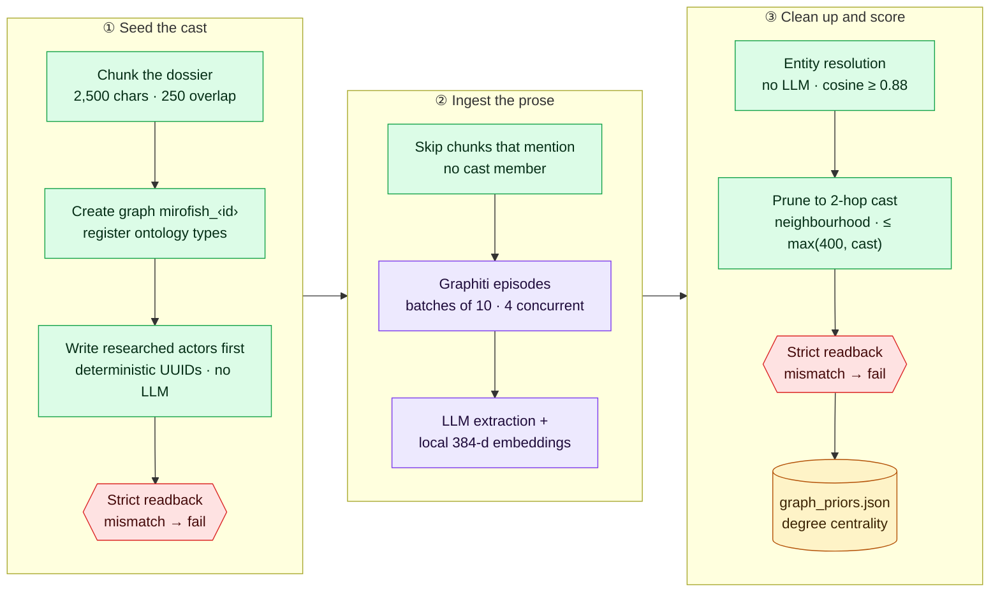

1. **Chunk.** The source text is split into 2,500-character chunks with a 250-character overlap. Embedded images are stripped, and each chunk is wrapped as untrusted data. `GRAPH_CHUNK_SOURCE` picks the source text:
   - `dossier_only` (default): the actor dossier, or the report if there is no dossier;
   - `report_only`;
   - `both`.
2. **Create.** The graph ID is `mirofish_<16 hex>`. It is both the FalkorDB graph name and Graphiti's `group_id`. The ontology is registered as typed Pydantic models.
3. **Seed the cast before any prose.** For a sealed `actor-intelligence/v1` cast, a deterministic plan (`actor-graph-seed-manifest/v1`) writes every actor, alias and researched relationship. There is no LLM involved. Each record gets:
   - a UUIDv5 identity;
   - claim hashes;
   - causal attributes: sign, strength, lag and validity window.

   A strict physical readback (`actor-graph-seed-readback/v1`) must then match the plan exactly.
4. **Ingest prose.**
   - Chunks that mention no cast member are skipped.
   - The rest become Graphiti episodes, in batches of 10 with 4 running concurrently, timestamped at the research as-of date.
   - Graphiti extracts and resolves entities and facts with your LLM, and embeds them locally with a multilingual MiniLM model (384 dimensions).
   - If more than 30% of chunks fail, the graph is marked *degraded*.
5. **Clean up.**
   - **Entity resolution** merges duplicates that share a label, match on name or alias, and have embedding cosine ≥ 0.88. It never merges two researched actors.
   - **Pruning** keeps the cast plus its 2-hop neighbourhood, capped at max(400, cast size) nodes.
   - Community detection is implemented but off by default.
6. **Verify and score.** The seed readback runs once more after all these changes. Alias-folded degree-centrality priors are then written to `graph_priors.json`.

**How later stages query the graph.** ReportAgent gets these retrieval tools:

| Tool | What it does |
|---|---|
| `insight_forge` | Splits a question into up to 5 sub-queries and runs hybrid BM25 + vector searches. Returns relationship chains with fact IDs, with optional point-in-time filtering. |
| `panorama_search` | Separates currently valid facts from expired or historical ones |
| `quick_search` | A single, fast edge search |
| `trace_cascade` | Causal paths between two entities (up to 6 hops), or an entity's neighbourhood (up to 4 hops), with sign, strength and lag |
| `simulation_outcomes` · `coalition_map` · `opinion_shift` | Deterministic aggregates over the simulation logs |
| `interview_agents` · `faction_brief` · `scenario_diff` | Conditional tools. Each needs, respectively, a live simulation environment, community detection, or a what-if report. |

- **Reranking.** Searches fuse rankings with Reciprocal Rank Fusion by default. `GRAPHITI_RERANKER=bge` switches on a local BGE cross-encoder instead.
- **MCP access.** The same graph is exposed to DeerFlow as a stdio MCP server (`backend/app/mcp/kg_server.py`), with tools `kg_search`, `kg_trace_cascade`, `kg_entity_summary`, `kg_get_entities`, `kg_centrality_priors` and `kg_graph_statistics`.
- **Cost controls.** Extraction is the graph stage's only LLM cost. The defaults bound it with: dossier-only input, 2,500-character chunks, the cast filter, at most 2 full attempts per chunk, a 900 s per-operation timeout, and an embedding cache.
- **No simulation → graph feedback by default.** Simulated activity written into the graph could later be retrieved as if it were an observed fact. If you enable feedback (`SIM_GRAPH_FEEDBACK=true`), failed writes go to a dead-letter queue that `backend/scripts/replay_zep_dead_letters.py` can replay.

### Stage 4 · Prepare

Stage 4 turns researched actors into simulation agents and the question's horizon into a timeline. Apart from one event-design call, it is deterministic.

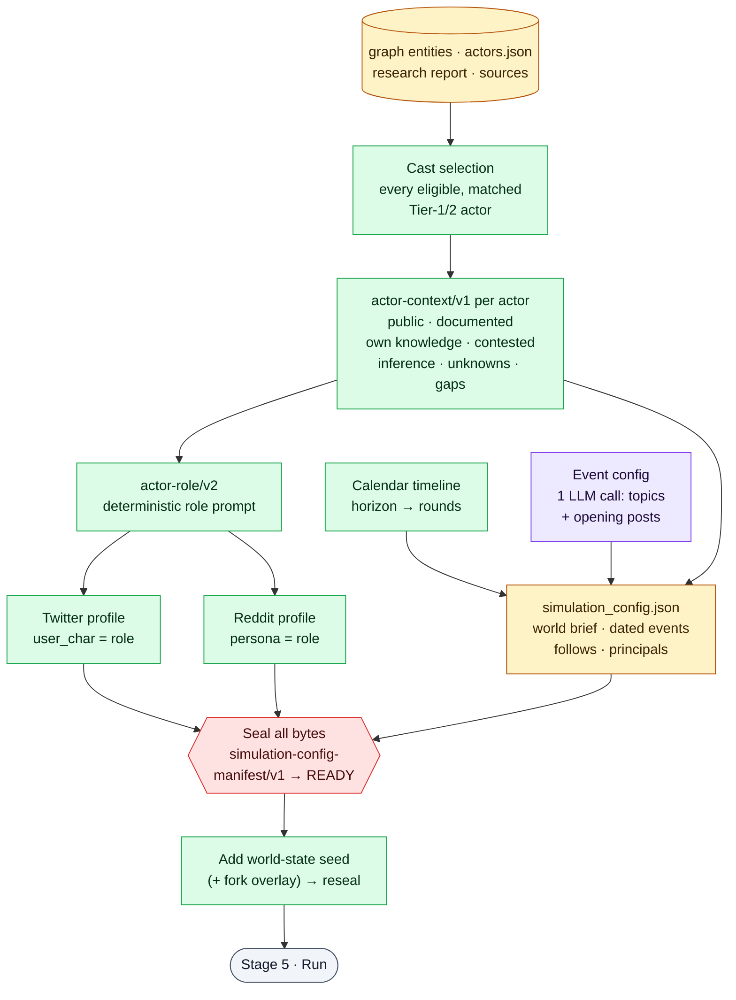

- **Cast.** Every eligible Tier-1/2 research actor that matches a graph entity becomes an agent, one per actor ID.
  - A graph entity that matches no researched actor is never cast.
  - An eligible actor the graph lost is restored from the dossier.
  - The research stage itself caps the cast at `ACTOR_CAST_MAX` (20) and demotes media outlets to context, so a default run simulates at most 20 actors.
  - Rule-generated "audience" agents are off by default (`SIM_AUDIENCE_AGENTS=0`).
- **Context packs** (`actor-context/v1`). Each actor's pack separates:
  - shared public evidence;
  - documented evidence *about* the actor;
  - the actor's own knowledge and beliefs;
  - contested items the actor can see;
  - analyst inference;
  - unknowns;
  - a six-field typed gap audit: `reason`, `attempted_queries`, `receipt_ids`, `result_ids`, `attempt_count`, `exhausted`.

  Only explicitly public, source-bound evidence enters the shared world. Analyst inference and the gap audit are sealed for accountability but never become agent knowledge.
- **Roles** (`actor-role/v2`). Each role prompt is compiled deterministically from the sealed evidence, within a 6,000-character budget. It covers:
  - identity and incentives;
  - capabilities and constraints;
  - plans and investments;
  - decision process, likely actions and red lines.

  Both platforms get this exact role:
  - Twitter's profile field `user_char` is the role, with newlines normalized.
  - Reddit's `persona` is the same role, with the legacy demographic fields left empty.
- **Simulation config.**
  - One LLM call designs the opening event configuration: hot topics, narrative direction and initial posts. Deterministic seed posts are the fallback.
  - Everything else is deterministic:
    - a public world brief;
    - neutral agent activity settings;
    - follow relationships;
    - researched events scheduled into the rounds containing their dates;
    - which agents are **principals**, meaning they act every round.
- **Seals.** `simulation-config-manifest/v1` binds the exact bytes of the config, profiles, role manifests, context packs and cast. The orchestrator then:
  - adds a world-state seed, plus the scenario overlay for a fork;
  - reseals and re-validates the config before Stage 5.

  A reused Prepare is validated read-only.

> Runs without a sealed actor contract (older runs, or runs with the contract disabled) take the **legacy path**: a ranked cast capped at `ACTOR_CAST_MAX`, LLM-written personas and LLM activity configs.

### Stage 5 · Simulation

Stage 5 runs [OASIS](https://github.com/camel-ai/oasis) in a single child process. That process drives Twitter and Reddit concurrently (two asyncio tasks in one event loop), and each round is one calendar period.

**From your question to rounds**

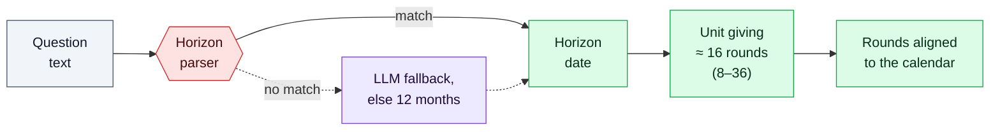

- **Horizon.** The parser tries, in order:
  1. an explicit date;
  2. an anchored period: "end of 2030", "Q3 2027", "H2 2027", "March 2027", "2035年底";
  3. a relative span: "in / within / next N days … years", "未来两年";
  4. a bare year: "by 2030" means 31 December 2030.

  If nothing matches, an LLM fallback tries. If that fails too, the default is 12 months.
- **Unit.** The unit is day, week, half-month, month, quarter or half-year.
  - The system picks the unit whose round count is closest to 16, among units yielding 8 to 36 rounds (the target is capped by `OASIS_DEFAULT_MAX_ROUNDS` and by any round cap you set). Ties go to the finer unit.
  - Horizons of 48 days or less use daily rounds, up to 48 of them.
  - Horizons beyond about 18 years use one round per year (a stride of two half-years).
  - An explicit round cap makes the unit coarser; it never cuts the horizon short.

Examples, for a research as-of date of 2026-09-27:

| The question says… | Horizon | Unit | Rounds |
|---|---|---|---|
| "in the next 3 weeks" | 2026-10-18 | day | 21 |
| "by end of 2026" | 2026-12-31 | week | 14 |
| "next 18 months" | 2028-03-27 | month | 18 |
| "by 2030" | 2030-12-31 | quarter | 17 |
| "by 2031" | 2031-12-31 | half-year | 11 |
| "by 2035" · "2035年底" | 2035-12-31 | half-year | 19 |
| "by 2050" | 2050-12-31 | half-year × 2 | 24 |

Round counts do not always grow with the horizon, because the unit switches at thresholds. That is why "by 2031" gets fewer, longer rounds than "by 2030".

**One round, on each platform**

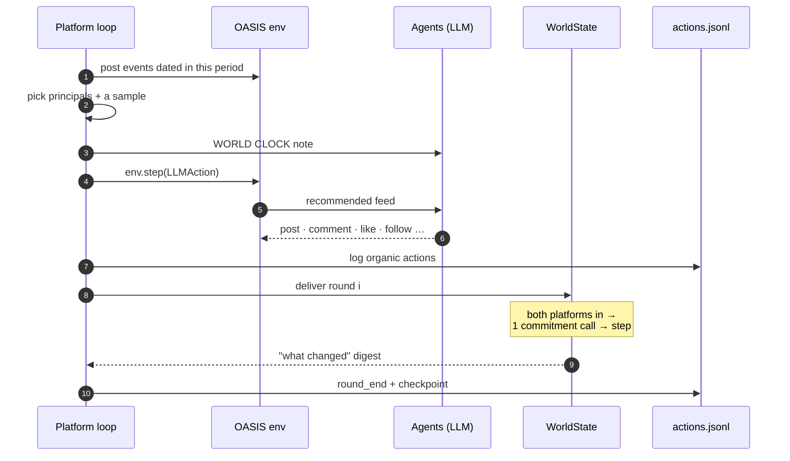

- **What agents know.** Each agent's system prompt is its sealed role, plus the shared world brief and the calendar vocabulary. For Reddit, the final prompt bytes are re-attested before the first action. Every round, agents also receive a **WORLD CLOCK** note containing:
  - the period's label and dates;
  - round *i* of *N*, the horizon, and how many periods remain;
  - the events confirmed for this period;
  - a qualitative "what changed last period" digest: fired events, the five most influential posts, and the direction of the leading trend. Numeric world-state shares are never shown.
- **Who acts.**
  - Every principal acts every round.
  - Other agents are sampled with a probability based on their activity and influence, and are more likely to act if they acted in the previous round.
  - With the neutral current configs every actor is equally influential. Principals are then chosen by rule: max(4, ⌈n/2⌉) of the n agents, or all of them when n ≤ 4.
- **What agents can do.**
  - On Twitter: create post, like, repost, quote, comment, follow, search posts, trend, do nothing.
  - On Reddit: create post, comment, like or dislike a post, like or dislike a comment, search posts, search users, trend, refresh, follow, mute, do nothing.
  - Recommendations come from a model-free recommender, which makes no extra LLM calls.
- **World state.** A shared WorldState advances once per paired round. After both platforms have delivered round *i*:
  - one batched LLM call reads the agents' commitments;
  - the state steps forward, with inertia scaled to the calendar unit and a base-rate entropy floor.

  The trajectory is saved to `world_state_trajectory.json` and charted in the report.
- **Monitoring and completion.**
  - A monitor thread in the backend tails the action logs every 2 s into `run_state.json`.
  - The pipeline polls every 5 s and stops a run that makes no round progress for 30 minutes.
  - Completion requires an end marker on every platform and a valid `run_summary.json`, which holds organic vs. seeded action counts, per-platform health and calendar coverage. A zero exit code alone is not trusted.
  - A checkpoint is written after every round. Resuming a simulation mid-run is opt-in (`SIM_RESUME=true`), and the rebuilt agents do not keep their conversation memory.
  - Afterwards, the child process stays alive for up to 60 idle minutes to answer interview requests over a file-based IPC mailbox.
- **Effect on the forecast.** By default (`SIMULATION_FORECAST_EFFECT=diagnostic_only`), the simulation feeds the report's analysis as clearly labelled scenario analysis, and **never** feeds its probabilities. A "hollow" simulation, where agents exist but produce no organic activity, marks pipeline health as *degraded*.

Output, in `backend/uploads/simulations/<sim_id>/`:
- `state.json`, the cast manifest and the `actor_context/` packs;
- `twitter_profiles.csv`, `reddit_profiles.json` and their role manifests;
- `simulation_config.json` and its seal;
- `twitter/actions.jsonl` and `reddit/actions.jsonl`, plus the two platform SQLite databases;
- `world_state_trajectory.json` and `decisions.jsonl`;
- `run_summary.json` and `simulation.log`.

`SIM_TEMPORAL_MODE=hours` restores the legacy news-cycle mode, in which an LLM picks 24–168 simulated hours.

### Stage 6 · Report and publication

Stage 6 writes the forecast, then tries hard to break it before anyone reads it.

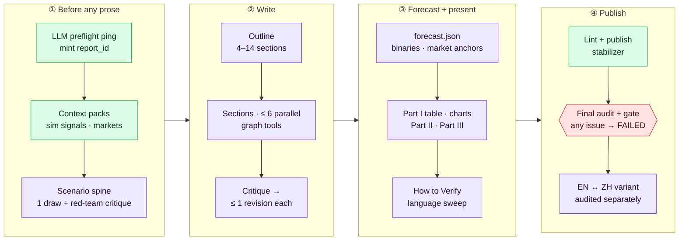

1. **Admission and context.**
   - A preflight ping checks that the LLM answers, and a `report_<12 hex>` ID is created.
   - It builds a **signal pack**: deterministic aggregates of the simulation, labelled as internal scenario analysis.
   - It builds a **market pack**: the research-time Polymarket snapshot, re-quoted live, with price deltas.
2. **Scenario spine, before any prose.**
   - One LLM draw proposes the scenarios (`REPORT_SPINE_SELFCONSISTENCY_K=1`).
   - One red-team critique then adds a residual ("other") scenario, caps overconfident peaks and enforces a contract of 2–5 scenarios.
   - Probabilities are floored at 3% and renormalized.
   - The spine is pinned into every later prompt, so the prose cannot drift from the numbers.
3. **Outline and sections.**
   - The outline has 4–14 sections. Up to 6 are written in parallel, each with a budget of about 12 graph-tool calls.
   - OpenAI-compatible providers (except MiniMax) use native tool calling. CLI providers, including the default `claude-cli`, use a ReAct text protocol.
   - Each section gets one critique and at most one revision.
   - A section that still fails becomes a placeholder, which later blocks publication.
   - Context slices such as prior sections, persona context and the world brief are sized to the active provider's context window (`ADAPTIVE_CONTEXT=true`), so large-window models see more.
4. **Forecast finalization** (`forecast.json`).
   - The spine is reused, and 10 or more binary forecasts are extracted from the **research dossier**. A contrarian top-up is added if the probabilities all cluster together.
   - Markets are re-quoted. One LLM call matches binaries to markets, accepting only **exact or near resolution-equivalent** matches.
   - If an anchored forecast differs from its market by more than 10 points without addressing the gap, one revision is attempted, and any remaining gap is disclosed.
   - Deterministic reconciliation keeps binaries consistent with the scenario partition and drops incomplete market anchors.
   - The forecast is appended to the ledger.
5. **Presentation.** Adds, in order: Part I (the binary-forecast table plus a Market Cross-Check), the charts, Part II (one LLM synthesis), Part III (the detailed sections), a "How to verify" section with resolution criteria for each scenario, and a language-purity sweep.
6. **Publication.** Four steps must all pass:
   1. Editorial lint.
   2. The publish stabilizer, at most 6 passes, repeated until the text stops changing. Each pass:
      - finalizes citations and the References section;
      - caps any source cited more than 20 times;
      - removes unsupported numeric sentences until citation coverage reaches at least 75%;
      - re-grounds quotations.
   3. A read-only final audit, written to `final_audit.json`.
   4. The publication gate.

   **Any** remaining issue marks the report FAILED; the pipeline itself stays resumable.
7. **Language variant.** Once the primary report passes, an English ↔ Chinese variant is translated section by section and audited separately. The primary report is never modified.

**Report anatomy**

```text
# Title
Part I    Binary forecasts: probability · resolution criteria · market anchor
          + Market Cross-Check (model vs. market, with divergence verdicts)
> Executive summary
Part II   Framework and holistic synthesis
Part III  Detailed analysis sections (charts placed inline)
Visual Annex (charts no section claimed) · How to Verify · References
```

**`forecast.json`** contains:
- the headline, horizon, confidence and key uncertainties;
- `scenarios[]`, each with a name, probability, drivers, resolution criteria, base-rate anchor and adjustment rationale;
- `binary_forecasts[]`, each with a statement, probability (0.02–0.98), resolution criteria and source, scenario membership, `market_anchor` and `market_influence`;
- quality blocks, including the citation audit, the binary-quality scorecard and the final gate result.

**Charts.** Charts are rendered without any LLM involvement into `reports/<id>/charts/`, with a `viz_manifest.json` index. Each is an interactive Plotly HTML file paired with a PNG, with a matplotlib fallback. Charts are served in a sandbox (CSP) and placed under the section they illustrate.

| Rendered by default (when the data exists) | Opt-in or conditional |
|---|---|
| Scenario probabilities · binary-forecast dot plot · model vs. market · event timeline · metric trajectories · technology shares · regional comparison · comparable forecast benchmarks · forecast revisions · world-state trajectory · market price history (anchored markets only) | `REPORT_META_CHARTS=1`: actor network and source-mix sunburst · what-if reports: base-vs-scenario comparison |

**Exports.**
- Markdown download.
- The language variant.
- **PDF**, built with pandoc + XeLaTeX with the CJK font auto-detected, and cached by content. It returns `409` if the report is not publishable and `503` if PDF export is disabled or fails.
- An **executive brief** and a **digest**, both deterministic with no LLM.

Every export is served only through the publication gate. The agent log (`/agent-log`, `/agent-log/stream`) follows the same rule: once a report has finished without passing the gate, its draft section text, raw LLM responses and ReACT thoughts are withheld (`draft_withheld: true`); while it is still generating, the log streams live.

### After the run: ensembles, ledgers and monitoring

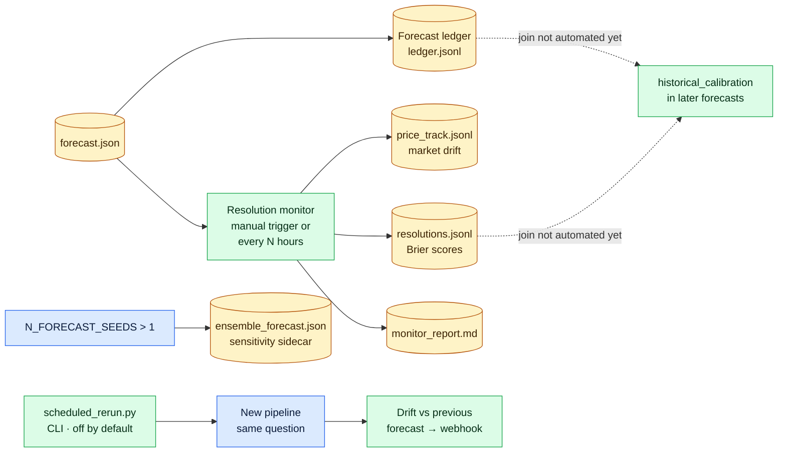

- **Multi-seed sensitivity** (experimental, off by default). Set `N_FORECAST_SEEDS` > 1 to enable it.
  - The run adds N−1 extra prepare → run → report lanes, with seeds `SIM_SEED + 7919·k`, running at most `ENSEMBLE_SEED_CONCURRENCY` (default 2) at a time. Each lane produces a full, gated report.
  - Their scenario probabilities are pooled in log-odds space into `ensemble_forecast.json`, together with spreads and an agreement score.
  - The primary report and forecast are never rewritten.
- **Forecast ledger.** Every finalized forecast appends its scenarios to `uploads/pipelines/_forecast_ledger/ledger.jsonl`.
- **Resolution monitor** (`backend/scripts/resolution_monitor.py`). For the 10 most recent reports, it:
  - re-quotes anchored markets into `price_track.jsonl`, flagging moves of 5 points or more;
  - records market resolutions with Brier scores in `resolutions.jsonl`;
  - lists binaries that need manual resolution;
  - writes `monitor_report.md`.

  You can run it from **Settings → Maintenance**, with `POST /api/research/resolution-monitor/run`, from the CLI, or every N hours via `RESOLUTION_MONITOR_AUTORUN_HOURS` (0 = off).
- **Calibration tooling.**
  - `backend/app/services/backtest.py` provides Brier score, log loss, calibration bins and the Murphy decomposition.
  - `backend/scripts/golden_eval.py` scores against resolved "golden" questions.
  - Joining resolutions back into the ledger, which is what would let later reports show `historical_calibration`, is **not automated yet**.
- **Scheduled reruns** (`backend/scripts/scheduled_rerun.py daemon|tick`, off by default). They re-run saved questions, record probability drift of 15 points or more, and can POST to a webhook. `scheduled_rerun.py diff <pipe_a> <pipe_b>` compares two runs.

---

## Trust and quality guarantees

The pipeline is built so that a finished run means something. Most of the weight rests on four mechanisms.

### 1. The actor-realism chain

Actor realism does not come from longer persona prompts. It comes from a sealed data path that runs from research all the way to the simulated agents:

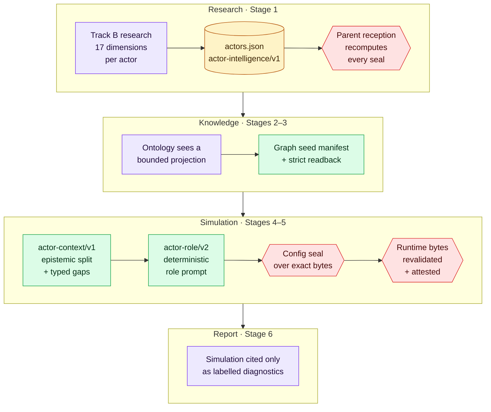

| Boundary | Contract | What is enforced |
|---|---|---|
| Research → parent | `actor-intelligence/v1` | Every claim is tied to a fetched source: a receipt, an exact quote or span, and a content hash. The parent recomputes the receipts, claim IDs, five behaviour families, coverage, roster and lineage hashes. Any mismatch fails the run before Stage 2 starts. |
| Ontology | bounded projection | The ontology LLM sees only canonical actor IDs, aliases, tiers and receipt-bound claims. It never sees free-form role, stance or brief fields. |
| Graph | `actor-graph-seed-manifest/v1` + `actor-graph-seed-readback/v1` | Actors and their relationships are written deterministically before any prose. Prose can enrich the graph but cannot replace them. This is checked after seeding, after all later changes, and whenever the graph is reused. |
| Context | `actor-context/v1` | Keeps public, documented, actor-private, contested, inferred and unknown information apart. Only public, source-bound evidence enters the shared world. |
| Role | `actor-role/v2` | The single source of each agent's behaviour, compiled without an LLM. |
| Runtime | `simulation-config-manifest/v1` | Config, profiles, roles, context and cast are sealed by their exact bytes. Both the parent process and the simulation child re-validate them before the first action. Reddit's final system messages are attested. |
| Report | `diagnostic_only` | Simulation output is cited as labelled scenario analysis. It is never treated as evidence or used as a probability input. |

All of these downstream checks are deterministic and add no LLM calls. Older runs without the sealed contract keep a documented legacy path. The full specification is in the [actor-intelligence architecture](docs/architecture/ACTOR_INTELLIGENCE_ARCHITECTURE.md).

### 2. No false success

A pipeline reaches `completed` only through the **health gate**.
- **Hard failures** mark the run failed (it stays resumable):
  - the report is missing, or every section is a placeholder;
  - `forecast.json` lacks scenarios or binary forecasts;
  - the report is under 2 KB;
  - `final_audit.json` is missing, stale, or does not match the SHA-256 of the files on disk.
- **Softer problems** mark the run *degraded*, but it still completes:
  - a hollow or truncated simulation;
  - a graph where more than 30% of chunks were skipped;
  - a failed prune;
  - failed simulation-feedback writes (the dead-letter queue).

Earlier hard gates apply as well: the research contract, actor reception, and the simulation's completion evidence.

### 3. Publish only what passed the audit

| Gate | What it checks | On failure |
|---|---|---|
| Research report judge | 7 quality dimensions over the exact dossier bytes | One targeted patch; then the stage fails |
| Actor dossier judge + coverage audit | 10 dimensions, plus claim-to-source coverage for every actor × dimension | The stage fails |
| Graph / Prepare / Run seals | Byte-exact manifests and readbacks | The stage fails |
| Publish stabilizer | Citations resolve to sources; at least 75% of claims are cited; no source is cited more than 20 times; quotes are verbatim; lint is stable | The report is FAILED |
| Final audit + publication gate | See below | The report is FAILED |
| API publication status | The audited SHA-256 hashes of `full_report.md` and `forecast.json` still match, re-checked on every read | `409`, with the reasons |
| Pipeline health gate | See [No false success](#2-no-false-success) | The pipeline is failed or *degraded* |

The final audit and publication gate check:
- **the scenario contract:** 2–5 scenarios, probabilities summing to 1 ± 0.015, a residual scenario, and resolution criteria;
- **consistency:** the prose agrees with `forecast.json`, and every binary forecast agrees with the scenarios;
- **leakage:** no simulation leakage into factual claims and no language contamination;
- **completeness:** no failed sections;
- **market anchors:** every market anchor is intact.

With `REPORT_PUBLISH_GATE=true` (the default), *epistemic* problems also block publication, alongside hard errors. For example, citation coverage below 75% blocks it.

### 4. Evidence decides; simulation and markets inform

- **Simulation.** Under the default `SIMULATION_FORECAST_EFFECT=diagnostic_only`, simulation and world-state outputs appear only as labelled analysis. They never reach the scenario spine or the binary probabilities.
- **Markets.** A Polymarket price is attached to a forecast only when an exact or near resolution-equivalent market exists. Otherwise the forecast is left unanchored, rather than being compared with a market that asks a different question.
- **Untrusted text.** Web content and research prose are sanitized and wrapped in explicit untrusted-data delimiters before every downstream model call. The test suite checks these boundaries (`backend/tests/test_prompt_injection_boundaries.py`).
- **Reproducibility.** `run.json` records the git SHA, the DeerFlow ref and the model resolved for each stage. Safety-relevant policies are pinned per run when it is admitted.

### 5. Checked numbers and citations (research engine v3)

- **Numbers.** A research finding is tagged VERIFIED only when each of its numbers appears on the fetched page it cites. Percentages must match percentages, and power, energy and currency figures must match the same unit class, so "15%" is not confirmed by a date's 15 and "176 GW" is not confirmed by "176 pages". Findings with a missing number are tagged UNVERIFIED and are never stated as fact.
- **Citations.** `[S#]` markers are positional into `sources.json`; an agent can cite only sources it was shown, and research lint never deletes, invents or truncates a marker.
- **Honest degradation.** Template plans, deterministic fallback sections, cut replies and failed extractions are listed in `research_quality.degradation`, and a run with no model output or no sourced evidence exits with a resumable failure instead of publishing.

---

## Requirements

| Requirement | Notes |
|---|---|
| **macOS or Linux** | `setup.sh`, `npm start` and the ops scripts are bash. `npm start`/`npm stop` also need `curl`, `lsof`, `ps` and `tail`. |
| **Node.js ≥ 20.19** | For the frontend. Vite 7 needs Node ^20.19 or ≥ 22.12. |
| **Python 3.12** | Both the backend venv and DeerFlow's separate venv are pinned to exactly 3.12 (`backend/.python-version`, `uv sync --python 3.12`), because the `camel-ai`/`camel-oasis` stack caps the version. |
| **[uv](https://docs.astral.sh/uv/)** | Manages both Python venvs. Install with `curl -LsSf https://astral.sh/uv/install.sh \| sh`. |
| **git** | Lets `setup.sh` fetch the pinned upstream DeerFlow revision. Not needed if an assembled `deer-flow/` or a local `deer-flow-2.0.0/` source drop already exists. |
| **One LLM** | Either a logged-in local `claude` or `codex` CLI, or an API key for `openai`, `kimi`, `minimax`, `deepseek`, `qwen` or `glm`. See [Model providers](#model-providers). |
| **Disk space** | A few GB for the two venvs, the ~470 MB multilingual embedding model (downloaded on the first graph build) and run artifacts. `npm run doctor -- --deep` fails below 2 GB free and warns below 5 GB. |
| **Optional: search/fetch keys** | `FIRECRAWL_API_KEY` (recommended), `SERPER_API_KEY`, `TAVILY_API_KEY`, `EXA_API_KEY`. Without them, research uses keyless DuckDuckGo search and the Jina Reader. |
| **Optional: pandoc + XeLaTeX** | Needed for PDF export. Chinese PDFs also need a CJK font such as Noto Sans CJK SC, Source Han Sans SC or PingFang SC. |

---

## Installation and setup

The steps are: **install → configure → run**.

### 1. Install

```bash
./setup.sh
```

`setup.sh` automates the whole installation:

1. **Checks prerequisites:** Node, uv, git and Python 3.12.
2. **Lets you pick a provider.** It offers the local `claude` / `codex` CLIs (a detected CLI is pre-selected) or one of six API providers.
   - For an API provider, it asks for the key (the input is hidden) and **live-tests it** with a one-token completion. A mistyped key fails in seconds, not hours into a run.
   - It sets `LLM_PROVIDER` and the matching research model, `DEERFLOW_MODEL`.
   - On a re-run it defaults to your current provider, so pressing Enter never overwrites your configuration.
3. **Writes `.env`.** It creates `.env` from `.env.example` if missing, and records your choices.
4. **Installs npm packages** for the root and the frontend.
5. **Builds the backend venv** on Python 3.12, including the local Graphiti + FalkorDB stack.
6. **Assembles DeerFlow into `deer-flow/`,** which is generated and gitignored:
   - it uses a separately supplied local `deer-flow-2.0.0/` source drop if one is present, and otherwise clones `bytedance/deer-flow` at the pinned commit;
   - it trims the checkout and applies the tracked `deerflow_bridge/` overlays: the driver, tools, skills, middleware and provider patches;
   - it copies `config.yaml` **only if none exists**;
   - it builds DeerFlow's own Python 3.12 venv.

   A re-run keeps the existing base and `config.yaml` and refreshes only the tracked overlay.

These shell variables change setup behaviour. They are not `.env` keys.

| Variable | Effect |
|---|---|
| `DEERFLOW_DIR` | Where to assemble the runtime (default `./deer-flow`) |
| `DEERFLOW_REPO` / `DEERFLOW_REF` | Upstream URL and commit, e.g. `DEERFLOW_REF=main ./setup.sh` to track the upstream HEAD |
| `SETUP_NONINTERACTIVE=1` | Skips the picker and auto-detects. CI and piped runs do this automatically. |
| `SETUP_DRF2=1` | Also installs the optional [DRF2](#deerflow-2-integration-and-the-drf2-target) preview dependencies |

To package a custom environment by hand, treat [`setup.sh`](setup.sh) as the specification. The integration is more than copying one driver file.

### 2. Configure

1. **Credentials.** For an API provider, set its key in `.env` (see [Configuration](#configuration-env)). For a CLI provider, make sure the CLI is logged in by running `claude` or `codex` once.
2. **Check the environment:**

   ```bash
   npm run doctor                     # offline, free, instant: tools, venvs, DeerFlow overlay, .env, provider prerequisites
   npm run doctor -- --deep           # + a live 1-token completion, embedding-model cache check, free-disk check
   npm run doctor -- --deep --pull    # + pre-download the embedding model if it is missing
   ```

   Fix anything marked ✗ until it prints `All checks passed`. The exit code is 0 when ready, 1 when something blocks a run, and 2 when only a `--deep` probe warns.

### 3. Run

```bash
npm start                 # start backend + frontend detached, wait until both answer, open the browser,
                          # then follow both logs and print ▶/✓/✕ marks as stages change
npm start -- --detach     # same, but return after the readiness checks
npm start -- --no-open    # don't open a browser
npm stop                  # stop the services started by npm start
npm run dev               # alternative: run both in the foreground (Ctrl-C stops both)
```

Pressing Ctrl-C during `npm start` stops only the log stream; the services keep running until you run `npm stop`. Logs go to `logs/backend.out.log` and `logs/frontend.out.log`.

| Service | URL |
|---|---|
| Frontend (Vite dev server) | <http://localhost:3000>. It proxies `/api` to `:5001`. |
| Backend (Flask) | <http://localhost:5001>. Health check: `GET /health`. |
| Single-port mode | Run `npm run build`, then start only the backend (`npm run backend`) and open <http://localhost:5001>. Flask serves the built UI. |

The backend re-runs preflight whenever a run is started. A misconfiguration is reported in seconds, before any tokens are spent.

---

## Model providers

Two settings choose the models:

- **`LLM_PROVIDER`** drives the backend's own LLM calls (ontology, graph extraction, event design, the report) and the simulated agents.
- **`DEERFLOW_MODEL`** drives the research stage. It is configured separately, but switching the provider in Settings also switches it (see below).

| `LLM_PROVIDER` | Transport | Default endpoint · model | Research model it selects | Credential |
|---|---|---|---|---|
| `claude-cli` *(default)* | Local `claude` CLI (Claude Code subscription) | — | `claude` | CLI login, no key |
| `codex-cli` | Local `codex` CLI (ChatGPT subscription) | — | `codex` | CLI login, no key |
| `openai` | OpenAI-compatible HTTP | `https://api.openai.com/v1` · `gpt-4o-mini` | `claude` | `LLM_API_KEY` |
| `kimi` | OpenAI-compatible HTTP (Kimi for Coding) | `https://api.kimi.com/coding/v1` · `kimi-k2.7` | `kimi` | `LLM_API_KEY` (mirrored to `KIMI_API_KEY`) |
| `minimax` | OpenAI-compatible HTTP | `https://api.minimaxi.com/v1` · `MiniMax-M3` | `minimax` | `LLM_API_KEY` (mirrored to `MINIMAX_API_KEY`) |
| `deepseek` | OpenAI-compatible HTTP | `https://api.deepseek.com/v1` · `deepseek-chat` | `deepseek` | `LLM_API_KEY` (mirrored to `DEEPSEEK_API_KEY`) |
| `qwen` | OpenAI-compatible HTTP | `https://dashscope-intl.aliyuncs.com/compatible-mode/v1` · `qwen-plus` | `qwen` | `LLM_API_KEY` (mirrored to `DASHSCOPE_API_KEY`) |
| `glm` | OpenAI-compatible HTTP | `https://api.z.ai/api/paas/v4` · `glm-4.6` | `glm` | `LLM_API_KEY` (mirrored to `ZHIPUAI_API_KEY`) |

Every hosted provider takes `LLM_API_KEY`. `LLM_BASE_URL` and `LLM_MODEL_NAME` override the defaults above.

Research models (`DEERFLOW_MODEL`), as defined by the stanzas in `deerflow_bridge/config.yaml`:

| `DEERFLOW_MODEL` | Model | Credential |
|---|---|---|
| `claude` *(default)* | `claude-opus-4-8` | Claude Code OAuth login, no API key |
| `codex` | `gpt-5.5` | Codex / ChatGPT login |
| `kimi` | `kimi-k2.7` | `KIMI_API_KEY` |
| `minimax` | `MiniMax-M3` | `MINIMAX_API_KEY` |
| `deepseek` | `deepseek-v4-pro` | `DEEPSEEK_API_KEY` |
| `qwen` | `qwen3.7-max` | `DASHSCOPE_API_KEY` |
| `glm` | `glm-5.3` | `ZHIPUAI_API_KEY` |
| `antigravity` | `gemini-3-flash-preview`, through a local OpenAI-compatible proxy | `LLM_FALLBACK_API_KEY` + `LLM_FALLBACK_BASE_URL`; the local proxy must be running |

`deer-flow/config.yaml` is only created when it is absent, so an older runtime may still carry older stanzas. Compare it with `deerflow_bridge/config.yaml` after upgrading. You can also choose a research model for a single run, in the form's **Advanced** section or via the `model` field of `POST /api/research/run`.

### How to switch

- **Settings menu (easiest).** Pick a provider and, if needed, a key, base URL and model.
  - **Test connection** verifies the choice without saving anything. API providers get a real one-token completion, which reports a 401 (invalid key), 404 (wrong endpoint or model) or 429 (quota) precisely. CLI providers get a PATH + `--version` check.
  - **Apply** saves the choice to `.env`.
- **`setup.sh`.** Re-run it for the interactive picker.
- **`.env`.** Set `LLM_PROVIDER`, the credentials and `DEERFLOW_MODEL`.
- **API.** `GET /api/settings/llm` reads the current settings. `POST /api/settings/llm` with `{provider, api_key?, base_url?, model?}` switches. `POST /api/settings/llm/test` (same body) tests without saving.

> ⚠️ **A switch takes effect immediately and also sets `DEERFLOW_MODEL`.** It applies to everything that starts after it, including the later stages of a run that is already in progress. To keep a run on one provider, switch between runs.

### Reliability features

- **Retries and timeouts.** HTTP calls get 3 attempts with exponential backoff, honouring `Retry-After` up to 30 s, and a 600 s timeout per call. CLI calls time out after 180 s (`LLM_CLI_TIMEOUT`).
- **Circuit breakers.** Breakers for content-filter (422) and quota (429) errors are always armed.
- **Failover (off by default).** Set `LLM_FALLBACK_PROVIDER`; an HTTP fallback also needs `LLM_FALLBACK_MODEL`. Optional: `LLM_FALLBACK_BASE_URL`, `LLM_FALLBACK_API_KEY`.
- **Outage halt.** After 10 consecutive provider failures (`LLM_OUTAGE_HALT_CONSECUTIVE`), the run fails fast instead of burning time. Resume it once the provider recovers.
- **`claude-cli` isolation.** The CLI runs with your personal Claude Code hooks disabled. A stray `ANTHROPIC_API_KEY` is stripped from its environment, so billing stays on your subscription; set `LLM_CLI_USE_API_KEY=true` to keep the key.
- **Reasoning off.** For kimi, minimax, deepseek, qwen and glm, the backend turns off reasoning ("thinking") mode to save tokens.
- **Per-run budget caps (off by default).** `LLM_RUN_BUDGET_TOKENS` / `LLM_RUN_BUDGET_USD`.

---

## Configuration (`.env`)

- **Location.** `.env` lives at the repository root. `setup.sh` creates it from [`.env.example`](.env.example), which documents every setting (about 490 of them, grouped, with comments mostly in Chinese).
- **Precedence.** Values in `.env` **override** variables exported in your shell.
- **Sensible defaults.** Almost everything has a working default. Usually you only need a provider and its credentials.
- **Drift check.** `npm run check:env` checks that `.env.example` and `backend/app/config.py` agree.

**Providers**

| Setting | Default | Purpose |
|---|---|---|
| `LLM_PROVIDER` | `claude-cli` | Provider for the backend and the simulation (see [Model providers](#model-providers)) |
| `LLM_API_KEY` · `LLM_BASE_URL` · `LLM_MODEL_NAME` | — | Credentials and overrides for the hosted providers |
| `DEERFLOW_MODEL` | `claude` | Research model |
| `LLM_FALLBACK_PROVIDER` (+ `_MODEL`, `_BASE_URL`, `_API_KEY`) | unset | One-shot failover provider |

**Research (Stage 1)**

| Setting | Default | Purpose |
|---|---|---|
| `DEERFLOW_RESEARCH_DEPTH` | `deep` | `quick` / `standard` / `deep` (the form overrides it per run) |
| `DEERFLOW_RESEARCH_LANGUAGE` | *(auto)* | Force `Chinese` or `English` output; otherwise it is detected from the question |
| `DEERFLOW_RESEARCH_TIMEOUT` | *(depth-aware)* | Watchdog override, in seconds |
| `RESEARCH_ENGINE` | `v3` | `v3` (alias `linear`) or `legacy` (aliases `deerflow`, `agentic`) |
| `RESEARCH_LINEAR_*` | *(per depth)* | v3 engine limits: questions, agent steps, searches, fetches, workers, time, output caps, GLM reasoning effort (see `.env.example`) |
| `RESEARCH_PARALLEL_TRACKS` | `3` | Number of parallel evidence lanes (legacy engine only; v3 runs one lane) |
| `RESEARCH_GLOBAL_SYNTHESIS` | `true` | Seal the lanes and run a single global synthesis |
| `DEERFLOW_DUAL_TRACK` | `true` | The shared Track B actor plane |
| `DEERFLOW_SUBAGENTS` · `RESEARCH_GLOBAL_SUBAGENT_CAP` | `true` · `9` | Harness sub-agents, with a machine-wide cap |
| `RESEARCH_MCP_KG` | `true` | Give fork/continue/resume research runs access to an existing graph |
| `FIRECRAWL_API_KEY` · `SERPER_API_KEY` · `TAVILY_API_KEY` · `EXA_API_KEY` | — | Search and fetch backends (Firecrawl is recommended) |
| `PREDICTION_MARKETS_ENABLED` | `true` | Keyless Polymarket lookups during research and the report |

**Knowledge graph (Stages 2–3)**

| Setting | Default | Purpose |
|---|---|---|
| `GRAPH_BACKEND` | `auto` | `auto` picks an external FalkorDB if `FALKORDB_HOST` is set, else the embedded `falkordblite`, else Kùzu |
| `GRAPHITI_DATA_DIR` | `backend/uploads/graphiti_db` | Where the graph database lives |
| `GRAPHITI_EMBED_MODEL` · `GRAPHITI_EMBED_DIM` | `paraphrase-multilingual-MiniLM-L12-v2` · `384` | Local embedding model; the dimension must match the model |
| `GRAPHITI_RERANKER` | `rrf` | Or `bge`, for a local cross-encoder |
| `GRAPH_CHUNK_SOURCE` | `dossier_only` | `dossier_only` / `report_only` / `both` |
| `GRAPH_MAX_ENTITIES` | `400` | Pruning cap (never below the cast size) |
| `GRAPH_BUILD_COMMUNITIES` | `false` | Community detection |
| `FALKORDB_HOST` · `FALKORDB_PORT` | unset · `6379` | Use an external FalkorDB server instead of the embedded one |

**Simulation (Stages 4–5)**

| Setting | Default | Purpose |
|---|---|---|
| `SIM_TEMPORAL_MODE` | `calendar` | `calendar` or the legacy `hours` |
| `SIM_CALENDAR_TARGET_MAX_ROUNDS` · `OASIS_DEFAULT_MAX_ROUNDS` | `36` · `36` | Round budget used to choose the calendar unit |
| `ACTOR_CAST_MAX` | `20` | Maximum researched cast size |
| `SIM_AUDIENCE_AGENTS` | `0` | Extra rule-generated audience agents |
| `OASIS_SEMAPHORE` · `OASIS_CLI_SEMAPHORE` | `30`¹ · `8` | Concurrent agent LLM calls for API / CLI providers, split between the two platforms |
| `SIMULATION_FORECAST_EFFECT` | `diagnostic_only` | Keeps the simulation out of probabilities |
| `SIM_GRAPH_FEEDBACK` | `false` | Write simulated activity back into the graph |

¹ This is the simulation child's default when the variable is unset.

**Report (Stage 6)**

| Setting | Default | Purpose |
|---|---|---|
| `REPORT_OUTPUT_LANGUAGE` | *(auto)* | Force the report language; otherwise it is detected from the question |
| `REPORT_BILINGUAL` | `true` | Also produce the English ↔ Chinese variant |
| `REPORT_PUBLISH_GATE` | `true` | Block publication on any audit issue |
| `FORECAST_MARKET_ANCHORING` | `true` | Match binaries to resolution-equivalent Polymarket markets |
| `REPORT_VISUALIZER` | `true` | Render charts |
| `REPORT_PDF_EXPORT` | `true` | Enable the PDF endpoints |
| `N_FORECAST_SEEDS` · `ENSEMBLE_SEED_CONCURRENCY` | `1` · `2` | Multi-seed sensitivity sidecar |

**Server and operations**

| Setting | Default | Purpose |
|---|---|---|
| `FLASK_HOST` · `FLASK_PORT` | `127.0.0.1` · `5001` | Bind address (see [Security](#security)) |
| `APP_API_TOKEN` | — | Required as `X-API-Token` for non-loopback API clients |
| `FLASK_DEBUG` | `false` | Werkzeug debugger and auto-reloader (the reloader kills in-flight runs) |
| `API_V1_ENABLED` | `false` | Mount the optional `/api/v1` routes |
| `RESOLUTION_MONITOR_AUTORUN_HOURS` | `0` | Run the resolution monitor every N hours (0 = off) |
| `LLM_RUN_BUDGET_TOKENS` · `LLM_RUN_BUDGET_USD` | `0` | Per-run spend caps (0 = off) |
| `LOG_LEVEL` | `INFO` | Level for `backend/logs/` (daily rotation, 30 days kept) |

A minimal `.env` for a hosted provider:

```bash
LLM_PROVIDER=deepseek
LLM_API_KEY=sk-...
DEERFLOW_MODEL=deepseek
DEEPSEEK_API_KEY=sk-...          # the research stage reads the provider-specific variable
FIRECRAWL_API_KEY=fc-...         # optional but recommended
```

---

## API reference

**Conventions**
- **Base URLs.** The backend listens at `http://localhost:5001`, and all product routes live under `/api`. In development you can also go through the Vite proxy at `http://localhost:3000/api`.
- **Response format.** JSON responses use the envelope `{ "success": bool, "data": …, "error": … }`.
- **Health check.** `GET /health` needs no authentication.
- **Authentication.** Loopback clients are trusted. Any other client needs `X-API-Token` (see [Security](#security)).

These are the routes the dashboard uses. The complete list follows in a collapsible block.

**Research and pipelines (`/api/research`)**

| Method | Path | Purpose |
|---|---|---|
| `POST` | `/run` | Start a pipeline. The body is `{prompt, mode: full \| research_only, depth: quick \| standard \| deep, max_rounds?, language?: Chinese \| English \| auto, model?, project_name?}`. `language` also accepts the alias `research_language`, and `model` overrides the research model for this run. Returns `{pipeline_id, task_id, mode, status}`. Preflight problems return `400` with `preflight_errors`. |
| `GET` | `/preflight?mode=` | Checks readiness without starting a run. Add `format=full&deep=1` for the detailed report. |
| `GET` | `/status/<id>` | Pipeline state plus the `live` block: elapsed time, ETA, heartbeat, owner liveness, spend and budget |
| `GET` | `/<id>/progress?lines=&scope=full\|tail` | The merged research console logs |
| `GET` | `/list` | Run history |
| `POST` | `/<id>/cancel` · `/<id>/resume` (`{force?}`) · `/<id>/continue` | Lifecycle controls (see [Pipeline lifecycle](#pipeline-lifecycle-state-and-resume)) |
| `POST` | `/<id>/scenario` | Forks a what-if run from a completed graph. API only; the UI has no button for it. |
| `DELETE` | `/<id>` | Deletes a finished run. Returns `409` if the run is still running or if forks depend on it (unless `?force=true`). |
| `POST` | `/clean` | Bulk-deletes failed and cancelled runs (body `{statuses?}`) |
| `GET` · `PUT` | `/<id>/dossier` | Reads the dossier, actors, sources, timeline, quantitative and contested claims, markets and charts, plus `sealed`. `PUT` edits the dossier (only for completed research-only runs, or failed or cancelled runs whose graph stage has not completed). Sealed research is read-only: `PUT` returns `409` with `sealed: true`. |
| `POST` · `GET` | `/<id>/dossier/translations/<lang>` | Start, or read, an audited EN ↔ ZH translation of the research report |
| `GET` | `/<id>/dossier/pdf` | The research report as a PDF |
| `GET` | `/<id>/artifact/<name>` | A named stage artifact |
| `POST` | `/resolution-monitor/run` | Starts a resolution-monitor pass. Returns `202`, or `409` if one is already running. |

**Knowledge graph (`/api/graph`)**

| Method | Path | Purpose |
|---|---|---|
| `GET` | `/data/<graph_id>?top_k=&slim=&full=` | Nodes and edges, with counts, a truncation flag and layout positions |
| `GET` | `/data/<graph_id>/node/<uuid>` · `/edge/<uuid>` · `/neighbors/<uuid>?depth=` | Details for one node or edge, and neighbourhood expansion (depth ≤ 3) |

**Simulation (`/api/simulation`)**

| Method | Path | Purpose |
|---|---|---|
| `GET` | `/<sim_id>/run-status` | Live run status |
| `GET` | `/<sim_id>/profiles/realtime?platform=` | Agent profiles |
| `GET` | `/<sim_id>/posts?platform=&limit=` · `/<sim_id>/comments` | Simulated posts and replies |
| `GET` | `/<sim_id>/agent-stats` | Aggregate agent statistics |
| `GET` | `/<sim_id>/actions` · `/<sim_id>/timeline` · `/<sim_id>/trajectory` | The action log, the round timeline and the world-state trajectory |

**Report (`/api/report`)**

| Method | Path | Purpose |
|---|---|---|
| `GET` | `/<report_id>` | Metadata, translation state and publication status. The Markdown is included only when the report is publishable. |
| `GET` | `/<report_id>/sections-partial` | Sections as they complete (the dashboard polls this during generation) |
| `GET` | `/<report_id>/forecast` | `forecast.json` (publication-gated) |
| `GET` | `/<report_id>/download` · `/<report_id>/full_report.<lang>.md` | Markdown for the primary report or a language variant (publication-gated) |
| `POST` · `GET` | `/<report_id>/translations/<lang>` · `…/status` | Generate a language variant (needs a publishable primary), or poll its status |
| `GET` | `/<report_id>/pdf?lang=` | The report as a PDF. Returns `409` if not publishable, `503` if export is disabled or fails. |
| `GET` | `/<report_id>/charts/<file>` · `/<report_id>/viz-manifest` | Chart assets (served sandboxed) and their manifest |
| `GET` | `/<report_id>/exec-brief` · `/exec-brief.pdf` · `/digest` | Executive brief and digest (deterministic, publication-gated) |

**Settings (`/api/settings`):** `GET /llm` · `POST /llm` · `POST /llm/test` (see [How to switch](#how-to-switch)).

<details>
<summary><b>Every route</b> (102 blueprint routes + <code>/health</code>)</summary>

| Blueprint | Additional routes, beyond those above |
|---|---|
| `/api/graph` (14) | `GET /project/<id>` · `GET /project/list` · `DELETE /project/<id>` · `POST /project/<id>/reset` · `POST /ontology/generate` · `POST /build` · `GET /task/<task_id>` · `GET /tasks` · `POST /gc` · `DELETE /delete/<graph_id>` |
| `/api/simulation` (32) | `GET /entities/<graph_id>` · `GET /entities/<graph_id>/<uuid>` · `GET /entities/<graph_id>/by-type/<type>` · `POST /create` · `POST /prepare` · `POST /prepare/status` · `GET /<sim_id>` · `GET /list` · `GET /history` · `GET /<sim_id>/profiles` · `GET /<sim_id>/config` · `GET /<sim_id>/config/realtime` · `GET /<sim_id>/config/download` · `GET /script/<name>/download` · `POST /generate-profiles` · `POST /start` · `POST /stop` · `GET /<sim_id>/run-status/detail` · `POST /interview` · `POST /interview/batch` · `POST /interview/all` · `POST /interview/history` · `POST /env-status` · `POST /close-env` |
| `/api/report` (29) | `POST /generate` · `POST /generate/status` · `GET /by-simulation/<sim_id>` · `GET /list` · `DELETE /<report_id>` · `POST /chat` · `GET /<report_id>/progress` · `GET /<report_id>/sections` · `GET /<report_id>/section/<n>` · `GET /check/<sim_id>` · `GET /<report_id>/agent-log` · `GET /<report_id>/agent-log/stream` · `GET /<report_id>/console-log` · `GET /<report_id>/console-log/stream` · `POST /tools/search` · `POST /tools/statistics` |
| `/api/v1` (6, only when `API_V1_ENABLED=true`) | `POST /run` · `GET /status/<pipeline_id>` · `GET /list` · `GET /dossier/<pipeline_id>` · `GET /forecast/<report_id>` · `POST /resolve/<report_id>` |

Many of the extra graph, simulation and report routes predate the unified dashboard; they still work for scripting. The handlers live in [`backend/app/api/`](backend/app/api/).

</details>

---

## The dashboard

The frontend is a single Vue 3 view served at `/` (`/research` redirects there). It has two states:
- **No run selected.** You see the prompt form: example chips, **Full pipeline** or **Research only**, depth, a round cap, and **Advanced** options (research language, research model). A preflight banner warns about configuration problems before you start.
- **During a run:**
  - a header with the pipeline ID, a status title and the **run vitals** strip (elapsed time, ETA, liveness, tokens and cost, budget);
  - the original prompt;
  - a sticky **stage timeline** (01–06), showing each stage's status, sub-progress, latest message and duration;
  - five tabs, each of which unlocks when its artifact exists.

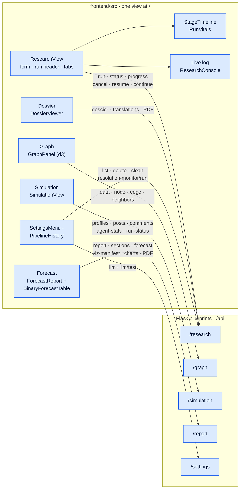

| Tab | Shows |
|---|---|
| **Live log** | The DeerFlow research console, colour-coded, with All / Tools / Results / Errors filters and a tool-call counter |
| **Dossier** | The research report with source/translation toggle and PDF download. Sub-tabs: **Key actors**, **Situation brief**, **Relationships**, **Markets** (when present), **Sources**. |
| **Graph** | The knowledge graph as an interactive d3 force layout: search, a time slider over `valid_at`, a type legend, and a ring marking researched actors. Also node/edge details, a focus mode (≤ 400 nodes, click to expand) and "load full graph". |
| **Simulation** | A Twitter/Reddit toggle, round and status tiles, persona cards, and the feed with nested replies. Refreshes every 10 s while the simulation runs. |
| **Forecast** | Sections stream in as they finish. Once complete, the tab shows:<br/>• a table of contents;<br/>• a forecast dashboard: scenario probabilities, confidence, ensemble agreement and market divergence;<br/>• the **Binary forecasts** table: probability and interval, confidence, market anchor and Δ;<br/>• a chart gallery with PNG images and interactive versions;<br/>• a language toggle;<br/>• Markdown/PDF download and "copy Markdown". |

**Controls:**
- **Cancel** is shown while a run is going.
- **Resume** is shown after a failure or cancellation.
- **Continue to full pipeline** is shown for a completed research-only run.
- **+ New** returns to the form.
- **History** (right drawer) lists past runs, with per-run cancel and delete and **Clear failed**.
- **Settings** holds the interface language, the provider switch with **Test connection**, and **Maintenance → Market resolution check**.
- The interface is bilingual (English / 中文). Switch with the navbar toggle or in Settings; the choice is remembered in the browser.

**Live updates.**
- The dashboard only polls; there are no websockets or server-sent events.
- The main loop polls `status` + `progress` every 2.5 s, slows to 12 s while nothing changes, and pauses while the tab is hidden.
- The Simulation tab refreshes every 10 s; the Forecast tab every 3 s during generation.
- After 4 consecutive failed polls, a "Lost connection" banner appears, and polling keeps retrying.

---

## Operations and tooling

**npm scripts (run from the repository root)**

| Command | What it does |
|---|---|
| `npm run setup` · `npm run setup:backend` · `npm run setup:all` | Install npm dependencies · build the backend venv (`uv sync --python 3.12`) · both |
| `npm run doctor` | Environment health check (see [Configure](#2-configure)) |
| `npm run smoke` | Offline smoke test of the contracts between stages, with a stub LLM, in under about 60 s. Set `SMOKE_GRAPH=1` for a real local graph, `SMOKE_FULL=1` to add an OASIS micro-simulation. |
| `npm start` · `npm stop` | Start the services detached and follow their logs · stop them |
| `npm run dev` | Backend + frontend in the foreground |
| `npm run backend` · `npm run frontend` | Start one service only |
| `npm run build` | Build the SPA into `frontend/dist` (Flask then serves it) |
| `npm test` | Backend test suite (`cd backend && uv run pytest`) |
| `npm run lint` | `ruff check` over `backend/app` |
| `npm run check:env` | Check that `.env.example` and `config.py` agree |

**Helper scripts**

| Script | What it does |
|---|---|
| `scripts/watch_pipeline_progress.py` | Streams stage transitions from the durable state files (`npm start` uses it) |
| `scripts/salvage_orphaned_pipelines.py` | Marks failed runs whose report was already complete as `completed` (*degraded*). Dry run by default; `--apply` writes. |
| `scripts/setup_port80.sh` | macOS only: a loopback pf redirect, so that `http://localhost/` reaches the backend on `:5001` |
| `backend/scripts/resolution_monitor.py` | Re-quotes anchored markets, records resolutions, writes `monitor_report.md` |
| `backend/scripts/scheduled_rerun.py` | Scheduled re-runs of saved questions with drift detection. `diff <pipe_a> <pipe_b>` compares two runs. |
| `backend/scripts/batch_runs.py` | Several related questions: research, ontology and graph run once, then a prepare/run/report branch is forked for each question |
| `backend/scripts/model_comparison.py` | The same question through several providers, compared side by side |
| `backend/scripts/forecast_tools.py` | Ensemble aggregation and backtesting over `forecast.json` files |
| `backend/scripts/golden_eval.py` · `eval_forecast_quality.py` | Golden-question scoring · rubric LLM-judge (opt-in) |
| `backend/scripts/export_demo_site_data.py` | Export runs into `docs/demos/<run>/` for the demo site |
| `backend/scripts/backfill_report_visuals.py` | Rebuild charts and citations for existing reports offline (`--apply` to write) |
| `backend/scripts/replay_zep_dead_letters.py` | Replay failed simulation → graph feedback writes |
| `backend/scripts/disk_usage_report.py` · `reclaim_report_space.py` | Read-only disk usage report · reclaim old report backups (dry run by default) |
| `backend/scripts/preflight.py` · `check_env_drift.py` | The preflight engine behind `doctor --deep` · the `.env` drift check |

Run the backend scripts from `backend/` with `uv run python scripts/<name>.py --help`.

**Demo site.** The static site lives in `docs/` (`index.html`, `demo.html`) and is served by GitHub Pages. Each run is a bundle in `docs/demos/<key>/`: `meta.json`, `report.md`, `dossier.md`, `actors.json`, `sources.json`, `ontology.json`, `graph.json`, `forum.json`, `research_log.txt` and optional `charts/`. A published translation is exported beside its original as `report.<lang>.md` / `dossier.<lang>.md`, and `meta.json` maps each language to its file (`report_languages`, `dossier_languages`). To add a run:
1. export it with `export_demo_site_data.py` (`--reports-only` refreshes just the report, the dossier and their translations);
2. register its key in `RUN_KEYS` in `docs/demo.html`;
3. add its title to `docs/i18n.js`;
4. add a card to `docs/index.html`.

---

## Security

- **Loopback by default.** Flask binds to `127.0.0.1`.
  - Loopback clients are trusted.
  - Any other client calling `/api/*` gets `403` if `APP_API_TOKEN` is unset, and `401` unless it sends a matching `X-API-Token` header (compared in constant time).
- **CORS** is limited to `localhost`/`127.0.0.1` on ports 3000 and 5001 (`APP_CORS_ORIGINS`).
- **No stack traces or secrets leak.**
  - Error responses omit Python stack traces unless `FLASK_DEBUG=true`.
  - Request logs redact secrets, and `run.json` stores no credentials.
  - Provider settings are sanitized before being written to `.env`.
  - Custom base URLs are validated. `APP_BLOCK_PRIVATE_URLS=true` additionally rejects private and loopback targets.
- **The dev server is loopback-only too.** `npm start` and `npm run dev` bind Vite to `127.0.0.1:3000`, which answers at both <http://localhost:3000> and <http://127.0.0.1:3000>. Its `/api` proxy reaches Flask over loopback and forwards the browser's address in `X-Forwarded-For`. Flask trusts a loopback caller only if every forwarded address (`X-Forwarded-For`, `X-Real-IP`, `Forwarded`) is loopback too, so a request proxied for another machine is treated as remote. Forwarding headers can only lower trust, never raise it.
  - To open the dev server to your network, start it with `FRONTEND_HOST=0.0.0.0 npm run dev` (a shell variable; Vite does not read the root `.env`). Remote browsers then get `403` from `/api` unless you configure `APP_API_TOKEN`, and the SPA does not send the token, so put an authenticating reverse proxy in front for real remote use.
- **Exposing the backend deliberately.** Set `FLASK_HOST=0.0.0.0` **and** `APP_API_TOKEN`. The SPA does not send the token, so for browser access put an authenticating reverse proxy in front.

---

## Development and testing

| What | Command | Notes |
|---|---|---|
| Backend tests | `npm test` | About 4,300 offline tests in ~170 modules. No network or LLM spend. Needs the backend venv (`npm run setup:backend`). |
| Frontend unit tests | `cd frontend && npm run test:unit` | `node:test` over `src/utils` and the dev-server config (72 tests) |
| Lint | `npm run lint` | Ruff. CI also lints `backend/scripts` and `deerflow_bridge`. |
| Config drift | `npm run check:env` | Every setting `config.py` reads must be documented in `.env.example` |
| Stage-contract smoke test | `npm run smoke` | Stub LLM, deterministic, $0 |
| Forecast-quality evaluation | `backend/scripts/golden_eval.py`, `eval_forecast_quality.py` | Scores forecast quality rather than code shape |

**CI** (`.github/workflows/ci.yml`) runs three offline jobs on pushes to `main` and on pull requests:
- Ruff lint plus the env-drift gate;
- the backend test suite;
- a byte-compile check of all backend and bridge code.

CI does not run the frontend unit tests.

The DeerFlow overlay has its own tests in `deerflow_bridge/patches/tests/`, which run against the assembled `deer-flow/` runtime.

---

## DeerFlow 2 integration and the DRF2 target

The live pipeline already uses the **DeerFlow 2** harness for Stage 1, through an embedded `DeerFlowClient` in isolated subprocesses. It does not use the original DeerFlow 1.x graph. Three layers of code relate to DeerFlow 2:

| Layer | What it is | Status |
|---|---|---|
| `deer-flow-2.0.0/` | An optional local DeerFlow 2.0 source drop, used as the seed for a fresh assembly when present | A gitignored local reference. An ordinary clone uses upstream commit `799bef6d…` instead, which predates the public `v2.0.0` tag. |
| `deerflow_bridge/` → `deer-flow/` | The tracked driver, tools, skills, patches and config, assembled into an isolated runtime | **The live Stage 1 path** |
| `drf2/` | Custom agents and skills, KG and simulation MCP servers, and a deterministic Runs-API driver | Optional and **pre-cutover** (not yet the live path) |

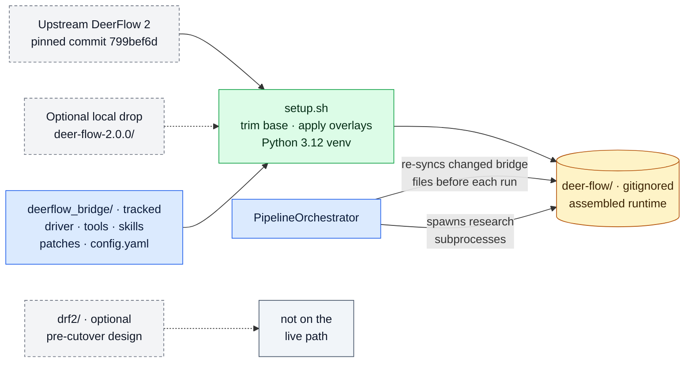

```text
current   Flask orchestrator → isolated research subprocesses → embedded DeerFlowClient
          → lead model ↔ tools (search · fetch · markets · optional KG MCP) → scoped sub-agents
          → evidence packs → global synthesis / judge / extraction → sealed research contract

native    client → DeerFlow 2 FastAPI gateway (threads / runs) → RunManager → same agent assembly
          → checkpoints / store → SSE replay        (implemented upstream; unused by the live pipeline)

target A  chat-native lead agent + 4 custom agents ↔ KG and simulation stdio MCP      (pre-cutover)
target B  deterministic driver → persistent Runs-API thread running slash-skills       (pre-cutover)
```

**What DRF2 is.** DRF2 would move more of the knowledge work into native DeerFlow 2 while keeping the deterministic gates outside the model:
- methodology becomes 7 custom skills: `deep-research`, `actor-ontology-research`, `ontology-generation`, `kg-construction`, `simulation-design`, `forecast-report`, `prediction-markets`;
- the graph and the simulation become stdio MCP engines;
- a thin driver owns manifests, gates, resume and multi-seed runs.

**Try it offline.** Run `SETUP_DRF2=1 ./setup.sh` to install the preview dependencies, then:

```bash
PYTHONPATH=. backend/.venv/bin/python -m drf2.driver.cli run --question "…" --dry-run --base-dir /tmp/drf2
```

Its tests run with `cd backend && uv run pytest tests/test_drf2_*.py`.

**Known gaps before cutover:**
- The supplied config has no `driver:` section, so a live run stops with "driver.harness.base_url missing".
- The driver's HTTP simulation client has no matching server; the engine is stdio-only.
- No KG tool creates or selects a graph, or applies an ontology.
- Config paths are machine-specific.
- The driver does not persist an in-flight run ID, so it cannot reattach after a restart.
- An empty manifest allows reuse.
- The sequential ensemble skips two single-run gates.
- There is no live end-to-end proof yet.

See [`drf2/README.md`](drf2/README.md) and [§17 of the DeerFlow 2 atlas](docs/architecture/deerflow2/DEERFLOW_2_ARCHITECTURE.md#17-drf2-pre-cutover-target-in-detail).

---

## Project layout

```text
DeepResearchForecast/                # repository: linroger/DeepResearchForecast
├── backend/                         # Flask API + UI host on :5001 (uv, Python 3.12)
│   ├── app/
│   │   ├── api/                     #   research · graph · simulation · report · settings · sdk (/api/v1)
│   │   ├── services/                #   orchestrator, ontology, graph, prepare, simulation, report, ensemble…
│   │   │   └── graphiti_client/     #   Graphiti + FalkorDB facade (keeps legacy Zep-style names)
│   │   ├── utils/                   #   llm_client, oasis_llm, sim_timeline, actors, prediction_markets…
│   │   ├── mcp/                     #   stdio MCP servers (knowledge graph, simulation)
│   │   └── models/                  #   project + in-memory task models
│   ├── scripts/                     #   OASIS runners, resolution monitor, reruns, exporters, evaluation
│   ├── tests/                       #   offline pytest suite (+ tests/eval golden scenarios)
│   ├── run.py                       #   entry point
│   └── uploads/                     #   [gitignored] pipelines/ projects/ simulations/ reports/ graphiti_db/
├── frontend/                        # Vue 3 + Vite 7 SPA (dev :3000, proxies /api → :5001)
│   ├── src/views/ResearchView.vue   #   the single dashboard view (/ ; /research → /)
│   ├── src/components/              #   GraphPanel (d3) + research/* panels
│   ├── src/api/ · src/utils/        #   axios clients · pure helpers (unit-tested)
│   ├── src/i18n.js                  #   English / 中文 strings
│   └── tests/                       #   node:test unit tests
├── deerflow_bridge/                 # tracked Stage 1 overlay for DeerFlow 2
│   ├── deerflow_research.py         #   research driver (lanes, tracks, synthesis, extraction)
│   ├── linear_research.py           #   research engine v3 (default; RESEARCH_ENGINE=v3)
│   ├── research_gateway.py          #   v3 model gateway, prompt-cache layout, tools, checks
│   ├── search_tools.py · cached_fetch.py · market_tools.py
│   ├── research_budget.py           #   cross-process tool budget + model leases
│   ├── runtime_skill_sync.py        #   verifies deployed skills match the tracked bundle
│   ├── skills/                      #   deep-research · actor-ontology-research · prediction-markets · forecast-visuals
│   ├── patches/                     #   model/provider fixes + middleware overlays (+ tests)
│   └── config.yaml                  #   research model stanzas (copied only if absent)
├── deer-flow/                       # [gitignored] assembled DeerFlow 2 runtime + its own venv
├── drf2/                            # optional pre-cutover DeerFlow-2-native design
├── docs/                            # GitHub Pages demo site + documentation
│   ├── index.html · demo.html       #   gallery + per-run walkthrough (i18n.js, site.css)
│   ├── demos/<run>/                 #   exported run bundles
│   ├── architecture/                #   system atlas, DeerFlow 2 atlas, inventories, tldraw generators
│   ├── media/                       #   screenshots and demo videos
│   └── adr/ · research/ · foglamp/ · loop_evidence/ · workflows/
├── scripts/                         # start.sh · doctor.sh · smoke.sh · watch/salvage helpers · setup_port80.sh
├── .github/workflows/ci.yml         # lint + env drift · offline tests · byte-compile
├── setup.sh                         # interactive installer
├── package.json                     # root npm scripts
├── .env.example                     # every setting, documented (copy to .env)
├── README.md · README.zh-CN.md      # this file (English / 中文)
├── ARCHITECTURE.md · DRF_ARCHITECTURE.md   # legacy engine notes · code-level map (July 2026)
├── init.sh · agent-progress.txt · feature_list.json   # agent-harness smoke check and bookkeeping
└── LICENSE                          # AGPL-3.0
```

Generated and gitignored: `.env`, `deer-flow/`, `deer-flow-2.0.0/`, `backend/uploads/`, `backend/logs/`, `logs/`, `frontend/dist/`, `node_modules/` and the venvs.

---

## Troubleshooting

**Start here:** run `npm run doctor`, then `npm run doctor -- --deep` if the problem involves keys, the embedding model or disk space.

| Symptom | Likely cause and fix |
|---|---|
| **`POST /api/research/run` returns a list of preflight errors** | The fail-fast check is doing its job, and nothing has been spent. Each item names the missing piece (graph backend, provider key, CLI login, DeerFlow runtime) and how to fix it. |
| **Graph stage: the local graph backend can't be imported** | Re-run `./setup.sh`, or run `( cd backend && uv sync --python 3.12 )`. |
| **The first graph build is slow or seems stuck downloading** | The ~470 MB embedding model downloads once, on first use. Pre-fetch it with `npm run doctor -- --deep --pull`. Behind a firewall, point `GRAPHITI_EMBED_MODEL` at a locally cached model and set `GRAPHITI_EMBED_DIM` to match. |
| **Backend install fails (camel-ai / tiktoken build errors)** | The venv must use Python 3.12: `( cd backend && uv sync --python 3.12 )`. |
| **Research runs on Claude even though I picked another provider** | Research uses `DEERFLOW_MODEL`. The Settings switch and `setup.sh` set it for you, but a hand-edited `.env` must set it (and its provider key) explicitly. The generic `openai` provider maps to the `claude` research model. |
| **The research stage fails to start** | Make sure DeerFlow's venv was built with Python 3.12: `UV_PROJECT_ENVIRONMENT=deer-flow/backend/.venv uv sync --project deer-flow/backend --python 3.12`, or re-run `./setup.sh`. `DEERFLOW_DIR` / `DEERFLOW_PYTHON` point at an existing runtime. |
| **Logs show `[FORCED STOP] Tool web_search called N times` from pass 2 onward** | The runtime lacks the bridge's loop-detection patch (per-run counter resets) or its research-grade limits. Re-run `./setup.sh`. If you keep your own `deer-flow/config.yaml`, merge the `loop_detection.tool_freq_overrides` block from `deerflow_bridge/config.yaml`. |
| **`claude-cli` returns 401, or bills the API instead of my subscription** | Log in again by running `claude` once. A stray `ANTHROPIC_API_KEY` is removed from the CLI's environment automatically; set `LLM_CLI_USE_API_KEY=true` if you *want* API billing. |
| **A provider switch changed a run that was already going** | Switches apply immediately, including to later stages of in-flight runs. Switch between runs. |
| **The UI shows "Lost connection"** | The backend stopped answering. Check `logs/backend.out.log`, then `npm start` again. Polling resumes automatically. |
| **The research stage times out** | Budgets depend on depth (quick ≈ 23 min, standard 3 h, deep 9 h). Raise `DEERFLOW_RESEARCH_TIMEOUT` or lower the depth. A timed-out lane 2 or 3 is salvaged; a timed-out lane 1 fails the stage, so resume the run. |
| **Resume returns `409` right after a crash or restart** | The run still looks owned: its heartbeat is less than 120 s old. Wait two minutes and resume again. |
| **The report is FAILED / "not publishable"** | `GET /api/report/<id>` lists the publication issues, and `final_audit.json` has the details. Resume the pipeline to regenerate the report. |
| **The PDF download returns `503`** | PDF export is disabled (`REPORT_PDF_EXPORT=false`), or pandoc / XeLaTeX / a CJK font is missing. Install pandoc and a TeX distribution with `xelatex`. |
| **The dossier shows "Sealed · read-only" and can't be edited** | The report's exact bytes are bound elsewhere: by the multi-lane research contract (`research_contract_manifest.json` and the judge's prose binding) or by a sealed `actor-intelligence/v1` cast. An in-place edit would make Continue re-run synthesis over it or fail actor reception, so the Edit button is replaced by this badge and `PUT /dossier` returns `409`. To change the research, start a new run with a refined question. Edits to unsealed runs are kept: saving refreshes `handoff/manifest.json`, so Continue reuses the edited research. |
| **I need to stop a long run** | Click **Cancel** or call `POST /api/research/<id>/cancel`. Research subprocesses stop within about 1 s and the simulation within about 5 s. |

---

## Glossary

| Term | Meaning |
|---|---|
| **Pipeline** (run) | One question's journey through the six stages. Its ID looks like `pipe_…`. |
| **Stage** | One of research, ontology, graph, prepare, run and report |
| **Research contract** / **handoff** | The files Stage 1 promotes into `handoff/` for later stages; legacy multi-lane runs seal them with `research_contract_manifest.json` |
| **Lane** | One isolated research subprocess with its own angle on the question |
| **Track A / Track B** | Evidence gathering (in every lane) / the shared actor-intelligence plane (lane 1 only) |
| **KIQ** | A key intelligence question: a sub-question the research must answer |
| **Evidence pack** | One lane's research output (`evidence_pack.md` + `sources.json`) |
| **Manifest v3** | `evidence_synthesis_manifest.json`, which seals the lane packs and the actor dossier before global synthesis |
| **Seal** / **manifest** | A SHA-256 record of exact bytes. A mismatch means "don't trust or reuse this". |
| **Epoch** | The tool-budget allowance for one research attempt (at most 3 per pipeline) |
| **`actor-intelligence/v1`** | The schema of `actors.json`: 17 dimensions per actor, with source-bound claims and typed gaps |
| **Tier-1/2 actor** | A principal actor, eligible to become an agent. Lower tiers and media outlets stay as context. |
| **Typed gap** | An explicit "unknown", recorded with the queries that were tried, instead of an invented fact |
| **Context pack** / **role** | `actor-context/v1` / `actor-role/v2`: an agent's sealed knowledge, and its deterministic role prompt |
| **Principal** | An agent that acts every round |
| **Round** / **calendar unit** | One simulated period: a day, week, half-month, month, quarter or half-year |
| **World clock** | The per-round note telling agents the simulated date and period, and what just happened |
| **WorldState** | A shared state, advanced once per round from the agents' commitments |
| **Hollow run** | A simulation whose agents produced no organic activity |
| **Spine** | The scenario probabilities, fixed before any prose is written |
| **Binary forecast** | A yes/no statement with a probability and objective resolution criteria |
| **Market anchor** | An accepted, resolution-equivalent Polymarket match for a binary forecast |
| **Publication gate** | The check a report must pass before it is served, re-verified on every read |
| **Sidecar** | An extra artifact written next to a sealed one without changing it, e.g. a language variant or the ensemble forecast |
| **Degraded** | Completed, but with a recorded, non-fatal health problem |
| **Pre-cutover** | Built and checked in, but not yet switched on as the live path |
| **DRF2** | The optional, pre-cutover DeerFlow-2-native re-architecture in `drf2/` |

---

## Further documentation

| Document | What it covers |
|---|---|
| [System architecture atlas](docs/architecture/DEEPRESEARCHFORECAST_SYSTEM_ATLAS.md) | An exhaustive, source-referenced map of every input, output, process boundary, model call, store and failure path. It is a snapshot of commit `fcf7378` (July 2026), taken before the linear research engine and the frontend consolidation. |
| [Whole-system canvas](docs/architecture/deepresearchforecast-system-architecture.tldr) ([SVG](docs/architecture/deepresearchforecast-system-architecture.svg) · [PNG](docs/architecture/deepresearchforecast-system-architecture.png)) | The atlas as an editable tldraw diagram (same snapshot) |
| [Model-call census](docs/architecture/llm-call-inventory.json) · [dataflow and route inventory](docs/architecture/dataflow-inventory.json) | Machine-readable companions to the atlas |
| [Actor-intelligence architecture](docs/architecture/ACTOR_INTELLIGENCE_ARCHITECTURE.md) | The sealed actor contract chain, stage by stage |
| [DeerFlow 2 architecture](docs/architecture/deerflow2/DEERFLOW_2_ARCHITECTURE.md) ([canvas](docs/architecture/deerflow2/deerflow2-architecture.tldr) · [PNG](docs/architecture/deerflow2/deerflow2-architecture.png)) | DeerFlow 2 internals as Stage 1 uses them, and the DRF2 target |
| [Research-stage optimization](docs/RESEARCH_STAGE_OPTIMIZATION.md) | Token forensics of the research stage, and the cost levers |
| [ADR 0001](docs/adr/0001-workflow-authority.md) · [ADR 0002](docs/adr/0002-forecast-evidence-publication-authority.md) | Accepted, not yet implemented, decisions on workflow and evidence authority |
| [DRF_ARCHITECTURE.md](DRF_ARCHITECTURE.md) | A code-level system map as of July 2026 (partly stale) |
| [ARCHITECTURE.md](ARCHITECTURE.md) | Notes on the original MiroFish simulation engine (legacy) |
| [deerflow_bridge/README.md](deerflow_bridge/README.md) · [drf2/README.md](drf2/README.md) | Component READMEs |
| [DeepWiki](https://deepwiki.com/linroger/DeepAgentForecast) | AI-generated Q&A over the repository |

**Regenerating the tldraw canvases.** The diagram content is defined in `src/main.jsx` of each generator.
1. Run `cd docs/architecture/tldraw-generator && npm ci && npm run render`.
2. Open the local page it serves in a real browser; rendering needs a browser canvas.
3. Run `npm run validate`.

The DeerFlow 2 canvas has its own generator in `docs/architecture/deerflow2/tldraw-generator/`.

---

## Acknowledgments

- **[OASIS](https://github.com/camel-ai/oasis)** (CAMEL-AI) powers the multi-agent social simulation. Sincere thanks to the CAMEL-AI team for their open-source work.
- **[DeerFlow](https://github.com/bytedance/deer-flow)** (ByteDance) powers the deep-research stage.
- **[Graphiti](https://github.com/getzep/graphiti)** powers the embedded temporal knowledge graph, with no graph cloud service or graph key. Structured extraction still goes through the configured LLM.
- Built on **[MiroFish](https://github.com/666ghj/MiroFish)**, the original population-simulation prediction engine.

## License

[AGPL-3.0](LICENSE)
