# DeepAgentForecast

[English](README.md) | **简体中文**

[](https://deepwiki.com/linroger/DeepAgentForecast)
[](LICENSE)
[](backend/.python-version)
[](package.json)

> **问一个关于未来的问题，得到一份经过研究、模拟与审计的预测。**

DeepAgentForecast 是一个在你自己机器上运行的预测引擎。你输入一个问题，例如「2030 年谁会赢得美国 AI 竞赛？」，它会：

1. 用 DeerFlow 2 研究智能体检索公开网络，并研究每一个关键行动者；
2. 把研究所得沉淀为时序知识图谱；
3. 让真实世界的行动者以 LLM 智能体的身份，在模拟的 Twitter 与 Reddit 上活动，每一轮推进一个日历时段；
4. 写出一份分章节的预测报告，内含情景概率、至少 10 条可事后核验的是/否预测、图表，以及与预测市场的交叉核对。

报告必须通过严格的引用与一致性审计才会对外提供。运行过程中，一个仪表盘实时展示每个阶段。

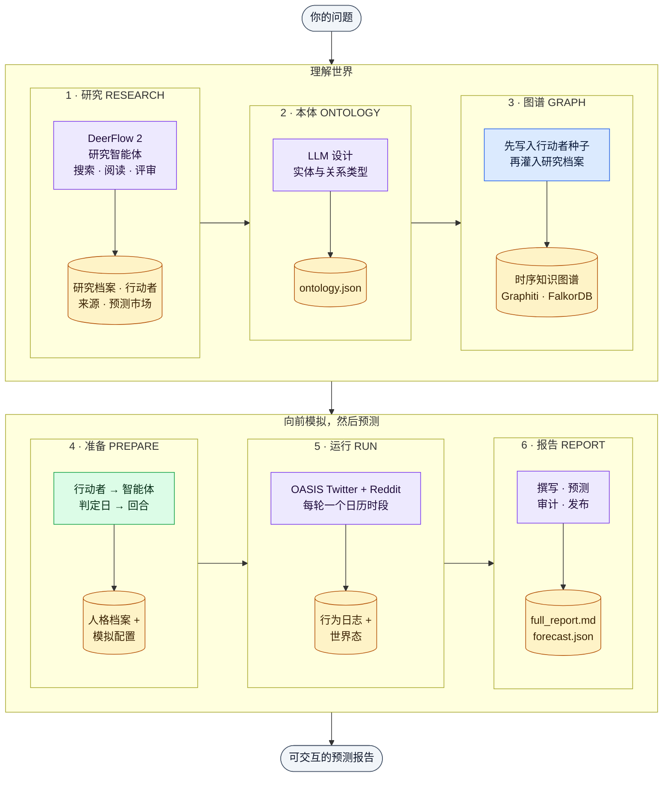

<sub>本文流程图的配色约定：**蓝** = 组件或进程 · **紫** = 由 LLM 驱动的步骤 · **绿** = 确定性步骤（不调用 LLM）· **红** = 门控或判断 · **琥珀** = 持久化产物或存储 · **灰色虚线框** = 外部服务。</sub>

### 亮点

- **一个问题，六个阶段。** 研究 → 本体 → 图谱 → 准备 → 运行 → 报告，作为一条可取消、可恢复的管线运行，无需在阶段之间手动搬运文件。
- **快速、有界、高缓存命中的研究。** 默认的研究引擎（v3）把问题拆成若干关键情报问题，为每个问题派出一个有界的"搜索—阅读"智能体，在工具预算内补齐缺口，并写出带引用的研究档案。它的提示词按提供方的提示缓存来编排，约 80% 的输入 token 由缓存提供。一次 deep 运行约 40 分钟、145 万输入 token，而此前的多轮循环约需 20 小时、4,680 万输入 token。证据中的每个数字都会与其引用的页面核对。
- **深入且并行的研究（旧版引擎）。** 设置 `RESEARCH_ENGINE=legacy` 时，三条相互隔离的 DeerFlow 2 研究证据轨从不同角度切入问题：
  - 基础证据；
  - 基率与历史参照；
  - 激励、反面观点与市场。

  其中一条还会为每位关键行动者建立 17 个维度的研究档案，每条主张都绑定到具体来源。随后，一个独立的综合步骤写出 1.5–2.2 万词的研究档案，并且必须通过 7 维质量评审。
- **无需自建托管的知识图谱。** 采用 [Graphiti](https://github.com/getzep/graphiti) + 内嵌 FalkorDB，并在本地计算多语言向量：没有图谱服务、没有 Docker，也不需要图谱 API Key。
- **以日历时间推演。** 问题中的预测判定日（「到 2030 年」「未来 18 个月」「2035年底」）会被切分为一串日历回合，每个回合是一天、一周、半个月、一个月、一个季度或半年。调研得到的真实事件在其实际发生的时段触发，共享的世界态在回合之间演化。
- **为可评分而设计的预测。**
  - 在写任何正文之前先确定情景概率。
  - 每份报告至少包含 10 条二元预测，每条都附概率与客观判定标准。
  - 若 Polymarket 上存在判定标准相同的市场，就用它对预测做交叉核对。
- **杜绝虚假成功。** 草稿要到达读者，必须依次通过 SHA-256 清单、封存的行动者契约、只读终审与发布门。只要存在无依据的引用、与正文矛盾的概率，或缺少兜底的「剩余」情景，报告就不会对外提供。
- **易于运行与观察。**
  - 实时阶段时间线与「运行体征」：已用时间、预计剩余、存活状态与花费。
  - 取消、恢复与继续。
  - 中英双语界面与报告，并支持 PDF 导出。
  - 可切换的 LLM 后端：本地 `claude` / `codex` CLI，或六个 OpenAI 兼容 API 之一。

📖 **更深入的文档：** [全系统架构图谱](docs/architecture/DEEPRESEARCHFORECAST_SYSTEM_ATLAS.md) · [行动者智能架构](docs/architecture/ACTOR_INTELLIGENCE_ARCHITECTURE.md) · [DeerFlow 2（阶段 1）深入解析](docs/architecture/deerflow2/DEERFLOW_2_ARCHITECTURE.md) · [DeepWiki](https://deepwiki.com/linroger/DeepAgentForecast)。各文档分别涵盖什么，见[延伸文档](#延伸文档)。

---

## 目录

- [快速上手](#快速上手)
- [演示](#演示)
- [工作原理](#工作原理)
- [架构](#架构)
  - [运行时拓扑](#运行时拓扑) · [请求生命周期](#请求生命周期) · [管线生命周期、状态与恢复](#管线生命周期状态与恢复) · [各阶段读取什么](#各阶段读取什么) · [代码地图](#代码地图)
- [逐阶段深入解析](#逐阶段深入解析)
  - [1 · 研究](#阶段-1--研究deerflow-2) · [2 · 本体](#阶段-2--本体) · [3 · 知识图谱](#阶段-3--知识图谱) · [4 · 准备](#阶段-4--准备) · [5 · 模拟](#阶段-5--模拟) · [6 · 报告与发布](#阶段-6--报告与发布) · [运行结束之后](#运行结束之后集成账本与监测)
- [可信度与质量保障](#可信度与质量保障)
- [环境要求](#环境要求)
- [安装与配置](#安装与配置)
- [模型提供方](#模型提供方)
- [配置（`.env`）](#配置env)
- [API 参考](#api-参考)
- [仪表盘](#仪表盘)
- [运维与工具](#运维与工具)
- [安全](#安全)
- [开发与测试](#开发与测试)
- [DeerFlow 2 集成与 DRF2 目标](#deerflow-2-集成与-drf2-目标)
- [项目结构](#项目结构)
- [故障排查](#故障排查)
- [术语表](#术语表)
- [延伸文档](#延伸文档)
- [致谢](#致谢) · [许可证](#许可证)

---

## 快速上手

```bash
git clone https://github.com/linroger/DeepAgentForecast.git
cd DeepAgentForecast
./setup.sh        # 交互式：选择 LLM 提供方、安装全部依赖、装配 DeerFlow
npm run doctor    # 快速、离线地检查依赖与导入
npm start         # 后端 :5001 + 前端 :3000；跟随日志并打印阶段变化
```

打开 **<http://localhost:3000>**，输入问题，点击 **启动 研究 + 模拟 + 预测**。

- **无需托管任何服务。** 知识图谱运行在内嵌的 FalkorDB 上：`falkordblite` 包会自行启动一个私有的 Redis + FalkorDB 子进程。无需 Docker、账号或图谱 API Key。
- **一个 LLM 就够。** 二选一：
  - 已登录的本地 `claude` 或 `codex` CLI（无需 API Key）；
  - `openai`、`kimi`、`minimax`、`deepseek`、`qwen` 或 `glm` 中任意一家的 API Key。

  `setup.sh` 会让你选择，用一次单 token 调用实测 Key 是否可用，并把研究阶段指向对应的模型。
- **为长时间运行做好准备。** 默认的 `deep` 深度详尽但缓慢：仅研究看门狗就允许阶段 1 运行最长 9 小时。第一次端到端试跑时，请在表单中选择 **quick** 深度。
- **推荐：** 配置 [Firecrawl](https://firecrawl.dev) Key（`FIRECRAWL_API_KEY`），网页搜索与正文抽取会更可靠。

完整步骤见[环境要求](#环境要求)、[安装与配置](#安装与配置)与[配置（`.env`）](#配置env)。

---

## 演示

🔗 **[在线演示站](https://linroger.github.io/DeepAgentForecast/)**（中英双语）带你走完真实端到端运行的**每一个阶段**：
- 深度研究控制台日志；
- 含行动者与来源的研究档案；
- 自动生成的本体；
- 可交互的知识图谱；
- 模拟的 Twitter/Reddit 论坛；
- 最终的预测报告。

下面是一个提示词「Who wins the US AI race by 2030?」（2030 年谁会赢得美国 AI 竞赛？）从提问到可交互预测的全过程（研究 → 知识图谱 → 群体模拟 → 报告）：


▶ **[观看完整演示视频（47 秒，MP4）](docs/media/demo.mp4)**

### 展示运行：2030 年前的全球半导体产业

- 以深度模式研究半导体全产业链：存储、HBM、逻辑与代工，覆盖 17 家具名企业。
- 285 个节点的知识图谱。
- **115 个人格**，进行 **40 轮双平台模拟**。
- 一份分章节的预测报告。

▶ **[观看半导体运行全程（42 秒，4 倍速，MP4）](docs/media/demo-semiconductors.mp4)** · 🔗 **[在线浏览这次运行](https://linroger.github.io/DeepAgentForecast/demo.html?run=semiconductors-2030)**

| | |
|---|---|
|  <br/>*阶段 1：深度研究控制台记录每一次搜索、抓取与写作* |  <br/>*完成的研究档案：对 2030 年半导体产业的循证深度研究* |
|  <br/>*研究提取的关键行动者：CEO、分析师与企业，各附经研究的立场与影响力* |  <br/>*支撑档案论断的网络来源* |
|  <br/>*285 个实体的知识图谱，以及自动生成的 10 个实体类型* |  <br/>*跑完 40/40 轮后的模拟：115 个人格与完整的 Twitter 信息流* |
|  <br/>*带可点击目录的最终预测报告* | |

### 全部演示运行

演示站收录了 15 次完整运行，下表按从新到旧排列。各次规模不同，是因为默认设置随时间变化过：早期运行的阵容更大，有些还使用了旧式的新闻周期模拟模式。按当前默认设置，一次运行最多模拟 20 位研究所得的行动者，通常为 7–36 个日历回合。已有通过审计的译本的运行，其报告与研究档案标签页可在 English 与中文之间切换。

| 运行 | 日期 | 研究模型 | 模拟 |
|---|---|---|---|
| [2040 年前的量子计算：美中欧竞速](https://linroger.github.io/DeepAgentForecast/demo.html?run=quantum-2040) | 2026-09 | GLM-5.3 | 29 轮 · 18 个人格 |
| [2030 年前全球数据中心市场：中美算力竞赛](https://linroger.github.io/DeepAgentForecast/demo.html?run=datacenter-2030) | 2026-09 | GLM-5.3（由实验性线性引擎收尾完成） | 17 轮 · 18 个人格 |
| [2040 年前全球电网级储能产业](https://linroger.github.io/DeepAgentForecast/demo.html?run=grid-storage-2040) | 2026-07 | MiniMax | 29 轮 · 19 个人格 |
| [2035 年前全球电动汽车产业](https://linroger.github.io/DeepAgentForecast/demo.html?run=ev-2035) | 2026-07 | MiniMax | 19 轮 · 12 个人格 |
| [2026 年美国中期选举：参众两院控制权情景](https://linroger.github.io/DeepAgentForecast/demo.html?run=us-midterms-2026) | 2026-07 | MiniMax | 36 轮 · 14 个人格 |
| [2028 年美国贸易体系：关税、供应链回流与 AI 生产力竞赛](https://linroger.github.io/DeepAgentForecast/demo.html?run=us-trade-2028) | 2026-07 | MiniMax | 36 轮 · 20 个人格 |
| [碰撞的十年：现代重商主义 × AI（2026–2031）](https://linroger.github.io/DeepAgentForecast/demo.html?run=collision-decade-2031) | 2026-07 | Claude | 24 轮 · 80 个人格 |
| [2030 年全球云计算竞争格局推演](https://linroger.github.io/DeepAgentForecast/demo.html?run=cloud-2030) | 2026-06 | MiniMax | 120 轮 · 80 个人格 |
| [2027—2028 年存储半导体前景预判](https://linroger.github.io/DeepAgentForecast/demo.html?run=storage-semi-2028) | 2026-06 | MiniMax | 96 轮 · 80 个人格 |
| [2030 年前全球存储半导体市场](https://linroger.github.io/DeepAgentForecast/demo.html?run=memory-semi-2030) | 2026-06 | — | 4 轮 · 80 个人格 |
| [2026 年美伊战争如何收场？](https://linroger.github.io/DeepAgentForecast/demo.html?run=us-iran-2026) | 2026-06 | MiniMax | 40 轮 · 135 个人格 |
| [2035 年中国储能与电池市场](https://linroger.github.io/DeepAgentForecast/demo.html?run=china-storage-2035) | 2026-06 | MiniMax | 40 轮 · 94 个人格 |
| [2030 年前全球半导体产业](https://linroger.github.io/DeepAgentForecast/demo.html?run=semiconductors-2030) | 2026-06 | MiniMax | 40 轮 · 115 个人格 |
| [2030 年谁主导美国 AI？](https://linroger.github.io/DeepAgentForecast/demo.html?run=us-ai-2030) | 2026-06 | MiniMax | 40 轮 · 42 个人格 |
| [俄乌战争如何终结、何时终结？](https://linroger.github.io/DeepAgentForecast/demo.html?run=russia-ukraine) | 2026-06 | MiniMax | 3 轮 · 36 个人格 |

### 截图

以下截图展示统一仪表盘在实际运行中的样子。截图摄于 2026 年 6 月，当时运行体征条与二元预测表尚未加入。

| | |
|---|---|
|  <br/>***知识图谱**标签页：阶段 3 构建的时序知识图谱，截于阶段 4 运行期间* |  <br/>***研究档案 → 信息来源**：研究报告引用的全部网络来源* |
|  <br/>***研究档案 → 关键参与者**：经研究的核心行动者档案* |  <br/>***实时日志**标签页：模拟运行期间仍可查看 DeerFlow 研究控制台* |
|  <br/>*在**知识图谱**标签页中查看某个实体的属性与摘要* |  <br/>*第 20/40 轮的**群体模拟**标签页：人格卡片与模拟的 Twitter 信息流* |
|  <br/>*第 21/40 轮：智能体以各自的角色发帖与互动* |  <br/>*第 33/40 轮的**群体模拟**标签页，此时管线已完成 88%* |

---

## 工作原理

系统的一次运行称为一条**管线**（pipeline），ID 形如 `pipe_1ee2fae33f8c`。`PipelineOrchestrator` 在后台线程中依次执行六个阶段，并把每个产物连同其 SHA-256 哈希记入清单。因此，失败或被取消的运行可以从第一个产物校验不通过的阶段**恢复**。

| # | 阶段 | 进度区间¹ | 发生了什么 | 主要产物 |
|---|---|---|---|---|
| 1 | **研究** | 0–30% | 默认引擎（v3）规划关键情报问题，为每个问题并行运行一个有界的"搜索—阅读"智能体，补齐缺口，写出并检查带引用的研究档案，再抽取结构化数据：行动者、时间线、数值、争议主张与预测市场。旧版引擎（`RESEARCH_ENGINE=legacy`）则运行三条 DeerFlow 2 证据轨，外加一次经评审的全局综合。 | `research_report.md`、`actor_dossier.md`、`actors.json`、`sources.json`、`timeline.json`、`prediction_markets.json` |
| 2 | **本体** | 30–40% | 一次 LLM 调用为该问题设计至多 10 个实体类型与 10 个关系类型，并以研究所得的行动者类型为种子。随后由确定性后处理标注原型、关系族与正负向。 | `ontology.json` |
| 3 | **图谱** | 40–60% | 先以确定性方式把研究所得的行动者及其关系写入本地时序知识图谱，再把研究档案作为 Graphiti episode 灌入（LLM 抽取 + 本地向量）。之后合并重复实体，并围绕阵容剪枝。 | 图谱 `mirofish_<id>`、`graph_priors.json` |
| 4 | **准备** | 60–72% | 每位研究所得的行动者成为一个智能体。它的封存上下文包把公开事实与行动者自身所知严格分开，角色提示词则以确定性方式编译而成。系统从问题中解析出预测判定日，并切分为日历回合。 | `simulation_config.json`、Twitter/Reddit 人格档案、封存清单 |
| 5 | **运行** | 72–92% | OASIS 让 Twitter 与 Reddit 并行运行，每轮一个日历时段。每一轮都有「世界时钟」（当前的模拟日期）、落在该时段内的真实事件，以及持续演化的共享世界态。 | `actions.jsonl`、`world_state_trajectory.json`、`run_summary.json` |
| 6 | **报告** | 92–100% | ReportAgent 依次：<br/>• 先确定情景概率；<br/>• 借助图谱检索工具撰写各章节；<br/>• 抽取至少 10 条二元预测；<br/>• 与预测市场交叉核对；<br/>• 渲染图表；<br/>• 在发布前运行 lint、引用与审计门控。 | `full_report.md`、`forecast.json`、`charts/`、`final_audit.json` |

¹ 这些是静态区间。一旦知道图谱的分块数与模拟的回合数，编排器会按预期工作量重新划分 40–100% 的区间，因此报告阶段通常从 78% 左右开始。

**两种运行模式：**
- **完整管线**：全部六个阶段。
- **仅研究**：只运行阶段 1，由它占满整个进度条。已完成的仅研究运行可以**继续**为完整管线，复用其已封存的研究成果。

---

## 架构

### 运行时拓扑

所有组件都运行在同一台机器上。
- **前端与 API。** Vue 单页应用只与一个 Flask 进程通信。这个进程是以多线程模式运行的 Werkzeug 开发服务器，绑定在 `127.0.0.1:5001`。
- **耗时工作不占用请求线程：**
  - 每条管线独占一个守护线程，另有一个每 30 秒跳动一次的心跳线程；
  - 阶段 1（研究）与阶段 5（模拟）以子进程运行；
  - 知识图谱存放在内嵌 FalkorDB 中，由一个 asyncio 线程驱动。
- **状态。** 所有持久化状态都是 `backend/uploads/` 下的普通文件。

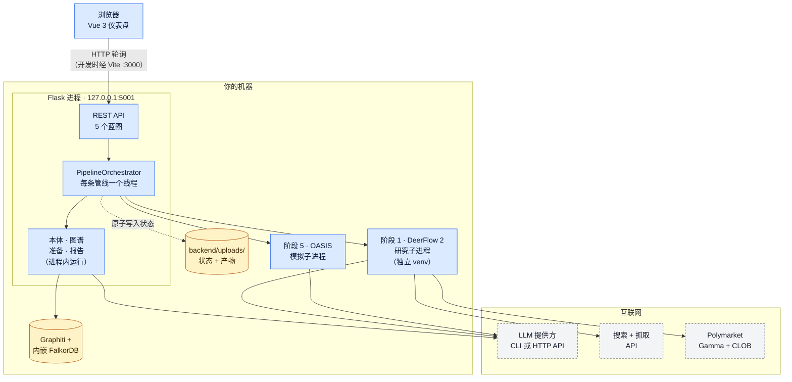

**端口。** 开发时，浏览器访问 `:3000` 上的 Vite 开发服务器，由它把 `/api` 代理给 Flask。执行 `npm run build` 之后，Flask 会自行托管构建好的界面，一切都在 `http://localhost:5001` 上。

**谁调用 LLM。** 模型调用通过三条互相独立的通道离开本机：
- DeerFlow 的模型工厂，用于研究；
- 后端的 `LLMClient`，用于本体、图谱抽取、事件配置与报告；
- OASIS 的模型适配层，用于模拟中的智能体。

**市场调用。** 报告阶段还会重新拉取 Polymarket 报价。

| 组件 | 技术栈 | 代码位置 | 职责 |
|---|---|---|---|
| 仪表盘 | Vue 3.5 · Vite 7 · vue-router · d3 · axios | `frontend/src/` | 位于 `/` 的单一视图：提问表单、阶段时间线、运行体征、五个结果标签页、运行历史与设置。通过轮询访问 API。 |
| API 与编排 | Flask（多线程）· Python 3.12 · uv | `backend/app/api/` · `backend/app/services/pipeline_orchestrator.py` | 准入与预检；六阶段状态机；取消、恢复、继续与分叉；产物清单；健康门 |
| 研究 | DeerFlow 2 超级智能体 harness（LangChain / LangGraph），独立 venv | `deerflow_bridge/` → 装配为 `deer-flow/` | 阶段 1：证据轨、行动者档案、综合、评审、结构化抽取、搜索/抓取/市场工具、技能 |
| 知识图谱 | graphiti-core 0.29.2 · falkordblite（内嵌 FalkorDB）· sentence-transformers `paraphrase-multilingual-MiniLM-L12-v2` | `backend/app/services/graph_builder.py` · `backend/app/services/graphiti_client/` | 阶段 2–3；为阶段 4 与阶段 6 提供检索 |
| 模拟 | [OASIS](https://github.com/camel-ai/oasis)（CAMEL-AI） | `backend/app/services/simulation_*.py` · `backend/scripts/run_parallel_simulation.py` | 阶段 4–5：阵容、角色、配置与双平台运行 |
| 报告 | ReportAgent · 预测抽取器 · 报告 lint · 可视化（Plotly + kaleido、matplotlib）· pandoc + XeLaTeX | `backend/app/services/report_agent.py` · `forecast_extractor.py` · `report_lint.py` · `report_visualizer.py` | 阶段 6、发布门与导出 |
| LLM 接入 | `LLMClient`（CLI 或 OpenAI 兼容 HTTP）· DeerFlow 模型工厂 · OASIS 模型适配层 | `backend/app/utils/llm_client.py` · `deerflow_bridge/config.yaml` · `backend/app/utils/oasis_llm.py` | 重试、熔断、可选的备用提供方、token 与费用计量 |

> **命名的历史渊源。** 本代码库脱胎于 [MiroFish](https://github.com/666ghj/MiroFish)，当年它把图谱存放在 Zep Cloud。`zep_tools.py`、各项 `ZEP_*` 设置，以及 `mirofish_<id>` 形式的图谱 ID，都是那个时期的遗留命名。如今它们都指向本地的 Graphiti 图谱。

### 请求生命周期

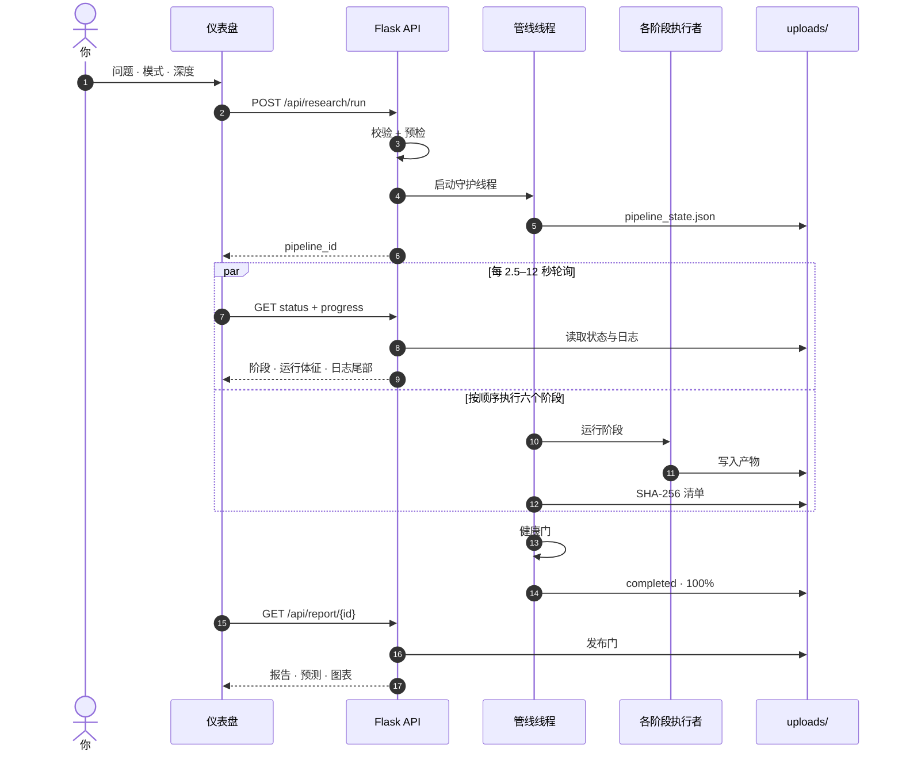

1. **准入。** `POST /api/research/run` 校验请求体：`prompt`、`mode`（`full` 或 `research_only`）、`depth`（`quick`、`standard` 或 `deep`）、`max_rounds`、`language` 与 `model`。随后执行一次**离线预检**，检查：
   - 图谱后端可以导入；
   - 提供方的 Key 或 CLI 已就绪；
   - DeerFlow 运行时与研究模型的凭据都存在。

   任何问题都会以 `400` 返回一份修复清单，此时还没有产生任何花费。
2. **启动。** 编排器会：
   - 创建 `pipe_<12 位十六进制>`，并以原子方式写入 `pipeline_state.json`；
   - 固定本次运行的策略，例如行动者智能契约、种子数量，以及模拟能否影响概率；
   - 启动一个守护线程。

   返回 `{success, data: {pipeline_id, task_id, mode, status}}`。并发运行数量不设上限，每条管线各占一个线程。
3. **观测。** 仪表盘轮询两个接口，没有 WebSocket，也没有服务端推送（SSE）。
   - `GET /api/research/status/<id>` 返回管线状态，外加一个计算出的 `live` 块：已用时间、预计剩余、心跳时长、所属进程是否存活、花费与预算。
   - `GET /api/research/<id>/progress` 返回合并后的研究日志。

   轮询从每 2.5 秒一次开始；状态无变化时按 ×1.5 退避，最长 12 秒；浏览器标签页隐藏时暂停。
4. **执行。** 管线线程按顺序运行各阶段。每一次进度更新同时也是一个取消检查点和一个提供方故障检查点。阶段完成时，其产物的哈希会写入 `handoff/manifest.json`。
5. **完成。** 报告写完后，先运行可选的多种子集成，再由[健康门](#可信度与质量保障)决定这次运行能否标记为 `completed`。
6. **交付。** 报告、预测、图表、Markdown 与 PDF 只能经**发布门**获取；每次读取时，发布门都会重新核对审计过的 SHA-256 哈希。

### 管线生命周期、状态与恢复

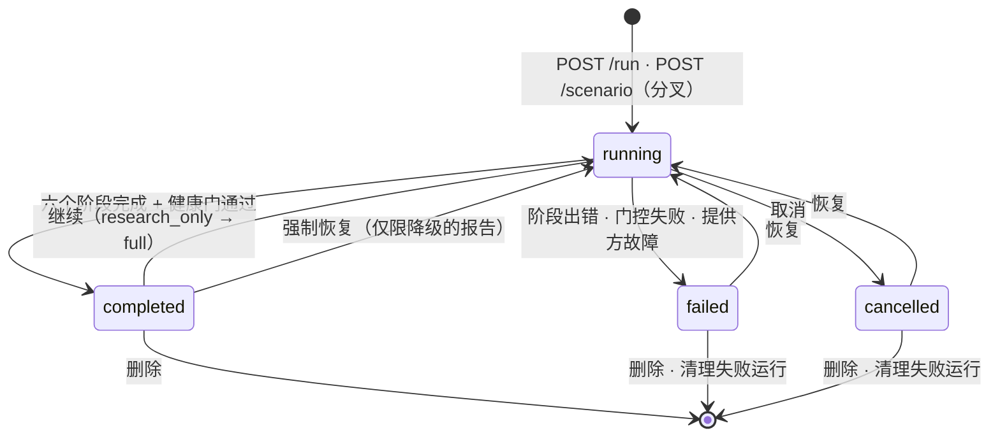

| 操作 | 入口 | 效果 |
|---|---|---|
| **取消** | 界面「取消」按钮 · `POST /api/research/<id>/cancel` | 设置本次运行的取消事件。研究子进程组约 1 秒内被终止；模拟在下一次 5 秒轮询时停止（先 SIGTERM，10 秒后 SIGKILL）。已完成的阶段保持完成状态。 |
| **恢复** | 界面「继续」按钮 · `POST /api/research/<id>/resume` | 沿用同一个管线 ID 与路径，并重新预检。只有通过下表检查的阶段才会被复用；否则从那个阶段重新开始。 |
| **继续** | 界面「继续完整管线 →」按钮 · `POST /api/research/<id>/continue` | 把已完成的仅研究运行转为完整管线。只要研究成果的封存契约仍然有效，就复用它。 |
| **分叉（假设推演）** | 仅限 API · `POST /api/research/<id>/scenario` | 新建一条管线，共享基线运行的研究、本体与图谱，在「准备」阶段叠加情景假设，然后重新运行模拟与报告。 |
| **删除 / 清理** | 历史抽屉 · `DELETE /api/research/<id>` · `POST /api/research/clean` | 删除 `uploads/pipelines/<id>/`。项目、模拟与报告会保留；不再被任何运行引用的图谱会被回收（始终保留最新的 5 个）。清理只删除失败与已取消的运行，但会跳过被分叉依赖的运行。 |

**恢复时可以复用什么：**

| 阶段 | 满足以下条件时复用 | 否则 |
|---|---|---|
| 研究 | v3：复用 `handoff/v3/` 下的各阶段，从停下的地方继续。旧版引擎：封存的研究契约（`research_contract_manifest.json`）逐字节一致，且报告评审通过 | 旧版引擎：若存在已封存的证据轨证据（`evidence_synthesis_manifest.json`），只重跑全局综合。否则重跑各证据轨，每条都从自己的检查点续跑。每条管线最多 3 个工具预算「纪元」（epoch，即恢复尝试）。 |
| 本体 | 项目中已有本体 | 重新生成 |
| 图谱 | 阶段产物与哈希一致、行动者种子回读仍然匹配，且图谱中有实体 | 以新的图谱 ID 重建 |
| 准备 | 清单哈希一致，且封存的模拟配置校验通过 | 新建一个模拟 ID |
| 运行 | 「准备」被复用，且旧的模拟已完整结束：每个平台都有结束标记、`run_summary.json` 有效、配置封印一致 | 重新运行模拟 |
| 报告 | 旧报告不是 FAILED 状态，其清单与图表校验通过，且管线健康状况允许复用 | 重新撰写报告 |

**持久化状态**（均位于 `backend/uploads/` 下）：

| 路径 | 内容 |
|---|---|
| `pipelines/<pipe_id>/pipeline_state.json` | 权威的运行记录：状态、各阶段、各类 ID、选项、固定的策略、心跳。以原子方式写入。 |
| `pipelines/<pipe_id>/run.json` | 复现快照：git SHA、DeerFlow 版本，以及每个阶段实际使用的模型（凭据已脱敏） |
| `pipelines/<pipe_id>/handoff/` | 阶段 1 输出与各阶段间的产物、`manifest.json`（每个产物的 SHA-256）、`research_contract_manifest.json` |
| `pipelines/<pipe_id>/run_telemetry.json` | token 与费用统计，跨多次尝试累计 |
| `projects/<project_id>/` | 项目记录：本体与 `graph_id` |
| `graphiti_db/` | 内嵌 FalkorDB（`falkor.db`）与向量缓存 |
| `simulations/<sim_id>/` | 人格档案、配置与封印、行为日志、SQLite 数据库、世界态轨迹、`run_summary.json` |
| `reports/<report_id>/` | `full_report.md`、`forecast.json`、`final_audit.json`、`charts/`、语言版本、PDF |
| `pipelines/_forecast_ledger/` | 预测账本与市场判定记录 |

**崩溃恢复。** 后端启动时，会清点上一个进程留下的 `running` 状态运行：
- 若所属进程已不存在（依据心跳判断），该运行标记为 `failed`；若其报告此前已写完，则改为标记 `completed`，健康状况为*降级*。
- 残留的研究进程会被终止。
- 最后一次心跳在 120 秒以内的运行会保持 `running`，直到心跳过期。崩溃后请等待两分钟再恢复。

### 各阶段读取什么

| 产物 | 写入者 | 读取者 |
|---|---|---|
| `handoff/research_report.md` | 阶段 1（v3 的分节写作，或旧版引擎的全局综合） | 本体 · 图谱（没有研究档案或 `GRAPH_CHUNK_SOURCE=both` 时）· 准备 · 报告 |
| `handoff/actor_dossier.md` | 阶段 1 Track B（仅旧版引擎） | 本体 · 图谱（默认的分块来源） |
| `handoff/actors.json`（旧版引擎下为封存的 `actor-intelligence/v1`；v3 下为基于报告、未封存的版本） | 阶段 1 抽取 | 本体（有界投影）· 图谱（确定性种子、分块过滤、剪枝核心）· 准备（阵容、上下文、角色）· 报告 |
| `handoff/sources.json` | 阶段 1 | 准备（与来源绑定的公共世界）· 报告（`[S#]` 引用） |
| `handoff/timeline.json` | 阶段 1 抽取 | 准备（带日期的事件）· 报告（大事记、时间线图） |
| `handoff/quantitative.json` · `contested.json` | 阶段 1 抽取 | 报告（指标轨迹、争议主张） |
| `handoff/prediction_markets.json` · `market_price_history.json` | 阶段 1 | 报告（市场信息包、锚定、价格历史图） |
| `handoff/ontology.json` | 阶段 2 | 图谱 |
| 图谱 `mirofish_<id>` · `handoff/graph_priors.json` | 阶段 3 | 准备（实体匹配、核心智能体排序）· 报告（检索工具） |
| `simulations/<sim_id>/…` | 阶段 4–5 | 报告（诊断信号包、模拟工具、世界态图） |

### 代码地图

| 路径 | 职责 |
|---|---|
| `backend/run.py` | 入口：校验配置，在 `127.0.0.1:5001` 启动 Flask，并按需启动判定监测调度器 |
| `backend/app/__init__.py` | 应用工厂：CORS、鉴权门、脱敏的请求日志、蓝图、托管已构建的 SPA、启动时清点 |
| `backend/app/config.py` | 全部设置（来自 `.env`，其优先级高于 shell 环境变量）与提供方目录 |
| `backend/app/api/` | 蓝图：`research.py`（管线）、`graph.py`、`simulation.py`、`report.py`、`settings.py`，以及 `sdk.py`（可选的 `/api/v1`） |
| `backend/app/services/pipeline_orchestrator.py` | 六阶段状态机、研究启动器、复用与恢复逻辑、健康门、多种子集成 |
| `backend/app/services/ontology_generator.py` | 阶段 2 |
| `backend/app/services/graph_builder.py` · `graphiti_client/` · `graph_pruner.py` · `zep_entity_resolver.py` | 阶段 3：在 Graphiti + FalkorDB 上构建图谱 |
| `backend/app/services/zep_tools.py` · `zep_entity_reader.py` | 为 ReportAgent 与「准备」阶段提供图谱检索 |
| `backend/app/services/actor_context.py` · `actor_role_prompt.py` · `oasis_profile_generator.py` · `simulation_config_generator.py` · `simulation_manager.py` | 阶段 4 |
| `backend/app/services/simulation_runner.py` · `simulation_ipc.py` · `worldstate.py` · `decision_channel.py` · `agent_dynamics.py` · `backend/scripts/run_parallel_simulation.py` | 阶段 5 |
| `backend/app/services/report_agent.py` · `forecast_extractor.py` · `report_lint.py` · `report_visualizer.py` · `exec_brief.py` | 阶段 6 |
| `backend/app/services/ensemble.py` · `backtest.py` · `forecast_ledger.py` · `resolution_autorun.py` | 多种子汇总、评分、预测账本、判定监测调度 |
| `backend/app/utils/` | `llm_client.py` · `oasis_llm.py` · `sim_timeline.py` · `actors.py` · `prediction_markets.py` · `telemetry.py` · `atomic.py` · `security.py` … |
| `backend/app/mcp/` | 供 DeerFlow 调用的 stdio MCP 服务（`kg_server.py`、`sim_server.py`） |
| `deerflow_bridge/` | 阶段 1 驱动 `deerflow_research.py`、研究引擎 v3（`linear_research.py` + `research_gateway.py`）、搜索/抓取/市场工具、预算账本、技能、补丁与 `config.yaml` |
| `frontend/src/` | `views/ResearchView.vue` · `components/research/*` · `components/GraphPanel.vue` · `api/*` · `utils/*` · `i18n.js` |
| `drf2/` | 可选、尚未上线（「切换前」）的 DeerFlow 2 原生重构方案（[详情](#deerflow-2-集成与-drf2-目标)） |

---

## 逐阶段深入解析

### 阶段 1 · 研究（DeerFlow 2）

阶段 1 把你的问题变成一份封存的**研究契约**：一份长篇研究档案，外加后续所有阶段都要用到的结构化数据。
- 这是唯一会访问网络的阶段。
- 它也曾是成本最高的阶段：项目自己的成本取证显示，在旧版引擎下约 96% 的 token 花费都用在研究上（见[研究阶段优化笔记](docs/RESEARCH_STAGE_OPTIMIZATION.md)）。研究引擎 v3 正是为解决这个问题而写的。

阶段 1 有两个引擎。编排器为每条管线选定一个，并显式传给研究子进程。

| 引擎 | 选择方式 | 形态 |
|---|---|---|
| **v3**（默认） | `RESEARCH_ENGINE=v3` 或不设置（`linear` 是其别名） | 一条有界、可续跑的研究轨：规划 → 按问题分派的智能体 → 补缺轮 → 分节写作 → 检查 → 结构化抽取。代码为 `deerflow_bridge/linear_research.py` + `deerflow_bridge/research_gateway.py`。 |
| **legacy** | `RESEARCH_ENGINE=legacy`（别名 `deerflow`、`agentic`） | DeerFlow 2 多轮智能体循环：三条证据轨、Track B 行动者档案与经评审的全局综合（详见[下文](#旧版引擎-research_enginelegacy)）。 |

证据轨、全局综合与仅抽取（extract-only）调用始终使用旧版引擎。如果某条管线固定下来的行动者策略要求封存的 `actor-intelligence/v1` 平面（例如在 v3 出现之前准入的管线），它也会使用旧版引擎；v3 写出的是基于报告、未封存的 `actors.json`，v3 准入时会把行动者平面固定为"非必需"。

#### 研究引擎 v3（默认）

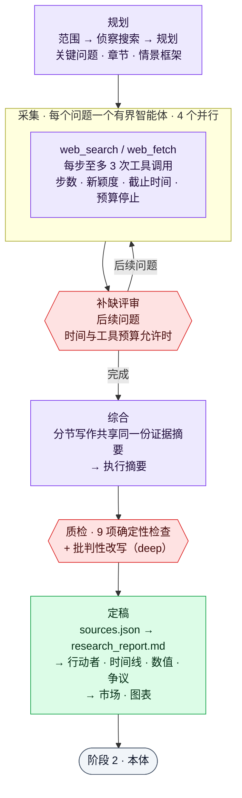

**工作方式**
- **规划。** 一次范围调用和几次侦察搜索为一次规划调用提供输入。规划返回关键情报问题（KIQ）、报告大纲、规范情景框架（名称与权重）以及具名行动者。如果模型不可用，会先采用确定性的模板规划，在采集前再尝试一次有界的重新规划，并把本次运行标记为降级。
- **采集。** 每个 KIQ 都有自己的工具智能体，以搜索结果为种子，可调用 `web_search` 与 `web_fetch`。智能体在以下情况停止：写出笔记、用完步数、连续两步没有新来源、临近阶段截止时间（为最后的笔记调用预留时间），或触及预算保留额。抓取的网页只存一次，并按关注点返回排序后的段落。
- **补缺轮。** 一次评审调用针对仍然缺失的内容提出后续问题。只有剩余时间和工具预算足以支撑时，才会运行这一轮。
- **综合。** 分节写作按组进行，共享同一份证据摘要，最后写执行摘要。被输出上限截断的回复会以更大的上限重试一次，否则只保留其完整段落。
- **检查。** 每份报告都要通过 9 项确定性检查：章节顺序、最短长度、引用密度、规范情景块、情景权重、陈旧引用、被删除的章节、错误标记与章节完整性。在 deep 深度下，还有一轮批判性审阅，会改写存在实质问题的章节。
- **定稿。** 先写 `sources.json`，再写 `research_report.md`，然后抽取行动者、时间线、数值与争议事实，最后是预测市场与图表。

**提示缓存与 token 效率**
- 每次模型调用都按 `[固定系统提示][运行简报][共享上下文][任务]` 排列，因此同类调用共享逐字节相同的前缀。智能体对话只追加不改写，每次调用都绑定同一份工具定义；每次并行扇出之前，还会用一次很小的预热调用写入提供方缓存。
- 使用 GLM（默认模型）时，缓存是隐式的。每次调用都会设置 thinking、`reasoning_effort`（智能体与 JSON 调用为 low，写作为 high）以及输出上限（6k / 16k / 20k token；抽取为 32k）。
- 使用 Claude 时，会用一个简短的确认轮次收尾共享上下文，使缓存断点正好落在其上。
- 用量以 `[usage] tokens in=… out=… cached=…` 行报告，管线的遥测与花费记录会读取这些行。

**准确性**
- **证据标签。** 只有当一条发现中的每个数字都出现在它所引用的页面上时，它才标为 **VERIFIED**；其中百分比只与百分比匹配，功率、能量与货币数值只与同一单位类别匹配。**REPORTED** 表示该发现依据的是搜索摘要或未抓取的来源。**UNVERIFIED** 表示某个数字不在所引用的页面上，写作时不得把它当作事实陈述。
- **引用。** 智能体只能引用它见过的来源。`[S#]` 标记会按位置重新编号，与 `sources.json` 一一对应，参考文献恰好等于被引用的集合。
- **情景。** 规范情景块由代码按预测解析器读取的格式渲染；正文中复述或凭空增加的概率会被修正或标记。
- **不可信文本。** 网络文本放在 `BEGIN/END UNTRUSTED EVIDENCE DATA` 分隔符内传递，并由一个精确、线性时间的过滤器删去针对模型的指令。

**可靠性**
- 各阶段保存在 `handoff/v3/` 下，并与本次运行的身份绑定，因此续跑会从停下的地方继续。因截止时间、预算或无法使用的回复而中断的问题，续跑时会重新研究。
- 每次提供方调用都有按截止时间裁剪的超时。网关对瞬时错误做退避重试，遇到配额错误后切换到备用模型，并关闭 SDK 自身的重试，只保留一套重试策略。
- 退出码：`0` 表示已写出报告，任何降级都列在 `meta.json` 的 `research_quality.degradation` 中；`2` 表示可续跑的失败：提供方始终没有应答、没有找到有来源的证据，或一次故障导致已研究的问题不到计划的一半；`3` 表示预检失败。

**预设**

| 深度 | 关键问题 | 补缺轮 × 后续问题 | 智能体步数 | 搜索 / 抓取（整次运行） | 时间规划 |
|---|---|---|---|---|---|
| `quick` | 4 | 无 | 5 | 30 / 24 | 20 分钟 |
| `standard` | 7 | 1 × 3 | 7 | 70 / 50 | 45 分钟 |
| `deep` | 10 | 2 × 4 | 9 | 140 / 110 | 90 分钟 |

v3 的时间规划取预设时间与看门狗预算 × 0.85 中较小的一个，因此总能在看门狗触发前完成。所有预设值都可以用 `.env.example` 中记载的 `RESEARCH_LINEAR_*` 设置修改。

**实跑验证**（GLM-5.3，2026 年 9 月，同一个问题在三种深度下各跑一次）

| 深度 | 耗时 | 模型调用 | 输入 / 输出 token | 缓存命中 | 问题数 | 事实（已核实） | 来源 | 质量分 |
|---|---|---|---|---|---|---|---|---|
| quick | 9 分钟 | 40 | 22.2 万 / 7.8 万 | 78% | 4 | 48（22） | 25 | 0.64 |
| standard | 31 分钟 | 94 | 69.3 万 / 12.3 万 | 81% | 10 | 116（69） | 34 | 0.69 |
| deep | 39 分钟 | 155 | 145 万 / 24.4 万 | 81% | 17 | 194（106） | 65 | 0.73 |

#### 旧版引擎 (`RESEARCH_ENGINE=legacy`)

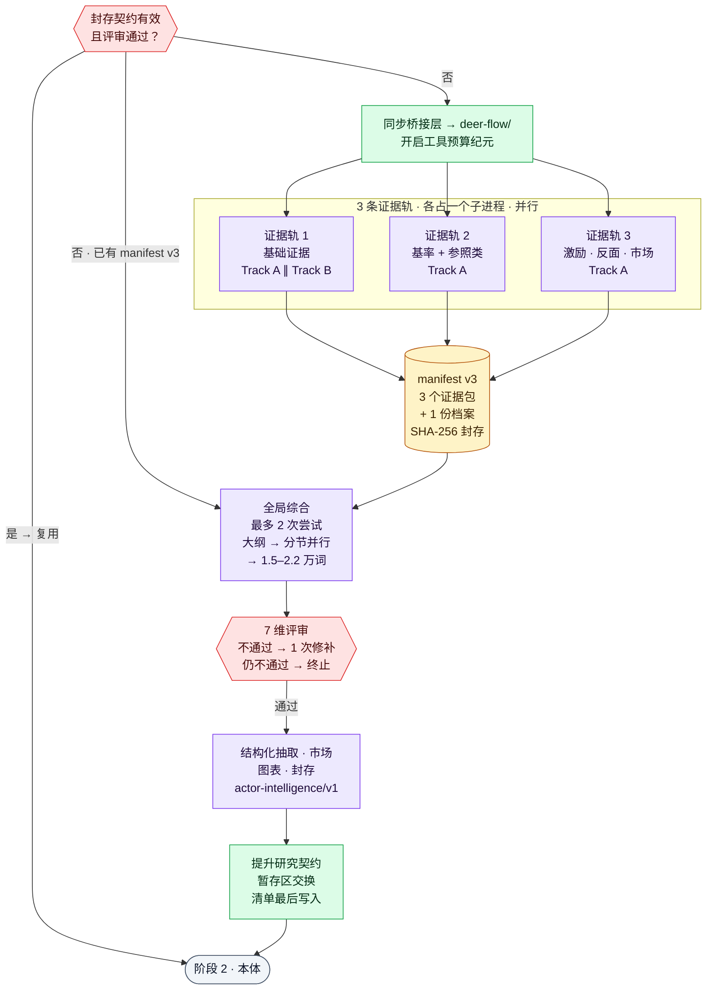

**旧版引擎的一次运行如何组织**

- **隔离。**
  - DeerFlow 运行在自己的 Python 3.12 虚拟环境（`deer-flow/backend/.venv`）里，以子进程方式执行，每个子进程自成一个进程组。因此它的 LangChain/LangGraph 依赖永远不会和后端的依赖混在一起。
  - 问题通过一个私有临时文件（权限 0600）传入，不会出现在进程列表中。
  - 每次研究开始前，编排器会把有变化的桥接层文件同步进 `deer-flow/`，以内容哈希比对。技能同步失败即关闭（fail-closed）。
- **三条证据轨**（`RESEARCH_PARALLEL_TRACKS=3`）。
  - **证据轨 1** 原样接收你的问题，搜集基础证据。
  - **证据轨 2** 寻找基率、参照类与历史类比。
  - **证据轨 3** 关注行动者激励、反面论证与市场定价。

  每条证据轨都是只收集证据的子进程，把 `evidence_pack.md` 与 `sources.json` 写入 `handoff/track_<k>/`。证据轨 2、3 失败不会中断本阶段；证据轨 1 则是必需的。
- **一个共享的行动者平面**（Track B，`DEERFLOW_DUAL_TRACK=true`）。它只在证据轨 1 内运行，与该轨的证据收集（Track A）并行，分五步：
  1. 绘制行动者全景；
  2. 按下文的 17 个维度，对全体阵容做一轮补全；
  3. 在不调用工具的情况下综合出研究档案；
  4. 经过 10 维评审，最多允许 2 轮修订；
  5. 运行一次确定性审计，检查每条主张都绑定了来源。

  档案不合格，本阶段就失败，绝不会退回使用未经审计的阵容。
- **封存。** `evidence_synthesis_manifest.json`（v3）记录三个证据包、各自的来源台账，以及唯一的一份行动者档案（连同覆盖率与评审文件），全部附带 SHA-256 哈希。
- **全局综合。** 一个全新的子进程（不使用子智能体，最多尝试 2 次）依次：
  1. 写出大纲；
  2. 由最多 4 个写作者并行起草各章节；
  3. 拼接各章节并补上执行摘要；
  4. 执行 1.5–2.2 万词的篇幅门（过短就扩写，超过硬上限就失败）；
  5. 定稿引用；
  6. 运行 **7 维报告评审**。判定为不通过且列出了缺口时，做一次定向修补再重评；明确判定为不通过则终止本阶段。
- **收尾。** 同一个子进程随后：
  - 抽取结构化数据（`actors.json`、`timeline.json`、`quantitative.json`、`contested.json`）；
  - 刷新 Polymarket 快照及其 90 天价格历史；
  - 渲染研究图表；
  - 封存行动者契约。
- **提升（promotion）。** 契约文件先复制到暂存目录，再换入 `handoff/`，同时保留一份回滚副本；`research_contract_manifest.json` **最后**写入。随后父进程会重新计算每一个行动者收据、主张与血缘哈希（「接收」），之后阶段 2 才能开始。

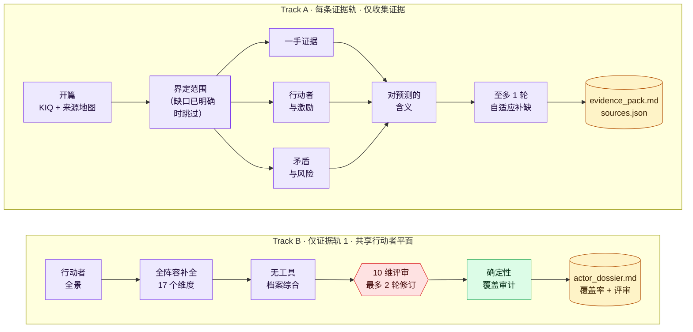

**一条证据轨的内部。** 每条证据轨按分阶段的多轮协议推进：
1. **开篇。** 拟出关键情报问题（KIQ）与来源地图。
2. **界定范围。** 若开篇已给出完整的缺口台账，则跳过这一步。
3. **三路并行：** 一手证据；行动者与激励；矛盾与风险。
4. **对预测的含义。**
5. **至多一轮自适应补缺。**

补缺与行动者研究由限定范围的子智能体（`scoped-researcher`）完成：每条证据轨最多 3 个，整台机器合计最多 9 个。

**17 个行动者维度。**
- **行动者是谁：** 身份与历史 · 价值观与世界观 · 激励 · 动机 · 能力 · 约束 · 行事偏好。
- **与谁打交道：** 盟友 · 对手与竞争者。
- **如何决策与行动：** 决策权、流程与触发条件 · 当前行动 · 未来计划 · 投资与资本配置。
- **可以预期什么：** 过往记录 · 可能行动 · 红线 · 知识状态。

每条主张都带有：
- 它适用的时间；
- 认知状态与置信度；
- 依赖、矛盾与限定条件；
- 来自已抓取来源的精确引文或区间。

没有依据的格子会记为一个**类型化缺口**，而不是编造的事实。

**DeerFlow harness。** 每个子进程把模型、工具、四个技能与一条有顺序的中间件栈装配成一个 LangChain 智能体。四个技能是 `deep-research`、`actor-ontology-research`、`prediction-markets` 与 `forecast-visuals`。
- 上下文达到 8 万 token 时触发摘要，保留最近的 1.6 万 token。
- 标题生成与长期记忆均已关闭：无界面运行从不显示标题，而长期记忆会在不同运行之间串味。
- 研究模型启用了 Claude 提示缓存；设置 `DEERFLOW_CLAUDE_PROMPT_CACHE=0` 可关闭。
- 打过补丁的中间件会在每次运行开始时重置工具调用计数，后面的研究轮次因此不会被饿死。

**工具、来源与预算**

| 工具 | 后端（按优先级） | 说明 |
|---|---|---|
| `web_search` | Serper → Tavily → Firecrawl v2 `/search` → 免 Key 的 DuckDuckGo，取决于配置了哪个 Key | 结果缓存 6 小时（200 MB） |
| `web_fetch` | Firecrawl v2 `/scrape`（有 Key 时）→ Jina Reader → Exa（有 Key 时）→ 直连 HTTP（需显式开启） | 熔断器（连续失败 5 次 → 暂停 120 秒）；缓存 72 小时（500 MB）；Firecrawl 复用 48 小时内的页面 |
| `prediction_market_search` | Polymarket Gamma API（无需 Key） | 经相关性门过滤的候选市场，按证据轨分别记录 |
| 知识图谱 MCP | 通过 stdio MCP 访问后端图谱 | 仅当研究启动时已存在图谱（分叉 / 继续 / 恢复），且 `RESEARCH_MCP_KG=true`。服务注册文件（`deerflow_bridge/extensions_config.json`）是模板：编排器把它部署到 `deer-flow/` 时，会填入本机检出路径与后端所用的 Python。 |

- **工具预算账本。** 所有证据轨共享一个 SQLite 账本，为每次尝试（一个「纪元」）设上限：工具调用 1,800 次、搜索 900 次（每轨 360 次）、抓取 450 次（每轨 180 次）。每条管线最多 3 个纪元。
- **整机租约。** 另一张 SQLite 表为本机所有管线合计限制并发：研究模型流最多 12 路，harness 子智能体最多 9 个。
- **Firecrawl 限额。** Firecrawl 调用有限速和每进程上限：每次搜索 5 条结果，每个进程最多 300 次搜索、400 次抓取，并在收到 HTTP 429 时退避。

**深度与时间预算**

| 深度 | 做什么 | 看门狗预算¹ |
|---|---|---|
| `quick` | 精简协议，适合端到端试跑 | 900 秒 × 1.5 ≈ 23 分钟 |
| `standard` | 折中 | 7,200 秒 × 1.5 = 3 小时 |
| `deep`（默认） | 上文完整的多轮协议 + 分节综合（1.5–2.2 万词） | 21,600 秒 × 1.5 = 9 小时 |

¹ 只要启用了双轨、子智能体或扇出中的任意一项，就会乘以 1.5；这三项默认都是开启的。可用 `DEERFLOW_RESEARCH_TIMEOUT` 覆盖该预算。v3 引擎把同一个看门狗预算作为上限，但会规划一个短得多的自身时间（见上文的预设）。

**出问题时会怎样**

- **看门狗。** 某条证据轨的预算耗尽时，看门狗会终止它的进程组。超时的证据轨 2 或 3，只要已写出证据包就会被抢救回来；证据轨 1 超时则本阶段失败。
- **综合重试。** 全局综合会在一个干净目录中重试一次。失败尝试的日志保留在 `handoff/research_attempts/`。
- **错误防护。** 拒收 LLM 错误文本和过短的报告。`deep` 综合宁可失败，也不会把各轮笔记直接拼接成报告。
- **故障熔断。** 提供方故障会计入运行级熔断器。连续失败 10 次后，本次运行立即失败，提供方恢复后可以恢复运行。
- **恢复。** 恢复时优先复用封存契约；做不到时只重跑全局综合，再不行则从各证据轨自己的检查点重跑（[详情](#管线生命周期状态与恢复)）。

**研究契约**（`backend/uploads/pipelines/<id>/handoff/`）

| 文件 | 内容 |
|---|---|
| `research_report.md` | 通过评审的研究档案，后附市场章节与可视化附录 |
| `research_report_judge.json` | 7 维评分表，与报告的精确字节绑定 |
| `actor_dossier.md` · `actor_dossier_coverage.json` · `actor_dossier_judge.json` | Track B 行动者档案、17 维覆盖台账、评审结论 |
| `actors.json` · `actor_intelligence_lineage.json` | 结构化阵容（`actor-intelligence/v1`）及其血缘哈希 |
| `sources.json` | 已抓取来源的台账（URL、S1–S4 分级、收据） |
| `timeline.json` · `quantitative.json` · `contested.json` | 带日期的事件 · 数值主张与轨迹 · 争议主张 |
| `prediction_markets.json` · `market_price_history.json` | Polymarket 快照 · 近 90 天的日度价格序列 |
| `charts.json` · `charts/` | 研究图表 |
| `evidence_synthesis_manifest.json` · `research_contract_manifest.json` | 各证据轨的封存索引 · 最终契约（最后写入） |
| `track_<k>/` | 每条证据轨的证据包、来源、检查点与日志 |
| `research_progress.log` · `meta.json` · `research_budget.json` | 实时日志 · 状态与元数据 · 预算遥测 |

> **v3 下的研究契约。** v3 运行会写出相同的顶层文件（`research_report.md`、`sources.json`、`actors.json`、`timeline.json`、`quantitative.json`、`contested.json`、`prediction_markets.json`、`charts.json`、`meta.json`、`research_progress.log`），并把可续跑的阶段状态保存在 `v3/` 下。它不写 Track B 档案、证据轨包、评审计分卡或契约清单。在单轨运行中，管线的研究 lint 只做报告，从不改写研究档案，因此引用始终保持按位置对应。
>
> 早先的实验性线性引擎 v2 已于 2026 年 9 月被 v3 取代；`RESEARCH_ENGINE=linear` 现在选用 v3，`RESEARCH_LINEAR_MODE=salvage` 会被忽略并给出警告。GLM-5.3 数据中心那次演示由 v2 以抢救模式完成。

### 阶段 2 · 本体

阶段 2 为这个具体问题设计知识图谱的词汇表。

- **输入：**
  - 行动者档案与研究报告：经过清洗，作为不可信数据包裹，并采样到最多 12 万字符；
  - 你的问题；
  - 封存阵容的有界投影：最多 25 位行动者，每位附 ID、名称、类型、层级、别名以及每个维度一条绑定来源的主张，总计不超过 1.2 万字符；
  - 一段「种子块」，列出要保留的研究所得行动者类型与关系名称。
- **一次 LLM 调用**，返回 JSON。
  - 一个中英双语关键词测试决定使用 `social_opinion` 还是 `general_forecast` 模板。
  - JSON 无效时，以更低温度重试一次。
  - 只有第一次调用没产出任何实体类型时，才会有第二次调用。
- **确定性后处理：**
  - 实体类型与关系类型各不超过 10 个；
  - 重命名保留属性名；
  - 为每个实体类型标注原型（并请求一个模拟层级），为每个关系类型标注关系族与正负向；
  - 校正关系的两端类型；
  - 在阵容需要时补上 Person/Organization 兜底类型。
- **输出：** `project.json` 与 `handoff/ontology.json`。恢复时，已有的本体原样复用。

### 阶段 3 · 知识图谱

阶段 3 为本次运行构建一张时序知识图谱。它使用 [Graphiti](https://github.com/getzep/graphiti)（`graphiti-core` 0.29.2），底层是内嵌的 FalkorDB（`falkordblite`）。存储与向量计算都在本地完成；只有实体与关系的*抽取*会调用你配置的 LLM 提供方。

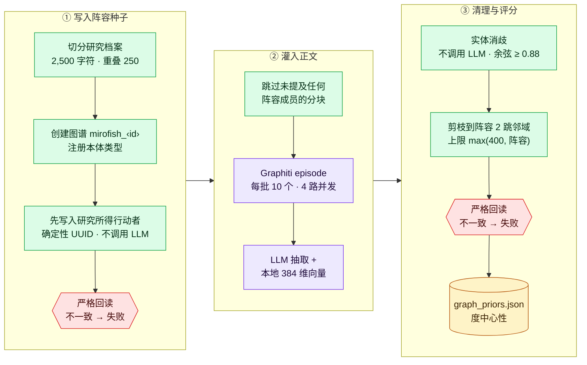

1. **分块。** 源文本被切成每块 2,500 字符、相邻重叠 250 字符的分块。内嵌图片会被剥离，每个分块都作为不可信数据包裹起来。`GRAPH_CHUNK_SOURCE` 决定源文本：
   - `dossier_only`（默认）：行动者档案；没有档案时退回研究报告；
   - `report_only`；
   - `both`。
2. **创建。** 图谱 ID 为 `mirofish_<16 位十六进制>`，它既是 FalkorDB 中的图名，也是 Graphiti 的 `group_id`。本体会注册为带类型的 Pydantic 模型。
3. **先写入阵容，再写正文。** 对于已封存的 `actor-intelligence/v1` 阵容，一份确定性计划（`actor-graph-seed-manifest/v1`）会写入每位行动者、每个别名与每条研究所得的关系，全程不调用 LLM。每条记录都带有：
   - UUIDv5 身份；
   - 主张哈希；
   - 因果属性：方向、强度、时滞与有效期。

   写入后，严格的物理回读（`actor-graph-seed-readback/v1`）必须与计划完全一致。
4. **灌入正文。**
   - 没有提及任何阵容成员的分块会被跳过。
   - 其余分块作为 Graphiti episode 写入，每批 10 个、4 路并发，时间戳都记为研究基准日。
   - Graphiti 用你的 LLM 抽取并消解实体与事实，再用多语言 MiniLM 模型（384 维）在本地计算向量。
   - 超过 30% 的分块失败时，图谱会被标记为*降级*。
5. **清理。**
   - **实体消歧**合并重复实体：它们须有相同标签、名称或别名匹配，且向量余弦 ≥ 0.88。消歧绝不会合并两位研究所得的行动者。
   - **剪枝**保留阵容及其 2 跳邻域，节点上限为 max(400, 阵容规模)。
   - 社区发现已实现，但默认关闭。
6. **校验与评分。** 以上所有改动完成后，种子回读会再运行一次。随后写出按别名折叠的度中心性先验，存入 `graph_priors.json`。

**后续阶段如何查询图谱。** ReportAgent 拥有以下检索工具：

| 工具 | 作用 |
|---|---|
| `insight_forge` | 把问题拆成最多 5 个子问题，运行 BM25 + 向量混合检索，返回带事实 ID 的关系链，可选按时间点过滤 |
| `panorama_search` | 区分当前有效的事实与已过期、已成为历史的事实 |
| `quick_search` | 一次快速的边检索 |
| `trace_cascade` | 两个实体之间的因果路径（最多 6 跳），或某个实体的邻域（最多 4 跳），附方向、强度与时滞 |
| `simulation_outcomes` · `coalition_map` · `opinion_shift` | 对模拟日志做确定性汇总 |
| `interview_agents` · `faction_brief` · `scenario_diff` | 条件性工具，分别需要：模拟环境仍在运行、开启社区发现、假设推演报告 |

- **重排序。** 检索默认用倒数排名融合（RRF）合并排名；设置 `GRAPHITI_RERANKER=bge` 可改用本地 BGE 交叉编码器。
- **MCP 访问。** 同一张图谱也以 stdio MCP 服务（`backend/app/mcp/kg_server.py`）的形式提供给 DeerFlow，工具有 `kg_search`、`kg_trace_cascade`、`kg_entity_summary`、`kg_get_entities`、`kg_centrality_priors` 与 `kg_graph_statistics`。
- **成本控制。** 抽取是图谱阶段唯一的 LLM 成本。默认设置通过以下方式控制它：只灌入研究档案、2,500 字符的分块、阵容过滤、每个分块最多 2 次完整尝试、每项操作 900 秒超时，以及向量缓存。
- **默认不把模拟写回图谱。** 写入图谱的模拟活动，日后可能被当作真实观测到的事实检索出来。如果你开启回写（`SIM_GRAPH_FEEDBACK=true`），写入失败的内容会进入死信队列，可用 `backend/scripts/replay_zep_dead_letters.py` 重放。

### 阶段 4 · 准备

阶段 4 把研究所得的行动者变成模拟智能体，把问题中的判定日变成一条时间线。除了一次事件设计调用之外，整个阶段都是确定性的。

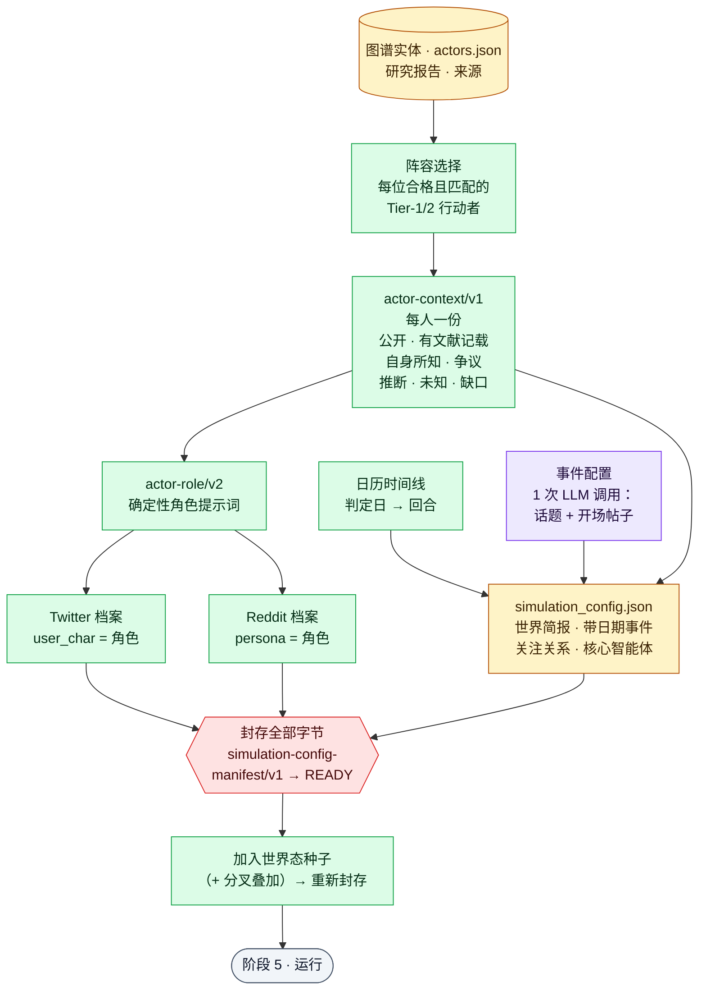

- **阵容。** 每位能与图谱实体匹配、且合格的 Tier-1/2 研究所得行动者都会成为智能体，一个行动者 ID 对应一个。
  - 与任何研究所得行动者都不匹配的图谱实体，永远不会进入阵容。
  - 图谱丢失的合格行动者，会根据研究档案补回。
  - 研究阶段本身就用 `ACTOR_CAST_MAX`（20）限制阵容，并把媒体机构降为背景，所以默认一次运行最多模拟 20 位行动者。
  - 按规则生成的「受众」智能体默认关闭（`SIM_AUDIENCE_AGENTS=0`）。
- **上下文包**（`actor-context/v1`）。每位行动者的上下文包把以下内容分开：
  - 共享的公开证据；
  - *关于*该行动者的文献证据；
  - 行动者自己的知识与信念；
  - 该行动者能看到的争议信息；
  - 分析师推断；
  - 未知事项；
  - 一份六字段的类型化缺口审计：`reason`、`attempted_queries`、`receipt_ids`、`result_ids`、`attempt_count`、`exhausted`。

  只有明确公开、绑定来源的证据才会进入共享世界。分析师推断与缺口审计会为问责而封存，但永远不会成为智能体的知识。
- **角色**（`actor-role/v2`）。每个角色提示词都由封存的证据以确定性方式编译而成，篇幅预算 6,000 字符，涵盖：
  - 身份与激励；
  - 能力与约束；
  - 计划与投资；
  - 决策流程、可能行动与红线。

  两个平台拿到的是同一个角色：
  - Twitter 档案字段 `user_char` 就是这个角色（换行已规范化）。
  - Reddit 的 `persona` 也是这个角色，旧式的人口统计字段留空。
- **模拟配置。**
  - 一次 LLM 调用设计开场的事件配置：热门话题、叙事走向与初始帖子。失败时退回确定性的种子帖子。
  - 其余全部是确定性的：
    - 一份公开的世界简报；
    - 中性的智能体活跃度设置；
    - 关注关系；
    - 把研究所得的事件排进其日期所在的回合；
    - 指定哪些智能体是**核心智能体**（principal），即每一轮都会行动。
- **封存。** `simulation-config-manifest/v1` 绑定配置、人格档案、角色清单、上下文包与阵容的精确字节。之后编排器会：
  - 加入世界态种子；若是分叉运行，还会叠加情景假设；
  - 在进入阶段 5 之前重新封存并重新校验。

  被复用的「准备」阶段只做只读校验。

> 没有封存行动者契约的运行（较早的运行，或显式关闭了契约的运行）走**旧路径**：按排名截断到 `ACTOR_CAST_MAX` 的阵容、由 LLM 撰写的人格，以及由 LLM 生成的活跃度配置。

### 阶段 5 · 模拟

阶段 5 在一个子进程中运行 [OASIS](https://github.com/camel-ai/oasis)。这个进程同时驱动 Twitter 与 Reddit（一个事件循环里的两个 asyncio 任务），每个回合对应一个日历时段。

**从问题到回合**

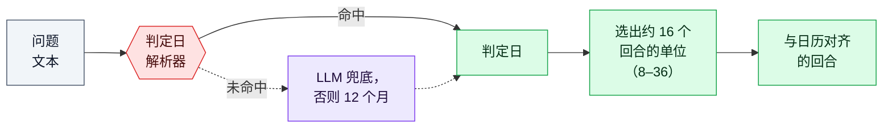

- **判定日。** 解析器依次尝试：
  1. 明确日期；
  2. 锚定时段：「end of 2030」「Q3 2027」「H2 2027」「March 2027」「2035年底」；
  3. 相对时长：「in / within / next N days … years」「未来两年」；
  4. 裸年份：「by 2030」即 2030 年 12 月 31 日。

  都未命中时，交给 LLM 兜底；仍不成功，就默认 12 个月。
- **单位。** 可选的单位有日、周、半月、月、季度、半年。
  - 在能产生 8 到 36 个回合的单位中，系统选回合数最接近 16 的那个（上限还受 `OASIS_DEFAULT_MAX_ROUNDS` 与你设置的任何回合上限约束）。并列时选更细的单位。
  - 判定日在 48 天以内时，使用按日推进的回合，最多 48 个。
  - 判定日超过约 18 年时，每个回合代表一年（即以两个半年为步长）。
  - 显式设置回合上限，只会让单位变粗，绝不会截短预测期。

以下示例假设研究基准日为 2026-09-27：

| 问题中写的是… | 判定日 | 单位 | 回合数 |
|---|---|---|---|
| 「in the next 3 weeks」 | 2026-10-18 | 日 | 21 |
| 「by end of 2026」 | 2026-12-31 | 周 | 14 |
| 「next 18 months」 | 2028-03-27 | 月 | 18 |
| 「by 2030」 | 2030-12-31 | 季度 | 17 |
| 「by 2031」 | 2031-12-31 | 半年 | 11 |
| 「by 2035」·「2035年底」 | 2035-12-31 | 半年 | 19 |
| 「by 2050」 | 2050-12-31 | 半年 × 2 | 24 |

回合数并不总随预测期的延长而增加，因为单位会在阈值处切换。所以「by 2031」得到的回合反而比「by 2030」更少，但每个回合更长。

**每个平台上的一个回合**

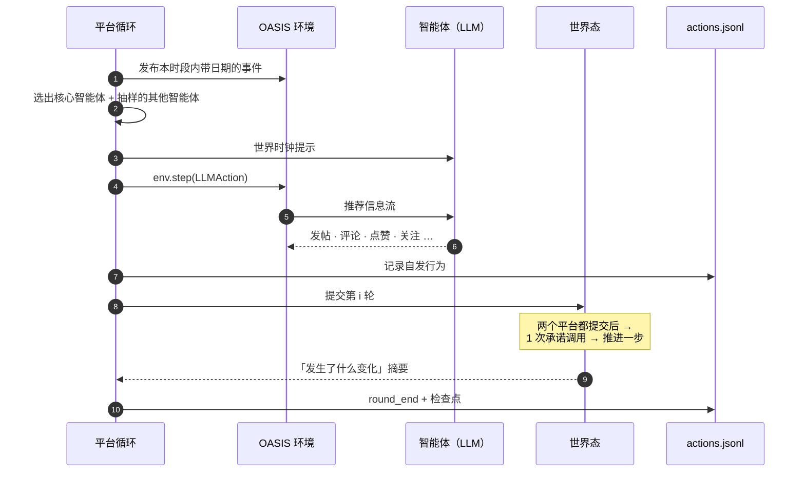

- **智能体知道什么。** 每个智能体的系统提示词由三部分组成：它的封存角色、共享的世界简报、日历词汇。对 Reddit，最终的提示词字节会在第一次行动前重新验证。每一轮，智能体还会收到一条**世界时钟**提示，内容包括：
  - 本时段的标签与起止日期；
  - 第 *i* 轮 / 共 *N* 轮，判定日，以及还剩几个时段；
  - 本时段内已确认的事件；
  - 一份定性的「上一时段发生了什么变化」摘要：已触发的事件、影响力最大的五条帖子、主导趋势的方向。世界态的具体数值份额从不展示。
- **谁会行动。**
  - 每个核心智能体每一轮都会行动。
  - 其他智能体按活跃度与影响力计算出的概率抽样；上一轮行动过的，更可能再次行动。
  - 在当前中性的配置下，所有行动者的影响力相同，于是按规则挑选核心智能体：n 个智能体中取 max(4, ⌈n/2⌉) 个；n ≤ 4 时全部都是核心智能体。
- **智能体能做什么。**
  - 在 Twitter 上：发帖、点赞、转发、引用、评论、关注、搜索帖子、查看趋势、什么都不做。
  - 在 Reddit 上：发帖、评论、给帖子点赞或点踩、给评论点赞或点踩、搜索帖子、搜索用户、查看趋势、刷新、关注、屏蔽、什么都不做。
  - 信息流由免模型的推荐器生成，不产生额外的 LLM 调用。
- **世界态。** 共享的 WorldState 每对齐一轮前进一次。两个平台都提交第 *i* 轮之后：
  - 一次批量 LLM 调用读取智能体的承诺；
  - 世界态随之推进一步，其惯性按日历单位缩放，并设有基率熵下限。

  轨迹保存在 `world_state_trajectory.json`，并在报告中绘成图表。
- **监控与完成判定。**
  - 后端的一个监控线程每 2 秒把行为日志汇总进 `run_state.json`。
  - 管线每 5 秒轮询一次；连续 30 分钟没有回合进展的模拟会被停止。
  - 判定完成，需要每个平台都有结束标记，并且 `run_summary.json` 有效（其中记录自发行为与种子行为的数量、各平台健康状况、日历覆盖情况）。仅凭退出码为 0 不足以判定完成。
  - 每一轮结束都会写入检查点。从中途恢复模拟需要显式开启（`SIM_RESUME=true`），重建的智能体不保留之前的对话记忆。
  - 结束之后，子进程会再存活最多 60 分钟空闲时间，通过基于文件的 IPC 信箱响应采访请求。
- **对预测的影响。** 默认设置下（`SIMULATION_FORECAST_EFFECT=diagnostic_only`），模拟只作为明确标注的情景分析为报告提供参考，**绝不**参与概率计算。若模拟「空转」，即有智能体却没有自发活动，管线健康状况会被标记为*降级*。

输出位于 `backend/uploads/simulations/<sim_id>/`：
- `state.json`、阵容清单与 `actor_context/` 上下文包；
- `twitter_profiles.csv`、`reddit_profiles.json` 及各自的角色清单；
- `simulation_config.json` 及其封印；
- `twitter/actions.jsonl` 与 `reddit/actions.jsonl`，以及两个平台的 SQLite 数据库；
- `world_state_trajectory.json` 与 `decisions.jsonl`；
- `run_summary.json` 与 `simulation.log`。

设置 `SIM_TEMPORAL_MODE=hours` 可恢复旧式的新闻周期模式，由 LLM 选定 24–168 个模拟小时。

### 阶段 6 · 报告与发布

阶段 6 写出预测，然后在任何人读到之前，尽力把它推翻一遍。

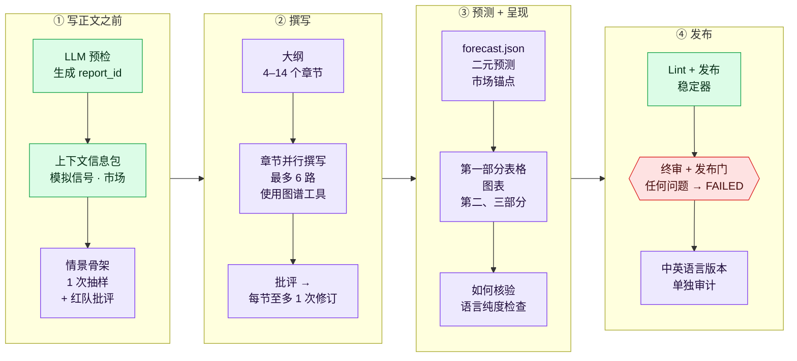

1. **准入与上下文。**
   - 一次预检调用确认 LLM 可以应答，并生成 `report_<12 位十六进制>` ID。
   - 构建**信号包**：对模拟的确定性汇总，标注为内部情景分析。
   - 构建**市场包**：研究时的 Polymarket 快照，按实时价格重新报价，并附价格变化。
2. **在写正文之前先定情景骨架。**
   - 一次 LLM 抽样提出情景（`REPORT_SPINE_SELFCONSISTENCY_K=1`）。
   - 一次红队式自我批评随后补上兜底的「剩余」情景、压低过度自信的峰值概率，并强制情景数为 2–5 个。
   - 概率下限为 3%，之后重新归一化。
   - 情景骨架会钉进之后的每一个提示词，因此正文不会偏离这些数字。
3. **大纲与章节。**
   - 大纲有 4–14 个章节，最多 6 个并行撰写，每节约有 12 次图谱工具调用的预算。
   - OpenAI 兼容提供方（MiniMax 除外）使用原生工具调用；CLI 提供方（包括默认的 `claude-cli`）使用 ReAct 文本协议。
   - 每个章节接受一次批评，最多修订一次。
   - 仍然失败的章节会变成占位符，之后会阻止发布。
   - 前文章节、人格上下文与世界简报等上下文切片，会按当前提供方的上下文窗口调整大小（`ADAPTIVE_CONTEXT=true`），大窗口模型能看到更多内容。
4. **定稿预测**（`forecast.json`）。
   - 复用情景骨架，并从**研究档案**中抽取至少 10 条二元预测。若概率全都挤在一起，会再补一组反向的预测。
   - 重新报价市场。一次 LLM 调用把二元预测与市场匹配，只接受判定标准**完全或近似等价**的匹配。
   - 若已锚定的预测与其市场相差超过 10 个百分点且未加以说明，会尝试修订一次，剩余的差距会被公开披露。
   - 确定性的对账让二元预测与情景划分保持一致，并剔除不完整的市场锚点。
   - 预测会追加写入账本。
5. **呈现。** 依次加入：第一部分（二元预测表 + 市场交叉核对）、图表、第二部分（一次 LLM 综合）、第三部分（详细章节）、附有各情景判定标准的「如何核验」章节，最后做一次语言纯度检查。
6. **发布。** 以下四步必须全部通过：
   1. 编辑 lint。
   2. 发布稳定器：最多 6 轮，直到文本不再变化。每一轮会：
      - 定稿引用与参考文献；
      - 限制任何来源被引用超过 20 次；
      - 删去缺乏支撑的数值句，直到引用覆盖率达到 75% 以上；
      - 重新核对引文。
   3. 只读终审，写入 `final_audit.json`。
   4. 发布门。

   **只要仍有任何问题**，报告就会被标记为 FAILED；管线本身仍可恢复。
7. **语言版本。** 主报告通过后，会逐章节翻译出一份中↔英版本并单独审计。主报告本身不会被修改。

**报告结构**

```text
# 标题
第一部分   二元预测：概率 · 判定标准 · 市场锚点
          + 市场交叉核对（模型 vs 市场，附偏离结论）
> 执行摘要
第二部分   框架与整体综合
第三部分   详细分析章节（图表内嵌在对应章节中）
可视化附录（未被任何章节认领的图表）· 如何核验 · 参考文献
```

**`forecast.json`** 包含：
- 标题结论、判定日、置信度与关键不确定性；
- `scenarios[]`：每项含名称、概率、驱动因素、判定标准、基率锚点与调整理由；
- `binary_forecasts[]`：每项含命题、概率（0.02–0.98）、判定标准与判定来源、所属情景、`market_anchor` 与 `market_influence`；
- 质量相关的各块，包括引用审计、二元预测质量评分表与最终门控结果。

**图表。** 图表的渲染完全不调用 LLM，输出到 `reports/<id>/charts/`，并附 `viz_manifest.json` 索引。每张图都是一个可交互的 Plotly HTML 文件，外加一张 PNG，并以 matplotlib 兜底。图表在沙箱（CSP）中提供，并放在它所说明的章节下方。

| 默认渲染（有数据时） | 可选或按条件渲染 |
|---|---|
| 情景概率 · 二元预测点图 · 模型 vs 市场 · 事件时间线 · 指标轨迹 · 技术份额 · 区域对比 · 可比预测基准 · 预测修订 · 世界态轨迹 · 市场价格历史（仅限已锚定的市场） | `REPORT_META_CHARTS=1`：行动者网络、来源构成旭日图 · 假设推演报告：基线 vs 情景对比 |

**导出。**
- Markdown 下载。
- 另一种语言的版本。
- **PDF**：使用 pandoc + XeLaTeX 构建，自动探测 CJK 字体，并按内容缓存。报告未通过发布门时返回 `409`；PDF 导出被关闭或构建失败时返回 `503`。
- **执行简报**与**摘要**：均为确定性生成，不调用 LLM。

所有导出都只能经发布门获取。智能体日志（`/agent-log`、`/agent-log/stream`）遵循同样的规则：报告生成结束但未通过发布门时，其中的章节草稿正文、LLM 原始响应与 ReACT 思考会被隐去（`draft_withheld: true`）；报告仍在生成时，日志照常实时推送。

### 运行结束之后：集成、账本与监测

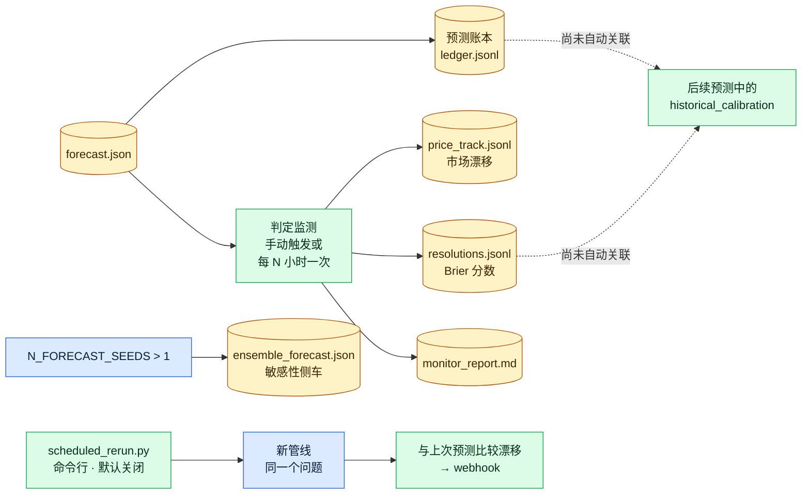

- **多种子敏感性分析**（实验性，默认关闭）。设置 `N_FORECAST_SEEDS` > 1 即可启用。
  - 系统会额外运行 N−1 条「准备 → 运行 → 报告」支线，种子为 `SIM_SEED + 7919·k`，同时最多运行 `ENSEMBLE_SEED_CONCURRENCY`（默认 2）条。每条支线都产出一份完整、经过门控的报告。
  - 各支线的情景概率在对数几率空间中汇总，连同离散度与一致性评分写入 `ensemble_forecast.json`。
  - 主报告与主预测不会被改写。
- **预测账本。** 每一份定稿的预测都会把它的情景追加到 `uploads/pipelines/_forecast_ledger/ledger.jsonl`。
- **判定监测**（`backend/scripts/resolution_monitor.py`）。针对最近的 10 份报告，它会：
  - 重新报价已锚定的市场，写入 `price_track.jsonl`，并标记 5 个百分点及以上的变动；
  - 把市场判定结果连同 Brier 分数记入 `resolutions.jsonl`；
  - 列出需要人工判定的二元预测；
  - 写出 `monitor_report.md`。

  你可以通过**设置 → 维护**、`POST /api/research/resolution-monitor/run` 或命令行运行它，也可以设置 `RESOLUTION_MONITOR_AUTORUN_HOURS` 让它每 N 小时运行一次（0 = 关闭）。
- **校准工具。**
  - `backend/app/services/backtest.py` 提供 Brier 分数、对数损失、校准分箱与 Murphy 分解。
  - `backend/scripts/golden_eval.py` 用已判定的「黄金问题」打分。
  - 把判定结果回填进账本，是让后续报告显示 `historical_calibration` 的前提，但这一步**尚未自动化**。
- **定时重跑**（`backend/scripts/scheduled_rerun.py daemon|tick`，默认关闭）。它会重跑保存过的问题，记录 15 个百分点及以上的概率漂移，并可 POST 到 webhook。`scheduled_rerun.py diff <pipe_a> <pipe_b>` 可以比较两次运行。

---

## 可信度与质量保障

整条管线的设计目标，是让一次「完成」的运行真正可信。这主要由四套机制支撑。

### 1. 行动者真实感链条

行动者的真实感不是靠更长的人格提示词，而是靠一条从研究一直延伸到模拟智能体的封存数据链：

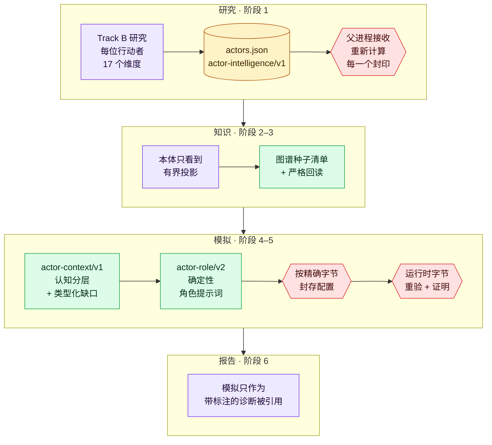

| 边界 | 契约 | 强制执行的内容 |
|---|---|---|
| 研究 → 父进程 | `actor-intelligence/v1` | 每条主张都绑定一个已抓取的来源：收据、精确引文或区间，以及内容哈希。父进程会重新计算收据、主张 ID、五个行为族、覆盖率、阵容与血缘哈希。只要有一处不一致，运行就会在阶段 2 开始前失败。 |
| 本体 | 有界投影 | 本体 LLM 只能看到规范的行动者 ID、别名、层级与绑定收据的主张，看不到自由格式的角色、立场或简介字段。 |
| 图谱 | `actor-graph-seed-manifest/v1` + `actor-graph-seed-readback/v1` | 行动者及其关系在任何正文之前以确定性方式写入。正文可以丰富图谱，但不能替换它们。写入种子后、之后所有改动之后、以及每次复用图谱时都会检查。 |
| 上下文 | `actor-context/v1` | 把公开、有文献记载、行动者私有、有争议、推断与未知的信息分开。只有公开且绑定来源的证据进入共享世界。 |
| 角色 | `actor-role/v2` | 每个智能体行为的唯一来源，编译时不调用 LLM。 |
| 运行时 | `simulation-config-manifest/v1` | 配置、人格档案、角色、上下文与阵容按精确字节封存。父进程与模拟子进程都会在第一次行动前重新校验；Reddit 最终的系统消息会被证明未经改动。 |
| 报告 | `diagnostic_only` | 模拟输出只作为带标注的情景分析被引用，从不被当作证据，也不作为概率输入。 |

以上这些下游检查全部是确定性的，不会增加任何 LLM 调用。没有封存契约的旧运行会走有文档说明的旧路径。完整规范见[行动者智能架构](docs/architecture/ACTOR_INTELLIGENCE_ARCHITECTURE.md)。

### 2. 杜绝虚假成功

管线只有通过**健康门**才会进入 `completed`。
- **硬性失败**会让运行失败（仍可恢复）：
  - 报告缺失，或所有章节都是占位符；
  - `forecast.json` 中缺少情景或二元预测；
  - 报告小于 2 KB；
  - `final_audit.json` 缺失、已过期，或与磁盘上文件的 SHA-256 不一致。
- **较轻的问题**只会把运行标记为*降级*，运行仍然完成：
  - 模拟空转或被截断；
  - 图谱中超过 30% 的分块被跳过；
  - 剪枝失败；
  - 模拟回写失败的内容进入了死信队列。

更早的硬性门同样生效：研究契约、行动者接收，以及模拟的完成证据。

### 3. 只发布通过审计的内容

| 门控 | 检查内容 | 不通过时 |
|---|---|---|
| 研究报告评审 | 针对研究档案精确字节的 7 个质量维度 | 做一次定向修补；仍不通过则阶段失败 |
| 行动者档案评审 + 覆盖审计 | 10 个维度，外加每位行动者 × 每个维度的主张与来源覆盖 | 阶段失败 |
| 图谱 / 准备 / 运行封印 | 字节级精确的清单与回读 | 阶段失败 |
| 发布稳定器 | 引用都能对应到来源；至少 75% 的主张有引用；没有来源被引用超过 20 次；引文逐字一致；lint 稳定 | 报告为 FAILED |
| 终审 + 发布门 | 见下文 | 报告为 FAILED |
| API 发布状态 | 每次读取时都重新核对 `full_report.md` 与 `forecast.json` 审计过的 SHA-256 哈希 | 返回 `409` 并附原因 |
| 管线健康门 | 见[杜绝虚假成功](#2-杜绝虚假成功) | 管线失败或*降级* |

终审与发布门检查：
- **情景契约：** 2–5 个情景，概率之和为 1 ± 0.015，含一个剩余情景，并附判定标准；
- **一致性：** 正文与 `forecast.json` 一致，每条二元预测都与情景一致；
- **泄漏：** 模拟内容没有渗入事实性陈述，也没有语言混杂；
- **完整性：** 没有失败的章节；
- **市场锚点：** 每个市场锚点都完整无误。

在默认的 `REPORT_PUBLISH_GATE=true` 下，除了硬性错误之外，*认知类*问题同样会阻止发布，例如引用覆盖率低于 75%。

### 4. 由证据决定，模拟与市场只提供参考

- **模拟。** 在默认的 `SIMULATION_FORECAST_EFFECT=diagnostic_only` 下，模拟与世界态的输出只以带标注的分析形式出现，永远不会进入情景骨架或二元预测的概率。
- **市场。** 只有存在判定标准完全或近似等价的市场时，Polymarket 价格才会附到某条预测上。否则这条预测保持未锚定状态，不会拿一个问的其实是别的问题的市场来对比。
- **不可信文本。** 网络内容与研究正文在进入任何下游模型调用之前都会被清洗，并包裹在明确的不可信数据分隔符中。测试套件会检查这些边界（`backend/tests/test_prompt_injection_boundaries.py`）。
- **可复现性。** `run.json` 记录 git SHA、DeerFlow 版本以及每个阶段实际使用的模型。与安全相关的策略在运行准入时就固定下来。

### 5. 数字与引用的核对（研究引擎 v3）

- **数字。** 只有当一条研究发现中的每个数字都出现在它所引用的已抓取页面上时，它才会被标为 VERIFIED。百分比必须与百分比匹配，功率、能量与货币数值必须与同一单位类别匹配，因此"15%"不会因为某个日期里的 15 而被确认，"176 GW"也不会因为"176 页"而被确认。缺少数字支撑的发现标为 UNVERIFIED，永远不会被当作事实陈述。
- **引用。** `[S#]` 标记与 `sources.json` 按位置对应；智能体只能引用它见过的来源，研究 lint 也绝不会删除、凭空生成或截短任何标记。
- **如实降级。** 模板规划、确定性的兜底章节、被截断的回复与失败的抽取都会列入 `research_quality.degradation`；如果一次运行没有任何模型输出或没有任何有来源的证据，它会以可续跑的失败退出，而不是发布报告。

---

## 环境要求

| 要求 | 说明 |
|---|---|
| **macOS 或 Linux** | `setup.sh`、`npm start` 与各运维脚本都是 bash 脚本。`npm start`/`npm stop` 还需要 `curl`、`lsof`、`ps` 与 `tail`。 |
| **Node.js ≥ 20.19** | 前端所需。Vite 7 需要 Node ^20.19 或 ≥ 22.12。 |
| **Python 3.12** | 后端 venv 与 DeerFlow 的独立 venv 都固定为 3.12（`backend/.python-version`、`uv sync --python 3.12`），因为 `camel-ai`/`camel-oasis` 依赖栈限制了版本上限。 |
| **[uv](https://docs.astral.sh/uv/)** | 管理两个 Python venv。安装：`curl -LsSf https://astral.sh/uv/install.sh \| sh`。 |
| **git** | 供 `setup.sh` 拉取固定版本的上游 DeerFlow。若已有装配好的 `deer-flow/` 或本地 `deer-flow-2.0.0/` 源码包，则不需要。 |
| **一个 LLM** | 已登录的本地 `claude` 或 `codex` CLI，或 `openai`、`kimi`、`minimax`、`deepseek`、`qwen`、`glm` 其中之一的 API Key。见[模型提供方](#模型提供方)。 |
| **磁盘空间** | 需要几 GB，用于两个 venv、约 470 MB 的多语言向量模型（首次构建图谱时下载）以及运行产物。`npm run doctor -- --deep` 在剩余空间低于 2 GB 时报错，低于 5 GB 时警告。 |
| **可选：搜索/抓取 Key** | `FIRECRAWL_API_KEY`（推荐）、`SERPER_API_KEY`、`TAVILY_API_KEY`、`EXA_API_KEY`。都不配置时，研究使用免 Key 的 DuckDuckGo 搜索与 Jina Reader。 |
| **可选：pandoc + XeLaTeX** | PDF 导出需要。中文 PDF 还需要 CJK 字体，例如 Noto Sans CJK SC、Source Han Sans SC 或 PingFang SC。 |

---

## 安装与配置

步骤是：**安装 → 配置 → 运行**。

### 1. 安装

```bash
./setup.sh
```

`setup.sh` 自动完成全部安装：

1. **检查前置条件：** Node、uv、git 与 Python 3.12。
2. **选择提供方。** 可选本地 `claude` / `codex` CLI（检测到的 CLI 会预先选中），或六个 API 提供方之一。
   - 选 API 提供方时，它会请你输入 Key（输入不回显），并用一次单 token 补全**实时校验**。输错的 Key 几秒钟内就会暴露，而不是在运行数小时之后。
   - 它会写入 `LLM_PROVIDER` 及对应的研究模型 `DEERFLOW_MODEL`。
   - 重新运行时默认沿用当前的提供方，直接回车不会覆盖已有配置。
3. **写入 `.env`。** `.env` 不存在时，从 `.env.example` 生成，并记录你的选择。
4. **安装 npm 包**，包括根目录与前端。
5. **构建后端 venv**，基于 Python 3.12，包含本地 Graphiti + FalkorDB 依赖栈。
6. **把 DeerFlow 装配进 `deer-flow/`**（自动生成，已被 gitignore）：
   - 若存在另行放置的本地 `deer-flow-2.0.0/` 源码包就使用它，否则按固定提交克隆 `bytedance/deer-flow`；
   - 精简检出内容，并应用受版本控制的 `deerflow_bridge/` 覆盖层：驱动、工具、技能、中间件与提供方补丁；
   - **仅在不存在时**才复制 `config.yaml`；
   - 构建 DeerFlow 自己的 Python 3.12 venv。

   重新运行时会保留已有的底座与 `config.yaml`，只刷新受版本控制的覆盖层。

以下 shell 变量可以改变安装行为。它们不是 `.env` 的配置项。

| 变量 | 作用 |
|---|---|
| `DEERFLOW_DIR` | 运行时的装配位置（默认 `./deer-flow`） |
| `DEERFLOW_REPO` / `DEERFLOW_REF` | 上游仓库地址与提交，例如 `DEERFLOW_REF=main ./setup.sh` 跟踪上游最新版本 |
| `SETUP_NONINTERACTIVE=1` | 跳过选择器，自动检测。CI 与管道运行会自动这样做。 |
| `SETUP_DRF2=1` | 同时安装可选的 [DRF2](#deerflow-2-集成与-drf2-目标) 预览依赖 |

如需手工打包自定义环境，请把 [`setup.sh`](setup.sh) 当作规范来看：这套集成不只是复制一个驱动文件那么简单。

### 2. 配置

1. **凭据。** 使用 API 提供方时，在 `.env` 中填写它的 Key（见[配置（`.env`）](#配置env)）。使用 CLI 提供方时，确认 CLI 已登录：运行一次 `claude` 或 `codex` 即可。
2. **检查环境：**

   ```bash
   npm run doctor                     # 离线、免费、即时：工具、两个 venv、DeerFlow 覆盖层、.env、提供方前置条件
   npm run doctor -- --deep           # 另加：一次真实的单 token 补全、向量模型缓存检查、磁盘空间检查
   npm run doctor -- --deep --pull    # 另加：向量模型缺失时预先下载
   ```

   修复所有标 ✗ 的项目，直到输出 `All checks passed`。退出码：0 表示可以运行，1 表示有阻塞问题，2 表示只有 `--deep` 探测给出了警告。

### 3. 运行

```bash
npm start                 # 以脱离终端的方式启动后端 + 前端，等两者都能应答后打开浏览器，
                          # 然后跟随两份日志，并在阶段变化时打印 ▶/✓/✕ 标记
npm start -- --detach     # 同上，但就绪检查完成后立即返回
npm start -- --no-open    # 不打开浏览器
npm stop                  # 停止由 npm start 启动的服务
npm run dev               # 另一种方式：在前台同时运行两者（Ctrl-C 同时停止）
```

在 `npm start` 期间按 Ctrl-C 只会停止日志流，服务会继续运行，直到你执行 `npm stop`。日志写入 `logs/backend.out.log` 与 `logs/frontend.out.log`。

| 服务 | 地址 |
|---|---|
| 前端（Vite 开发服务器） | <http://localhost:3000>，把 `/api` 代理到 `:5001` |
| 后端（Flask） | <http://localhost:5001>，健康检查：`GET /health` |
| 单端口模式 | 先执行 `npm run build`，再只启动后端（`npm run backend`），然后打开 <http://localhost:5001>。由 Flask 托管构建好的界面。 |

每次启动运行时，后端都会重新预检；配置错误几秒钟内就会报告，此时还没有消耗任何 token。

---

## 模型提供方

两项设置决定使用哪些模型：

- **`LLM_PROVIDER`** 驱动后端自己的 LLM 调用（本体、图谱抽取、事件设计、报告）以及模拟中的智能体。
- **`DEERFLOW_MODEL`** 驱动研究阶段。它是单独配置的，但在设置中切换提供方时也会随之切换（见下文）。

| `LLM_PROVIDER` | 通道 | 默认端点 · 模型 | 对应的研究模型 | 凭据 |
|---|---|---|---|---|
| `claude-cli`（默认） | 本地 `claude` CLI（Claude Code 订阅） | — | `claude` | CLI 登录，无需 Key |
| `codex-cli` | 本地 `codex` CLI（ChatGPT 订阅） | — | `codex` | CLI 登录，无需 Key |
| `openai` | OpenAI 兼容 HTTP | `https://api.openai.com/v1` · `gpt-4o-mini` | `claude` | `LLM_API_KEY` |
| `kimi` | OpenAI 兼容 HTTP（Kimi for Coding） | `https://api.kimi.com/coding/v1` · `kimi-k2.7` | `kimi` | `LLM_API_KEY`（同步到 `KIMI_API_KEY`） |
| `minimax` | OpenAI 兼容 HTTP | `https://api.minimaxi.com/v1` · `MiniMax-M3` | `minimax` | `LLM_API_KEY`（同步到 `MINIMAX_API_KEY`） |
| `deepseek` | OpenAI 兼容 HTTP | `https://api.deepseek.com/v1` · `deepseek-chat` | `deepseek` | `LLM_API_KEY`（同步到 `DEEPSEEK_API_KEY`） |
| `qwen` | OpenAI 兼容 HTTP | `https://dashscope-intl.aliyuncs.com/compatible-mode/v1` · `qwen-plus` | `qwen` | `LLM_API_KEY`（同步到 `DASHSCOPE_API_KEY`） |
| `glm` | OpenAI 兼容 HTTP | `https://api.z.ai/api/paas/v4` · `glm-4.6` | `glm` | `LLM_API_KEY`（同步到 `ZHIPUAI_API_KEY`） |

所有在线提供方都使用 `LLM_API_KEY`；`LLM_BASE_URL` 与 `LLM_MODEL_NAME` 可覆盖上表中的默认值。

研究模型（`DEERFLOW_MODEL`）由 `deerflow_bridge/config.yaml` 中的配置段定义：

| `DEERFLOW_MODEL` | 模型 | 凭据 |
|---|---|---|
| `claude`（默认） | `claude-opus-4-8` | Claude Code OAuth 登录，无需 API Key |
| `codex` | `gpt-5.5` | Codex / ChatGPT 登录 |
| `kimi` | `kimi-k2.7` | `KIMI_API_KEY` |
| `minimax` | `MiniMax-M3` | `MINIMAX_API_KEY` |
| `deepseek` | `deepseek-v4-pro` | `DEEPSEEK_API_KEY` |
| `qwen` | `qwen3.7-max` | `DASHSCOPE_API_KEY` |
| `glm` | `glm-5.3` | `ZHIPUAI_API_KEY` |
| `antigravity` | `gemini-3-flash-preview`，经由本地 OpenAI 兼容代理 | `LLM_FALLBACK_API_KEY` + `LLM_FALLBACK_BASE_URL`；需要本地代理正在运行 |

`deer-flow/config.yaml` 只在不存在时才会生成，因此较早装配的运行时可能仍带着旧的配置段。升级后请与 `deerflow_bridge/config.yaml` 对照。你也可以为单次运行指定研究模型：在表单的**高级**区域中设置，或在 `POST /api/research/run` 的 `model` 字段中指定。

### 如何切换

- **设置菜单（最简单）。** 选择提供方，按需填写 Key、Base URL 与模型。
  - **测试连接**在不保存任何内容的前提下验证你的选择。API 提供方会做一次真实的单 token 补全，能准确报告 401（Key 无效）、404（端点或模型错误）或 429（配额耗尽）；CLI 提供方会检查 PATH 与 `--version`。
  - **应用**把选择保存到 `.env`。
- **`setup.sh`。** 重新运行即可使用交互式选择器。
- **`.env`。** 设置 `LLM_PROVIDER`、凭据与 `DEERFLOW_MODEL`。
- **API。** `GET /api/settings/llm` 读取当前设置。`POST /api/settings/llm`（请求体为 `{provider, api_key?, base_url?, model?}`）执行切换。`POST /api/settings/llm/test`（请求体相同）只测试、不保存。

> ⚠️ **切换立即生效，并且会同时改写 `DEERFLOW_MODEL`。** 它作用于切换之后启动的一切，包括正在进行中的运行的后续阶段。想让一次运行始终用同一个提供方，请在两次运行之间再切换。

### 可靠性机制

- **重试与超时。** HTTP 调用最多尝试 3 次，采用指数退避，遵循 `Retry-After`（最长 30 秒），每次调用 600 秒超时。CLI 调用 180 秒超时（`LLM_CLI_TIMEOUT`）。
- **熔断器。** 针对内容过滤（422）与配额（429）错误的熔断器始终处于启用状态。
- **故障转移（默认关闭）。** 设置 `LLM_FALLBACK_PROVIDER`；HTTP 类的备用提供方还需要 `LLM_FALLBACK_MODEL`。可选：`LLM_FALLBACK_BASE_URL`、`LLM_FALLBACK_API_KEY`。
- **故障熔断。** 提供方连续失败 10 次后（`LLM_OUTAGE_HALT_CONSECUTIVE`），本次运行立即失败，而不是白白消耗时间。提供方恢复后即可恢复运行。
- **`claude-cli` 隔离。** CLI 运行时会禁用你个人的 Claude Code hooks。环境中残留的 `ANTHROPIC_API_KEY` 会被自动剔除，使计费继续走订阅；若需保留，请设置 `LLM_CLI_USE_API_KEY=true`。
- **关闭推理模式。** 对 kimi、minimax、deepseek、qwen 与 glm，后端会关闭推理（thinking）模式以节省 token。
- **单次运行预算上限（默认关闭）。** `LLM_RUN_BUDGET_TOKENS` / `LLM_RUN_BUDGET_USD`。

---

## 配置（`.env`）

- **位置。** `.env` 位于仓库根目录。`setup.sh` 会从 [`.env.example`](.env.example) 生成它；该文件记录了全部约 490 项设置，按主题分组，注释以中文为主。
- **优先级。** `.env` 中的值会**覆盖** shell 中导出的同名环境变量。
- **默认值可用。** 几乎每一项都有可用的默认值。通常你只需要配置一个提供方及其凭据。
- **漂移检查。** `npm run check:env` 检查 `.env.example` 与 `backend/app/config.py` 是否一致。

**提供方**

| 设置 | 默认值 | 作用 |
|---|---|---|
| `LLM_PROVIDER` | `claude-cli` | 后端与模拟使用的提供方（见[模型提供方](#模型提供方)） |
| `LLM_API_KEY` · `LLM_BASE_URL` · `LLM_MODEL_NAME` | — | 在线提供方的凭据与覆盖项 |
| `DEERFLOW_MODEL` | `claude` | 研究模型 |
| `LLM_FALLBACK_PROVIDER`（+ `_MODEL`、`_BASE_URL`、`_API_KEY`） | 未设置 | 一次性故障转移的备用提供方 |

**研究（阶段 1）**

| 设置 | 默认值 | 作用 |
|---|---|---|
| `DEERFLOW_RESEARCH_DEPTH` | `deep` | `quick` / `standard` / `deep`（表单可按次覆盖） |
| `DEERFLOW_RESEARCH_LANGUAGE` | （自动） | 强制输出 `Chinese` 或 `English`；否则根据问题自动判断 |
| `DEERFLOW_RESEARCH_TIMEOUT` | （随深度而定） | 看门狗时长覆盖值，单位为秒 |
| `RESEARCH_ENGINE` | `v3` | `v3`（别名 `linear`）或 `legacy`（别名 `deerflow`、`agentic`） |
| `RESEARCH_LINEAR_*` | （按深度） | v3 引擎的限额：问题数、智能体步数、搜索、抓取、并行数、时间、输出上限、GLM 推理强度（见 `.env.example`） |
| `RESEARCH_PARALLEL_TRACKS` | `3` | 并行证据轨的数量（仅旧版引擎；v3 只跑一条轨） |
| `RESEARCH_GLOBAL_SYNTHESIS` | `true` | 封存各证据轨，并只运行一次全局综合 |
| `DEERFLOW_DUAL_TRACK` | `true` | 共享的 Track B 行动者平面 |
| `DEERFLOW_SUBAGENTS` · `RESEARCH_GLOBAL_SUBAGENT_CAP` | `true` · `9` | harness 子智能体，以及整机上限 |
| `RESEARCH_MCP_KG` | `true` | 让分叉/继续/恢复的研究可以访问已有的图谱 |
| `FIRECRAWL_API_KEY` · `SERPER_API_KEY` · `TAVILY_API_KEY` · `EXA_API_KEY` | — | 搜索与抓取后端（推荐 Firecrawl） |
| `PREDICTION_MARKETS_ENABLED` | `true` | 在研究与报告阶段免 Key 查询 Polymarket |

**知识图谱（阶段 2–3）**

| 设置 | 默认值 | 作用 |
|---|---|---|
| `GRAPH_BACKEND` | `auto` | `auto`：设置了 `FALKORDB_HOST` 时用外部 FalkorDB，否则用内嵌 `falkordblite`，再否则用 Kùzu |
| `GRAPHITI_DATA_DIR` | `backend/uploads/graphiti_db` | 图数据库的存放位置 |
| `GRAPHITI_EMBED_MODEL` · `GRAPHITI_EMBED_DIM` | `paraphrase-multilingual-MiniLM-L12-v2` · `384` | 本地向量模型；维度必须与模型一致 |
| `GRAPHITI_RERANKER` | `rrf` | 或 `bge`，使用本地交叉编码器 |
| `GRAPH_CHUNK_SOURCE` | `dossier_only` | `dossier_only` / `report_only` / `both` |
| `GRAPH_MAX_ENTITIES` | `400` | 剪枝上限（不会低于阵容规模） |
| `GRAPH_BUILD_COMMUNITIES` | `false` | 社区发现 |
| `FALKORDB_HOST` · `FALKORDB_PORT` | 未设置 · `6379` | 使用外部 FalkorDB 服务器，代替内嵌实例 |

**模拟（阶段 4–5）**

| 设置 | 默认值 | 作用 |
|---|---|---|
| `SIM_TEMPORAL_MODE` | `calendar` | `calendar`，或旧式的 `hours` |
| `SIM_CALENDAR_TARGET_MAX_ROUNDS` · `OASIS_DEFAULT_MAX_ROUNDS` | `36` · `36` | 选择日历单位时使用的回合预算 |
| `ACTOR_CAST_MAX` | `20` | 研究阵容的最大规模 |
| `SIM_AUDIENCE_AGENTS` | `0` | 额外按规则生成的受众智能体数量 |
| `OASIS_SEMAPHORE` · `OASIS_CLI_SEMAPHORE` | `30`¹ · `8` | API / CLI 提供方下智能体并发 LLM 调用数，由两个平台平分 |
| `SIMULATION_FORECAST_EFFECT` | `diagnostic_only` | 不让模拟影响概率 |
| `SIM_GRAPH_FEEDBACK` | `false` | 把模拟活动写回图谱 |

¹ 这是该变量未设置时，模拟子进程采用的默认值。

**报告（阶段 6）**

| 设置 | 默认值 | 作用 |
|---|---|---|
| `REPORT_OUTPUT_LANGUAGE` | （自动） | 强制报告语言；否则根据问题自动判断 |
| `REPORT_BILINGUAL` | `true` | 同时生成另一种语言（中↔英）的版本 |
| `REPORT_PUBLISH_GATE` | `true` | 审计发现任何问题都阻止发布 |
| `FORECAST_MARKET_ANCHORING` | `true` | 把二元预测与判定标准等价的 Polymarket 市场匹配 |
| `REPORT_VISUALIZER` | `true` | 渲染图表 |
| `REPORT_PDF_EXPORT` | `true` | 启用 PDF 接口 |
| `N_FORECAST_SEEDS` · `ENSEMBLE_SEED_CONCURRENCY` | `1` · `2` | 多种子敏感性侧车 |

**服务与运维**

| 设置 | 默认值 | 作用 |
|---|---|---|
| `FLASK_HOST` · `FLASK_PORT` | `127.0.0.1` · `5001` | 监听地址（见[安全](#安全)） |
| `APP_API_TOKEN` | — | 非环回的 API 客户端须以 `X-API-Token` 提供 |
| `FLASK_DEBUG` | `false` | Werkzeug 调试器与自动重载（重载会杀掉进行中的运行） |
| `API_V1_ENABLED` | `false` | 挂载可选的 `/api/v1` 路由 |
| `RESOLUTION_MONITOR_AUTORUN_HOURS` | `0` | 每 N 小时运行一次判定监测（0 = 关闭） |
| `LLM_RUN_BUDGET_TOKENS` · `LLM_RUN_BUDGET_USD` | `0` | 单次运行的花费上限（0 = 关闭） |
| `LOG_LEVEL` | `INFO` | `backend/logs/` 的日志级别（按天滚动，保留 30 天） |

使用在线提供方时，一份最小的 `.env`：

```bash
LLM_PROVIDER=deepseek
LLM_API_KEY=sk-...
DEERFLOW_MODEL=deepseek
DEEPSEEK_API_KEY=sk-...          # 研究阶段读取的是提供方专属的变量
FIRECRAWL_API_KEY=fc-...         # 可选，但推荐
```

---

## API 参考

**约定**
- **基础地址。** 后端监听 `http://localhost:5001`，所有产品路由都在 `/api` 之下。开发时也可以经 Vite 代理访问 `http://localhost:3000/api`。
- **响应格式。** JSON 响应统一使用 `{ "success": bool, "data": …, "error": … }` 信封格式。
- **健康检查。** `GET /health` 无需鉴权。
- **鉴权。** 环回地址的客户端默认受信任，其他客户端需要提供 `X-API-Token`（见[安全](#安全)）。

以下是仪表盘用到的路由，完整清单放在后面的折叠块中。

**研究与管线（`/api/research`）**

| 方法 | 路径 | 用途 |
|---|---|---|
| `POST` | `/run` | 启动一条管线。请求体为 `{prompt, mode: full \| research_only, depth: quick \| standard \| deep, max_rounds?, language?: Chinese \| English \| auto, model?, project_name?}`。`language` 也接受别名 `research_language`，`model` 可为本次运行覆盖研究模型。返回 `{pipeline_id, task_id, mode, status}`；预检发现问题时返回 `400` 并附 `preflight_errors`。 |
| `GET` | `/preflight?mode=` | 不启动运行，只检查是否就绪。加上 `format=full&deep=1` 可获得详细报告。 |
| `GET` | `/status/<id>` | 管线状态，外加 `live` 块：已用时间、预计剩余、心跳、所属进程是否存活、花费与预算 |
| `GET` | `/<id>/progress?lines=&scope=full\|tail` | 合并后的研究控制台日志 |
| `GET` | `/list` | 运行历史 |
| `POST` | `/<id>/cancel` · `/<id>/resume`（`{force?}`）· `/<id>/continue` | 生命周期控制（见[管线生命周期](#管线生命周期状态与恢复)） |
| `POST` | `/<id>/scenario` | 从已完成的图谱分叉出一次假设推演。仅限 API，界面上没有对应按钮。 |
| `DELETE` | `/<id>` | 删除一次已结束的运行。运行仍在进行，或有分叉依赖它时返回 `409`（除非带 `?force=true`）。 |
| `POST` | `/clean` | 批量删除失败与已取消的运行（请求体 `{statuses?}`） |
| `GET` · `PUT` | `/<id>/dossier` | 读取研究档案、行动者、来源、时间线、数值与争议主张、预测市场与图表，以及 `sealed`。`PUT` 用于编辑档案（仅限已完成的仅研究运行，或图谱阶段尚未完成的失败/已取消运行）。已封存的研究只读：`PUT` 返回 `409` 与 `sealed: true`。 |
| `POST` · `GET` | `/<id>/dossier/translations/<lang>` | 发起或读取研究报告经审计的中↔英翻译 |
| `GET` | `/<id>/dossier/pdf` | 研究报告的 PDF |
| `GET` | `/<id>/artifact/<name>` | 按名称获取某个阶段产物 |
| `POST` | `/resolution-monitor/run` | 启动一轮判定监测。返回 `202`；已有一轮在运行时返回 `409`。 |

**知识图谱（`/api/graph`）**

| 方法 | 路径 | 用途 |
|---|---|---|
| `GET` | `/data/<graph_id>?top_k=&slim=&full=` | 节点与边，附计数、截断标记与布局坐标 |
| `GET` | `/data/<graph_id>/node/<uuid>` · `/edge/<uuid>` · `/neighbors/<uuid>?depth=` | 单个节点或边的详情，以及邻域展开（深度 ≤ 3） |

**模拟（`/api/simulation`）**

| 方法 | 路径 | 用途 |
|---|---|---|
| `GET` | `/<sim_id>/run-status` | 实时运行状态 |
| `GET` | `/<sim_id>/profiles/realtime?platform=` | 智能体档案 |
| `GET` | `/<sim_id>/posts?platform=&limit=` · `/<sim_id>/comments` | 模拟的帖子与回复 |
| `GET` | `/<sim_id>/agent-stats` | 智能体汇总统计 |
| `GET` | `/<sim_id>/actions` · `/<sim_id>/timeline` · `/<sim_id>/trajectory` | 行为日志、回合时间线与世界态轨迹 |

**报告（`/api/report`）**

| 方法 | 路径 | 用途 |
|---|---|---|
| `GET` | `/<report_id>` | 元数据、翻译状态与发布状态。只有报告可发布时才包含 Markdown 正文。 |
| `GET` | `/<report_id>/sections-partial` | 已完成的章节（仪表盘在生成期间轮询它） |
| `GET` | `/<report_id>/forecast` | `forecast.json`（受发布门约束） |
| `GET` | `/<report_id>/download` · `/<report_id>/full_report.<lang>.md` | 主报告或某个语言版本的 Markdown（受发布门约束） |
| `POST` · `GET` | `/<report_id>/translations/<lang>` · `…/status` | 生成语言版本（需要主报告可发布），或查询其状态 |
| `GET` | `/<report_id>/pdf?lang=` | 报告的 PDF。不可发布时返回 `409`；导出被关闭或失败时返回 `503`。 |
| `GET` | `/<report_id>/charts/<file>` · `/<report_id>/viz-manifest` | 图表资源（在沙箱中提供）及其清单 |
| `GET` | `/<report_id>/exec-brief` · `/exec-brief.pdf` · `/digest` | 执行简报与摘要（确定性生成，受发布门约束） |

**设置（`/api/settings`）：** `GET /llm` · `POST /llm` · `POST /llm/test`（见[如何切换](#如何切换)）。

<details>
<summary><b>全部路由</b>（102 个蓝图路由 + <code>/health</code>）</summary>

| 蓝图 | 上文之外的其余路由 |
|---|---|
| `/api/graph`（14） | `GET /project/<id>` · `GET /project/list` · `DELETE /project/<id>` · `POST /project/<id>/reset` · `POST /ontology/generate` · `POST /build` · `GET /task/<task_id>` · `GET /tasks` · `POST /gc` · `DELETE /delete/<graph_id>` |
| `/api/simulation`（32） | `GET /entities/<graph_id>` · `GET /entities/<graph_id>/<uuid>` · `GET /entities/<graph_id>/by-type/<type>` · `POST /create` · `POST /prepare` · `POST /prepare/status` · `GET /<sim_id>` · `GET /list` · `GET /history` · `GET /<sim_id>/profiles` · `GET /<sim_id>/config` · `GET /<sim_id>/config/realtime` · `GET /<sim_id>/config/download` · `GET /script/<name>/download` · `POST /generate-profiles` · `POST /start` · `POST /stop` · `GET /<sim_id>/run-status/detail` · `POST /interview` · `POST /interview/batch` · `POST /interview/all` · `POST /interview/history` · `POST /env-status` · `POST /close-env` |
| `/api/report`（29） | `POST /generate` · `POST /generate/status` · `GET /by-simulation/<sim_id>` · `GET /list` · `DELETE /<report_id>` · `POST /chat` · `GET /<report_id>/progress` · `GET /<report_id>/sections` · `GET /<report_id>/section/<n>` · `GET /check/<sim_id>` · `GET /<report_id>/agent-log` · `GET /<report_id>/agent-log/stream` · `GET /<report_id>/console-log` · `GET /<report_id>/console-log/stream` · `POST /tools/search` · `POST /tools/statistics` |
| `/api/v1`（6，仅当 `API_V1_ENABLED=true`） | `POST /run` · `GET /status/<pipeline_id>` · `GET /list` · `GET /dossier/<pipeline_id>` · `GET /forecast/<report_id>` · `POST /resolve/<report_id>` |

许多额外的图谱、模拟与报告路由早于统一仪表盘出现，至今仍可用于脚本调用。处理函数位于 [`backend/app/api/`](backend/app/api/)。

</details>

---

## 仪表盘

前端是一个在 `/` 提供服务的 Vue 3 单一视图（`/research` 会重定向到这里）。它有两种状态：
- **未选择运行时。** 显示提问表单：示例问题、**完整管线**或**仅研究**、深度、回合上限，以及**高级**选项（研究语言、研究模型）。开始之前，一条预检横幅会提示配置问题。
- **运行进行中：**
  - 页头显示管线 ID、状态标题与**运行体征**条（已用时间、预计剩余、存活状态、token 与费用、预算）；
  - 原始问题；
  - 一条吸顶的**阶段时间线**（01–06），显示每个阶段的状态、子进度、最新消息与耗时；
  - 五个标签页，各自在对应产物生成后解锁。

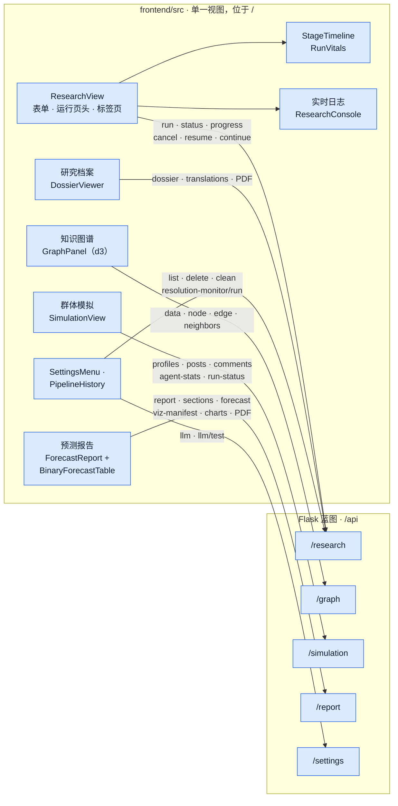

| 标签页 | 展示内容 |
|---|---|
| **实时日志** | DeerFlow 研究控制台，按颜色区分，带「全部 / 工具 / 结果 / 错误」过滤与工具调用计数 |
| **研究档案** | 研究报告，可切换原文与译文，可下载 PDF。子标签：**研究报告**、**关键参与者**、**局势简报**、**关系网**、**预测市场**（有数据时）、**信息来源**。 |
| **知识图谱** | 以交互式 d3 力导向布局展示知识图谱：搜索、基于 `valid_at` 的时间滑块、类型图例，以及标记研究所得行动者的圆环。还有节点/边详情、聚焦模式（≤ 400 个节点，点击展开）与「加载完整图谱」。 |
| **群体模拟** | Twitter/Reddit 切换、回合与状态卡片、人格卡片，以及带嵌套回复的信息流。模拟运行期间每 10 秒刷新一次。 |
| **预测报告** | 各章节完成后陆续出现。全部完成后，标签页显示：<br/>• **目录**；<br/>• **预测仪表盘**：情景概率、置信度、集成一致性与市场偏离；<br/>• **二元预测**表：概率与区间、置信度、市场锚点及其差值 Δ；<br/>• **图表**画廊：PNG 图片与可交互版本；<br/>• 语言切换；<br/>• Markdown/PDF 下载与「复制 Markdown」。 |

**操作：**
- **取消**：运行进行中时显示。
- **继续**（即恢复）：运行失败或被取消后显示。
- **继续完整管线 →**：已完成的仅研究运行显示此按钮。
- **＋ 新建**：回到表单。
- **历史推演**（右侧抽屉）：列出过往运行，每条都可取消或删除，另有**清理失败**。
- **设置**：界面语言、带**测试连接**的提供方切换，以及**维护 → 市场判定监测**。
- 界面支持中英双语，可通过导航栏的切换按钮或在设置中切换；选择会保存在浏览器中。

**实时更新。**
- 仪表盘只使用轮询，没有 WebSocket，也没有 SSE。
- 主循环轮询 `status` + `progress`：起始间隔 2.5 秒，状态无变化时逐步放慢到 12 秒，标签页隐藏时暂停。
- 群体模拟标签页每 10 秒刷新一次；预测报告标签页在生成期间每 3 秒刷新一次。
- 连续 4 次轮询失败后，会显示「连接中断」横幅，同时继续重试。

---

## 运维与工具

**npm 脚本（在仓库根目录运行）**

| 命令 | 作用 |
|---|---|
| `npm run setup` · `npm run setup:backend` · `npm run setup:all` | 安装 npm 依赖 · 构建后端 venv（`uv sync --python 3.12`）· 两者都做 |
| `npm run doctor` | 环境健康检查（见[配置](#2-配置)） |
| `npm run smoke` | 离线冒烟测试，用桩 LLM 检查各阶段之间的契约，约 60 秒以内。设置 `SMOKE_GRAPH=1` 可使用真实的本地图谱，`SMOKE_FULL=1` 可额外运行一个 OASIS 微型模拟。 |
| `npm start` · `npm stop` | 以脱离终端的方式启动服务并跟随日志 · 停止服务 |
| `npm run dev` | 在前台同时运行后端 + 前端 |
| `npm run backend` · `npm run frontend` | 只启动其中一个服务 |
| `npm run build` | 把 SPA 构建到 `frontend/dist`（之后由 Flask 托管） |
| `npm test` | 后端测试套件（`cd backend && uv run pytest`） |
| `npm run lint` | 对 `backend/app` 运行 `ruff check` |
| `npm run check:env` | 检查 `.env.example` 与 `config.py` 是否一致 |

**辅助脚本**

| 脚本 | 作用 |
|---|---|
| `scripts/watch_pipeline_progress.py` | 从持久化状态文件流式输出阶段变化（`npm start` 会用到） |
| `scripts/salvage_orphaned_pipelines.py` | 把报告其实已完整写出的失败运行改标为 `completed`（*降级*）。默认只演练，加 `--apply` 才真正写入。 |
| `scripts/setup_port80.sh` | 仅限 macOS：设置环回 pf 重定向，使 `http://localhost/` 指向 `:5001` 上的后端 |
| `backend/scripts/resolution_monitor.py` | 重新报价已锚定的市场、记录判定结果、写出 `monitor_report.md` |
| `backend/scripts/scheduled_rerun.py` | 定时重跑已保存的问题并检测漂移；`diff <pipe_a> <pipe_b>` 可以比较两次运行 |
| `backend/scripts/batch_runs.py` | 一组相关问题：研究、本体与图谱只运行一次，再为每个问题分叉出一条「准备/运行/报告」支线 |
| `backend/scripts/model_comparison.py` | 用多个提供方回答同一个问题，并排比较 |
| `backend/scripts/forecast_tools.py` | 对 `forecast.json` 文件做集成汇总与回测 |
| `backend/scripts/golden_eval.py` · `eval_forecast_quality.py` | 黄金问题评分 · 评分量规式 LLM 裁判（需显式开启） |
| `backend/scripts/export_demo_site_data.py` | 把运行导出到 `docs/demos/<run>/`，供演示站使用 |
| `backend/scripts/backfill_report_visuals.py` | 离线为已有报告重建图表与引用（加 `--apply` 才写入） |
| `backend/scripts/replay_zep_dead_letters.py` | 重放失败的模拟 → 图谱回写 |
| `backend/scripts/disk_usage_report.py` · `reclaim_report_space.py` | 只读的磁盘占用报告 · 回收旧的报告备份（默认只演练） |
| `backend/scripts/preflight.py` · `check_env_drift.py` | `doctor --deep` 背后的预检引擎 · `.env` 漂移检查 |

后端脚本请在 `backend/` 下运行：`uv run python scripts/<name>.py --help`。

**演示站。** 静态站点位于 `docs/`（`index.html`、`demo.html`），由 GitHub Pages 提供服务。每次运行都是 `docs/demos/<key>/` 下的一个数据包：`meta.json`、`report.md`、`dossier.md`、`actors.json`、`sources.json`、`ontology.json`、`graph.json`、`forum.json`、`research_log.txt`，以及可选的 `charts/`。已发布的译本与原文并列导出为 `report.<lang>.md` / `dossier.<lang>.md`，`meta.json` 记录每种语言对应的文件（`report_languages`、`dossier_languages`）。新增一次运行：
1. 用 `export_demo_site_data.py` 导出它（`--reports-only` 只刷新报告、研究档案及其译本）；
2. 在 `docs/demo.html` 的 `RUN_KEYS` 中登记它的键；
3. 在 `docs/i18n.js` 中加上标题；
4. 在 `docs/index.html` 中加一张卡片。

---

## 安全

- **默认只监听环回地址。** Flask 绑定在 `127.0.0.1`。
  - 环回地址的客户端受信任。
  - 其他客户端调用 `/api/*` 时：未设置 `APP_API_TOKEN` 则返回 `403`；已设置但没有携带匹配的 `X-API-Token` 请求头则返回 `401`（常数时间比较）。
- **CORS** 仅允许 `localhost`/`127.0.0.1` 的 3000 与 5001 端口（`APP_CORS_ORIGINS`）。
- **不泄漏堆栈与凭据。**
  - 除非 `FLASK_DEBUG=true`，错误响应不包含 Python 堆栈。
  - 请求日志会对凭据脱敏，`run.json` 不保存任何凭据。
  - 提供方设置在写入 `.env` 前会被清洗。
  - 自定义 Base URL 会被校验；设置 `APP_BLOCK_PRIVATE_URLS=true` 还会拒绝私有地址与环回地址。
- **开发服务器同样只监听环回地址。** `npm start` 与 `npm run dev` 把 Vite 绑定在 `127.0.0.1:3000`，<http://localhost:3000> 与 <http://127.0.0.1:3000> 均可访问。它的 `/api` 代理经由环回地址访问 Flask，并在 `X-Forwarded-For` 中转发浏览器的地址。只有当所有转发地址（`X-Forwarded-For`、`X-Real-IP`、`Forwarded`）也都是环回地址时，Flask 才信任这个环回调用方；替其他机器代理过来的请求一律按远程请求处理。转发头只会降低信任，绝不会提升信任。
  - 若要让网络中的其他设备访问开发服务器，请用 `FRONTEND_HOST=0.0.0.0 npm run dev` 启动（这是 shell 变量，Vite 不会读取根目录的 `.env`）。此时远程浏览器访问 `/api` 会得到 `403`，除非配置了 `APP_API_TOKEN`；而 SPA 不会发送 token，因此真正的远程使用请在前面放一个负责鉴权的反向代理。
- **有意对外暴露后端时。** 请同时设置 `FLASK_HOST=0.0.0.0` **和** `APP_API_TOKEN`。SPA 不会发送 token，因此需要浏览器访问时，请在前面放一个负责鉴权的反向代理。

---

## 开发与测试

| 内容 | 命令 | 说明 |
|---|---|---|
| 后端测试 | `npm test` | 约 4,300 个离线测试，分布在约 170 个模块中。不访问网络、不消耗 LLM。需要先构建后端 venv（`npm run setup:backend`）。 |
| 前端单元测试 | `cd frontend && npm run test:unit` | 基于 `node:test`，覆盖 `src/utils` 与开发服务器配置（72 个测试） |
| Lint | `npm run lint` | Ruff。CI 还会检查 `backend/scripts` 与 `deerflow_bridge`。 |
| 配置漂移 | `npm run check:env` | `config.py` 读取的每一项设置都必须在 `.env.example` 中有说明 |
| 阶段契约冒烟测试 | `npm run smoke` | 桩 LLM、确定性、零成本 |
| 预测质量评估 | `backend/scripts/golden_eval.py`、`eval_forecast_quality.py` | 评估预测质量本身，而不只是代码形态 |

**CI**（`.github/workflows/ci.yml`）在推送到 `main` 与提交 Pull Request 时运行三个离线任务：
- Ruff lint 加上环境变量漂移门；
- 后端测试套件；
- 对全部后端与桥接代码做字节编译检查。

CI 不运行前端单元测试。

DeerFlow 覆盖层有自己的测试，位于 `deerflow_bridge/patches/tests/`，需要针对装配好的 `deer-flow/` 运行时运行。

---

## DeerFlow 2 集成与 DRF2 目标

线上管线的阶段 1 已经在使用 **DeerFlow 2** harness：在隔离的子进程中通过内嵌的 `DeerFlowClient` 调用，而不是原始的 DeerFlow 1.x 研究图。仓库中有三层与 DeerFlow 2 相关的代码：

| 层 | 是什么 | 状态 |
|---|---|---|
| `deer-flow-2.0.0/` | 可选的本地 DeerFlow 2.0 源码包，存在时作为全新装配的底座 | 已被 gitignore 的本地参考。普通克隆会改用上游提交 `799bef6d…`，该提交早于公开的 `v2.0.0` 标签。 |
| `deerflow_bridge/` → `deer-flow/` | 受版本控制的驱动、工具、技能、补丁与配置，装配进一个隔离的运行时 | **当前线上的阶段 1 路径** |
| `drf2/` | 自定义智能体与技能、知识图谱与模拟的 MCP 服务，以及一个确定性的 Runs API 驱动器 | 可选，**尚未切换**（还不是线上路径） |

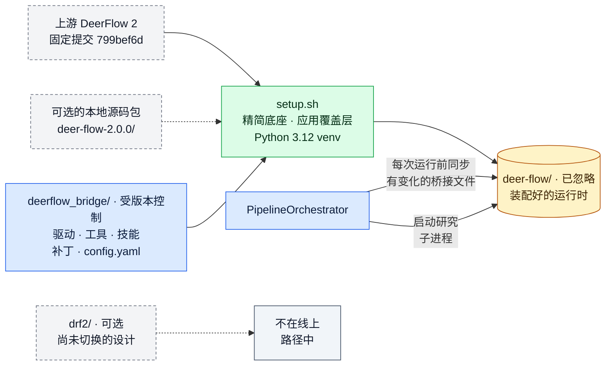

```text
当前     Flask 编排器 → 隔离的研究子进程 → 内嵌 DeerFlowClient
         → 主模型 ↔ 工具（搜索 · 抓取 · 市场 · 可选的知识图谱 MCP）→ 限定范围的子智能体
         → 证据包 → 全局综合 / 评审 / 抽取 → 封存的研究契约

原生     客户端 → DeerFlow 2 FastAPI 网关（threads / runs）→ RunManager → 同一套智能体装配
         → 检查点 / 存储 → SSE 回放            （上游已实现；线上管线未使用）

目标 A   聊天原生的主智能体 + 4 个自定义智能体 ↔ 知识图谱与模拟的 stdio MCP      （尚未切换）
目标 B   确定性驱动器 → 在持久的 Runs API 线程上执行斜杠技能                    （尚未切换）
```

**DRF2 是什么。** DRF2 会把更多知识型工作交给原生 DeerFlow 2，同时把确定性门控保留在模型之外：
- 方法论变成 7 个自定义技能：`deep-research`、`actor-ontology-research`、`ontology-generation`、`kg-construction`、`simulation-design`、`forecast-report`、`prediction-markets`；
- 图谱与模拟变成 stdio MCP 引擎；
- 一个轻量驱动器负责清单、门控、恢复与多种子运行。

**离线试用。** 先执行 `SETUP_DRF2=1 ./setup.sh` 安装预览依赖，然后运行：

```bash
PYTHONPATH=. backend/.venv/bin/python -m drf2.driver.cli run --question "…" --dry-run --base-dir /tmp/drf2
```

它的测试：`cd backend && uv run pytest tests/test_drf2_*.py`。

**切换前的已知缺口：**
- 随附的配置中没有 `driver:` 段，所以真实运行会以「driver.harness.base_url missing」退出。
- 驱动器的 HTTP 模拟客户端没有对应的服务端；模拟引擎只支持 stdio。
- 没有任何知识图谱工具能创建或选择图谱，也不能应用本体。
- 配置中的路径与具体机器绑定。
- 驱动器不保存进行中的 run ID，因此重启后无法重新接上。
- 空清单也会被允许复用。
- 顺序执行的集成会跳过两个单次运行才有的门控。
- 目前还没有真实的端到端验证。

详见 [`drf2/README.md`](drf2/README.md) 与 [DeerFlow 2 图谱 §17](docs/architecture/deerflow2/DEERFLOW_2_ARCHITECTURE.md#17-drf2-pre-cutover-target-in-detail)。

---

## 项目结构

```text
DeepAgentForecast/                   # 仓库：linroger/DeepAgentForecast
├── backend/                         # Flask API + 界面托管，端口 :5001（uv，Python 3.12）
│   ├── app/
│   │   ├── api/                     #   research · graph · simulation · report · settings · sdk（/api/v1）
│   │   ├── services/                #   编排器、本体、图谱、准备、模拟、报告、集成……
│   │   │   └── graphiti_client/     #   Graphiti + FalkorDB 门面（沿用 Zep 风格的旧命名）
│   │   ├── utils/                   #   llm_client、oasis_llm、sim_timeline、actors、prediction_markets……
│   │   ├── mcp/                     #   stdio MCP 服务（知识图谱、模拟）
│   │   └── models/                  #   项目模型 + 内存中的任务模型
│   ├── scripts/                     #   OASIS 运行脚本、判定监测、重跑、导出、评估
│   ├── tests/                       #   离线 pytest 套件（+ tests/eval 黄金场景）
│   ├── run.py                       #   入口
│   └── uploads/                     #   [已忽略] pipelines/ projects/ simulations/ reports/ graphiti_db/
├── frontend/                        # Vue 3 + Vite 7 SPA（开发端口 :3000，把 /api 代理到 :5001）
│   ├── src/views/ResearchView.vue   #   唯一的仪表盘视图（/ ；/research → /）
│   ├── src/components/              #   GraphPanel（d3）+ research/* 面板
│   ├── src/api/ · src/utils/        #   axios 客户端 · 纯函数工具（有单元测试）
│   ├── src/i18n.js                  #   中英文案
│   └── tests/                       #   node:test 单元测试
├── deerflow_bridge/                 # 受版本控制的阶段 1 DeerFlow 2 覆盖层
│   ├── deerflow_research.py         #   研究驱动（证据轨、双轨、综合、抽取）
│   ├── linear_research.py           #   研究引擎 v3（默认；RESEARCH_ENGINE=v3）
│   ├── research_gateway.py          #   v3 模型网关、提示缓存编排、工具与核验
│   ├── search_tools.py · cached_fetch.py · market_tools.py
│   ├── research_budget.py           #   跨进程工具预算 + 模型租约
│   ├── runtime_skill_sync.py        #   校验部署的技能与受版本控制的技能包一致
│   ├── skills/                      #   deep-research · actor-ontology-research · prediction-markets · forecast-visuals
│   ├── patches/                     #   模型/提供方修复 + 中间件覆盖层（+ 测试）
│   └── config.yaml                  #   研究模型配置段（仅在不存在时复制）
├── deer-flow/                       # [已忽略] 装配好的 DeerFlow 2 运行时 + 独立 venv
├── drf2/                            # 可选、尚未切换的 DeerFlow 2 原生设计
├── docs/                            # GitHub Pages 演示站 + 文档
│   ├── index.html · demo.html       #   运行画廊 + 单次运行演练（i18n.js、site.css）
│   ├── demos/<run>/                 #   导出的运行数据包
│   ├── architecture/                #   系统图谱、DeerFlow 2 图谱、清单、tldraw 生成器
│   ├── media/                       #   截图与演示视频
│   └── adr/ · research/ · foglamp/ · loop_evidence/ · workflows/
├── scripts/                         # start.sh · doctor.sh · smoke.sh · 监视/抢救辅助脚本 · setup_port80.sh
├── .github/workflows/ci.yml         # lint + 环境漂移 · 离线测试 · 字节编译
├── setup.sh                         # 交互式安装脚本
├── package.json                     # 根目录 npm 脚本
├── .env.example                     # 全部设置及说明（复制为 .env）
├── README.md · README.zh-CN.md      # 本文件（English / 中文）
├── ARCHITECTURE.md · DRF_ARCHITECTURE.md   # 旧引擎说明 · 代码级地图（2026 年 7 月）
├── init.sh · agent-progress.txt · feature_list.json   # 智能体 harness 冒烟检查与记录
└── LICENSE                          # AGPL-3.0
```

自动生成且已被 gitignore 的内容：`.env`、`deer-flow/`、`deer-flow-2.0.0/`、`backend/uploads/`、`backend/logs/`、`logs/`、`frontend/dist/`、`node_modules/` 以及各个 venv。

---

## 故障排查

**第一步：** 运行 `npm run doctor`；如果问题涉及 Key、向量模型或磁盘空间，再运行 `npm run doctor -- --deep`。

| 现象 | 可能原因与解决办法 |
|---|---|
| **`POST /api/research/run` 返回一串预检错误** | 这正是快速失败检查在起作用，此时还没有产生任何花费。每一项都指明了缺失的环节（图谱后端、提供方 Key、CLI 登录、DeerFlow 运行时）以及修复方法。 |
| **图谱阶段：无法导入本地图谱后端** | 重新运行 `./setup.sh`，或执行 `( cd backend && uv sync --python 3.12 )`。 |
| **首次构建图谱很慢，或似乎卡在下载上** | 约 470 MB 的向量模型会在首次使用时下载一次。可用 `npm run doctor -- --deep --pull` 预先下载。在防火墙之后时，把 `GRAPHITI_EMBED_MODEL` 指向本地已缓存的模型，并让 `GRAPHITI_EMBED_DIM` 与之匹配。 |
| **后端安装失败（camel-ai / tiktoken 构建错误）** | venv 必须使用 Python 3.12：`( cd backend && uv sync --python 3.12 )`。 |
| **明明选了别的提供方，研究阶段却在用 Claude** | 研究使用的是 `DEERFLOW_MODEL`。设置菜单与 `setup.sh` 会替你设置它，但手工编辑 `.env` 时必须显式设置它（以及对应的提供方 Key）。通用的 `openai` 提供方对应的研究模型是 `claude`。 |
| **研究阶段无法启动** | 确认 DeerFlow 的 venv 是用 Python 3.12 构建的：`UV_PROJECT_ENVIRONMENT=deer-flow/backend/.venv uv sync --project deer-flow/backend --python 3.12`，或重新运行 `./setup.sh`。`DEERFLOW_DIR` / `DEERFLOW_PYTHON` 可指向一个已有的运行时。 |
| **从第二轮起日志出现 `[FORCED STOP] Tool web_search called N times`** | 运行时缺少桥接层的循环检测补丁（每次运行重置计数）或研究级的限额。重新运行 `./setup.sh`。如果你保留了自己的 `deer-flow/config.yaml`，请把 `deerflow_bridge/config.yaml` 中的 `loop_detection.tool_freq_overrides` 段手工合并进去。 |
| **`claude-cli` 返回 401，或计费走了 API 而不是订阅** | 运行一次 `claude` 重新登录。环境中残留的 `ANTHROPIC_API_KEY` 会自动从 CLI 环境中剔除；若你*确实*想走 API 计费，请设置 `LLM_CLI_USE_API_KEY=true`。 |
| **切换提供方影响了一次正在进行的运行** | 切换立即生效，包括进行中运行的后续阶段。请在两次运行之间再切换。 |
| **界面显示「连接中断」** | 后端停止了响应。查看 `logs/backend.out.log`，然后重新执行 `npm start`。轮询会自动恢复。 |
| **研究阶段超时** | 预算随深度而定（quick 约 23 分钟，standard 3 小时，deep 9 小时）。可调大 `DEERFLOW_RESEARCH_TIMEOUT` 或降低深度。超时的证据轨 2 或 3 会被抢救回来；证据轨 1 超时则本阶段失败，请恢复运行。 |
| **崩溃或重启后立即恢复，却返回 `409`** | 这次运行看起来仍有归属：它的心跳还不到 120 秒。等待两分钟再恢复。 |
| **报告为 FAILED /「不可发布」** | `GET /api/report/<id>` 会列出发布问题，`final_audit.json` 中有详情。恢复这条管线即可重新生成报告。 |
| **下载 PDF 返回 `503`** | PDF 导出被关闭（`REPORT_PDF_EXPORT=false`），或缺少 pandoc / XeLaTeX / CJK 字体。请安装 pandoc 与带 `xelatex` 的 TeX 发行版。 |
| **研究档案显示「已封存 · 只读」，无法编辑** | 报告的确切字节已在别处被绑定：多轨研究契约（`research_contract_manifest.json` 及评审对正文的绑定），或封存的 `actor-intelligence/v1` 角色阵容。原地编辑会让「继续」在其上重新运行综合，或在行动者接收校验处失败，因此「编辑」按钮被这个标记取代，`PUT /dossier` 也会返回 `409`。如需修改研究，请用修订后的问题重新发起一次运行。未封存运行的修改会被保留：保存时会刷新 `handoff/manifest.json`，「继续」会复用修改后的研究。 |
| **需要停止一次长时间运行** | 点击**取消**，或调用 `POST /api/research/<id>/cancel`。研究子进程约 1 秒内停止，模拟约 5 秒内停止。 |

---

## 术语表

| 术语 | 含义 |
|---|---|
| **管线**（pipeline，一次运行） | 一个问题走完六个阶段的全过程，ID 形如 `pipe_…` |
| **阶段** | 研究、本体、图谱、准备、运行、报告之一 |
| **研究契约** / **交接**（handoff） | 阶段 1 提升进 `handoff/`、供后续阶段使用的文件；旧版多轨运行由 `research_contract_manifest.json` 封存 |
| **证据轨**（lane） | 一个隔离的研究子进程，从自己的角度切入问题 |
| **Track A / Track B** | 证据收集（每条证据轨都有）/ 共享的行动者智能平面（仅证据轨 1） |
| **KIQ** | 关键情报问题，即研究必须回答的子问题 |
| **证据包** | 一条证据轨的研究产出（`evidence_pack.md` + `sources.json`） |
| **manifest v3** | `evidence_synthesis_manifest.json`，在全局综合之前封存各证据包与行动者档案 |
| **封印** / **清单** | 对精确字节的 SHA-256 记录；不一致就意味着「不要信任、不要复用」 |
| **纪元**（epoch） | 一次研究尝试的工具预算额度（每条管线最多 3 个） |
| **`actor-intelligence/v1`** | `actors.json` 的结构：每位行动者 17 个维度，主张绑定来源，附类型化缺口 |
| **Tier-1/2 行动者** | 核心行动者，有资格成为智能体。更低层级的行动者与媒体机构只作为背景。 |
| **类型化缺口** | 明确记录的「未知」，附上尝试过的查询，而不是编造的事实 |
| **上下文包** / **角色** | `actor-context/v1` / `actor-role/v2`：智能体的封存知识，以及它的确定性角色提示词 |
| **核心智能体**（principal） | 每一轮都会行动的智能体 |
| **回合** / **日历单位** | 一个模拟时段：一天、一周、半个月、一个月、一个季度或半年 |
| **世界时钟** | 每轮发给智能体的提示，告诉它们当前的模拟日期与时段，以及刚刚发生了什么 |
| **世界态**（WorldState） | 一个共享状态，每轮根据智能体的承诺推进一次 |
| **空转模拟** | 智能体没有产生任何自发活动的模拟 |
| **情景骨架**（spine） | 在写任何正文之前就确定下来的情景概率 |
| **二元预测** | 一个附概率与客观判定标准的是/否命题 |
| **市场锚点** | 为某条二元预测接受的、判定标准等价的 Polymarket 匹配 |
| **发布门** | 报告对外提供之前必须通过的检查，每次读取时都会重新核验 |
| **侧车**（sidecar） | 写在封存产物旁边、不改动它的附加产物，例如语言版本或集成预测 |
| **降级**（degraded） | 已完成，但记录了一个非致命的健康问题 |
| **尚未切换**（pre-cutover） | 已构建并纳入版本控制，但尚未作为线上路径启用 |
| **DRF2** | `drf2/` 中可选、尚未切换的 DeerFlow 2 原生重构方案 |

---

## 延伸文档

| 文档 | 涵盖内容 |
|---|---|
| [全系统架构图谱](docs/architecture/DEEPRESEARCHFORECAST_SYSTEM_ATLAS.md) | 一份附源码引用、详尽无遗的地图：每一个输入、输出、进程边界、模型调用、存储与失败路径。它是提交 `fcf7378`（2026 年 7 月）的快照，早于线性研究引擎与前端整合。 |
| [全系统画布](docs/architecture/deepresearchforecast-system-architecture.tldr)（[SVG](docs/architecture/deepresearchforecast-system-architecture.svg) · [PNG](docs/architecture/deepresearchforecast-system-architecture.png)） | 以可编辑的 tldraw 图呈现的架构图谱（同一快照） |
| [模型调用清单](docs/architecture/llm-call-inventory.json) · [数据流与路由清单](docs/architecture/dataflow-inventory.json) | 架构图谱的机器可读配套文件 |
| [行动者智能架构](docs/architecture/ACTOR_INTELLIGENCE_ARCHITECTURE.md) | 逐阶段说明封存的行动者契约链 |
| [DeerFlow 2 架构](docs/architecture/deerflow2/DEERFLOW_2_ARCHITECTURE.md)（[画布](docs/architecture/deerflow2/deerflow2-architecture.tldr) · [PNG](docs/architecture/deerflow2/deerflow2-architecture.png)） | 阶段 1 所用的 DeerFlow 2 内部机制，以及 DRF2 目标 |
| [研究阶段优化](docs/RESEARCH_STAGE_OPTIMIZATION.md) | 研究阶段的 token 取证与降本手段 |
| [ADR 0001](docs/adr/0001-workflow-authority.md) · [ADR 0002](docs/adr/0002-forecast-evidence-publication-authority.md) | 关于工作流权威与证据权威的决策（已接受，尚未实现） |
| [DRF_ARCHITECTURE.md](DRF_ARCHITECTURE.md) | 截至 2026 年 7 月的代码级系统地图（部分内容已过时） |
| [ARCHITECTURE.md](ARCHITECTURE.md) | 原 MiroFish 模拟引擎的说明（旧版） |
| [deerflow_bridge/README.md](deerflow_bridge/README.md) · [drf2/README.md](drf2/README.md) | 各组件的 README |
| [DeepWiki](https://deepwiki.com/linroger/DeepAgentForecast) | 基于本仓库的 AI 问答 |

**重新生成 tldraw 画布。** 图的内容定义在各生成器的 `src/main.jsx` 中。
1. 执行 `cd docs/architecture/tldraw-generator && npm ci && npm run render`。
2. 在真实浏览器中打开它提供的本地页面；渲染需要浏览器画布。
3. 执行 `npm run validate`。

DeerFlow 2 的画布有自己的生成器，位于 `docs/architecture/deerflow2/tldraw-generator/`。

---

## 致谢

- **[OASIS](https://github.com/camel-ai/oasis)**（CAMEL-AI）为多智能体社会模拟提供引擎。衷心感谢 CAMEL-AI 团队的开源工作。
- **[DeerFlow](https://github.com/bytedance/deer-flow)**（字节跳动）为深度研究阶段提供支持。
- **[Graphiti](https://github.com/getzep/graphiti)** 提供内嵌的时序知识图谱，无需图谱云服务，也无需图谱 Key；结构化抽取仍通过你配置的 LLM 完成。
- 构建于 **[MiroFish](https://github.com/666ghj/MiroFish)** 之上，它是最早的群体模拟预测引擎。

## 许可证

[AGPL-3.0](LICENSE)
